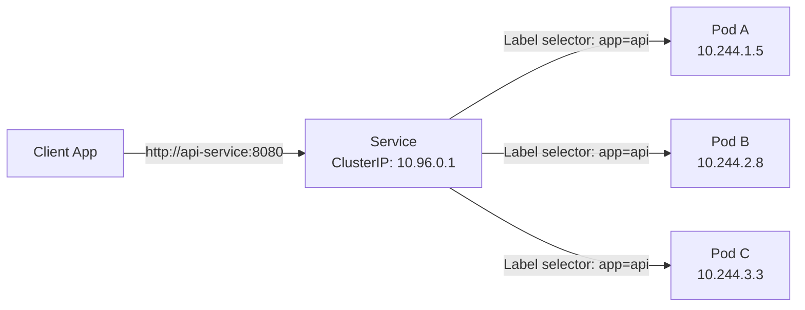
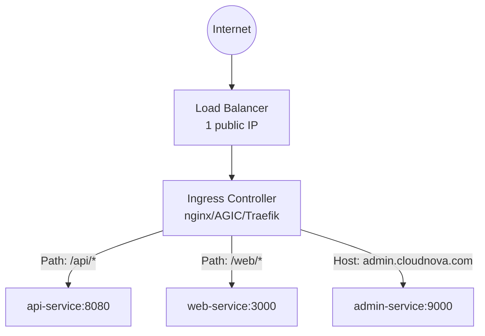
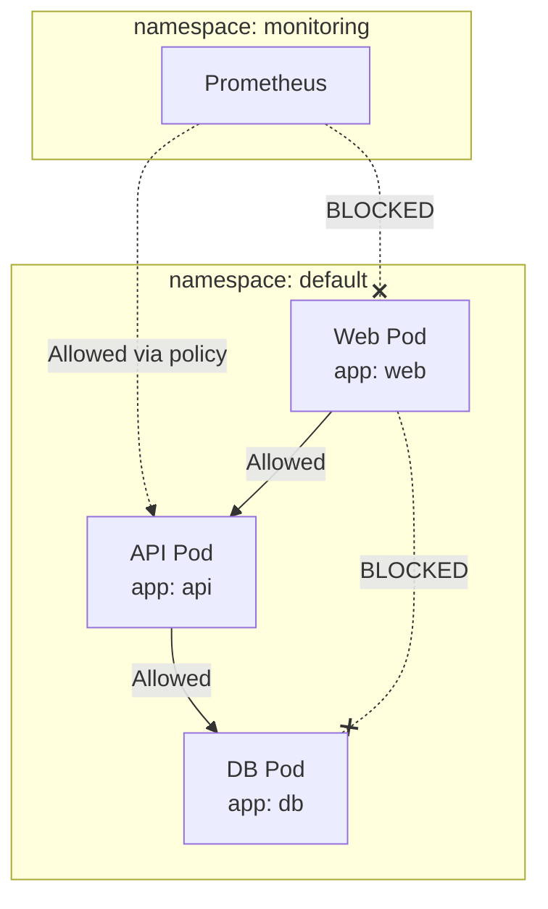

import {
  Info,
  Warning,
  Tip,
  BestPractice,
  Definition,
  Example,
  Analogy,
  CommonMistake,
  Debugging,
  Exercise,
  Quiz,
  CodeBlock,
  TerminalBlock,
  Flashcard,
  ProductionNote,
  ArchitectureNote,
  SecurityNote,
  CostNote,
  InterviewQuestion,
  CheatSheet,
  AIExplanation,
  AIQuiz,
  AIFlashcards,
} from "@site/src/components/shared/InteractiveBlocks";

export const CloudNova = ({ children }) => (
  <div
    style={{
      borderLeft: "4px solid #0ea5e9",
      padding: "1rem 1.5rem",
      margin: "1.5rem 0",
      background: "var(--ifm-color-emphasis-100)",
      borderRadius: "0 8px 8px 0",
    }}
  >
    <strong style={{ color: "#0ea5e9" }}>🏢 CloudNova Engineering</strong>
    <div style={{ marginTop: "0.5rem" }}>{children}</div>
  </div>
);

# Services & Networking — Connecting Everything

## The Problem: Pods Are Ephemeral

Pods come and go. When a Deployment replaces a pod, it gets a **new IP address**. If you hardcode `10.244.1.42:8080` in your app, it breaks the moment that pod dies.

<Analogy>

A restaurant doesn't give customers the chef's personal phone number. It gives them the **restaurant's phone number**. When the chef changes, the number stays the same, and the host routes your reservation to whoever is cooking that night.

A **Kubernetes Service** is the restaurant phone number. It provides a **stable IP and DNS name** that routes to whichever pods are currently running.

</Analogy>



---

## Service Types — Choose Wisely

### ClusterIP (Default) — Internal Only

<CodeBlock language="yaml" title="clusterip-service.yaml">
  apiVersion: v1 kind: Service metadata: name: nginx-service spec: type: ClusterIP selector: app:
  nginx ports: - protocol: TCP port: 80 # Service port targetPort: 8080 # Container port
</CodeBlock>

**Characteristics:**

- Only reachable **inside the cluster**
- Gets a virtual IP from the service CIDR range
- DNS: `nginx-service.default.svc.cluster.local`
- Used for internal microservice communication

### NodePort — Direct Node Access

```yaml
spec:
  type: NodePort
  selector:
    app: nginx
  ports:
    - port: 80
      targetPort: 8080
      nodePort: 30080 # 30000-32767 range
```

**Access pattern:** `http://<any-node-ip>:30080`

<Warning>

NodePort is rarely used in production directly. It's useful for development, debugging, and when you need something quick. For production, use LoadBalancer or Ingress.

</Warning>

### LoadBalancer — Cloud Integration

```yaml
spec:
  type: LoadBalancer
  selector:
    app: nginx
  ports:
    - port: 80
      targetPort: 8080
```

<Info>

When you create a LoadBalancer service in a cloud cluster (AKS, EKS, GKE), the cloud controller automatically provisions a cloud load balancer (Azure Load Balancer, AWS NLB/ALB, GCP LB) and assigns a public IP. **Each LoadBalancer service gets its own cloud LB — this can get expensive.**

</Info>

<CostNote>

**Cost implication**: Each LoadBalancer service typically costs $18-22/month per LB on Azure. With 20 microservices each getting their own LB, that's $400/month. **Use Ingress** to route multiple services through a single LB.

</CostNote>

---

## CoreDNS — Service Discovery

Every Service automatically gets a DNS record:

```
<service-name>.<namespace>.svc.cluster.local
```

<CodeBlock title="DNS Resolution Examples">
# From within a pod in the 'default' namespace:
curl http://nginx-service          # Short form
curl http://nginx-service.default  # Namespace-qualified
curl http://nginx-service.default.svc.cluster.local  # Full FQDN

# Cross-namespace:

curl http://api-service.staging.svc.cluster.local

</CodeBlock>

---

## Ingress — The Intelligent Router

Ingress provides **Layer 7 routing** — path-based, host-based, TLS termination:



<CodeBlock language="yaml" title="ingress.yaml">
  apiVersion: networking.k8s.io/v1 kind: Ingress metadata: name: app-ingress annotations:
  cert-manager.io/cluster-issuer: "letsencrypt-prod" nginx.ingress.kubernetes.io/rewrite-target: /
  spec: ingressClassName: nginx tls: - hosts: - cloudnova.com secretName: cloudnova-tls rules: -
  host: cloudnova.com http: paths: - path: /api pathType: Prefix backend: service: name: api-service
  port: number: 8080 - path: / pathType: Prefix backend: service: name: web-service port: number:
  3000
</CodeBlock>

---

## Network Policies — Pod Firewall

By default, **all pods can talk to all other pods**. NetworkPolicies restrict that:



<CodeBlock language="yaml" title="network-policy.yaml">
  apiVersion: networking.k8s.io/v1 kind: NetworkPolicy metadata: name: api-network-policy spec:
  podSelector: matchLabels: app: api policyTypes: - Ingress - Egress ingress: - from: - podSelector:
  matchLabels: app: web ports: - protocol: TCP port: 8080 - from: - namespaceSelector: matchLabels:
  name: monitoring ports: - protocol: TCP port: 9090 egress: - to: - podSelector: matchLabels: app:
  db ports: - protocol: TCP port: 5432
</CodeBlock>

<SecurityNote>

**Zero-trust networking on K8s**: Start with a default-deny policy (`podSelector: {}`, no ingress rules), then explicitly allow only the communication paths your application needs. This limits the blast radius of any compromised pod.

</SecurityNote>

---

## Professional — How kube-proxy Routes Traffic

kube-proxy watches the API server for Service and Endpoint changes, then updates node-level routing rules.

**iptables mode** (default, legacy):

- Creates DNAT (Destination NAT) rules
- For each Service, creates a chain that randomly selects a backend pod
- Scales poorly: O(n) rules, updates are slow with many services

**IPVS mode** (recommended):

- Uses Linux kernel IP Virtual Server
- Supports multiple scheduling algorithms (rr, lc, dh, sh)
- O(1) lookups, much better performance at scale

```bash
# Check your kube-proxy mode
kubectl logs -n kube-system -l k8s-app=kube-proxy | grep "Using"

# View iptables rules for a service
iptables -t nat -L KUBE-SERVICES -n | grep nginx
```

---

## Hand-On Exercise

<Exercise>

### Lab: Service & Ingress Setup

```bash
# 1. Deploy an nginx app
kubectl create deployment web --image=nginx --replicas=3

# 2. Expose as ClusterIP
kubectl expose deployment web --port=80 --target-port=80

# 3. Check the service
kubectl get svc web
kubectl describe svc web

# 4. Test from a temporary pod
kubectl run curl-test --image=curlimages/curl --rm -it -- sh
# Inside: curl http://web

# 5. Create a NodePort
kubectl expose deployment web --type=NodePort --port=80

# 6. Check endpoints (backend pods)
kubectl get endpoints web
```

</Exercise>

<Challenge>

**Challenge: Secure Microservice Communication**

Create three deployments (web, api, db) and:

1. Set up Services for each tier
2. Write NetworkPolicies that only allow: web → api → db
3. Verify that web cannot reach db directly
4. Add an Ingress that routes `/` to web and `/api` to api

</Challenge>

---

## Quiz

<Quiz
  questions={[
    {
      question: "What is the primary purpose of a Kubernetes Service?",
      options: [
        "To run containers",
        "To provide a stable IP and DNS for ephemeral pods",
        "To store configuration data",
        "To encrypt pod traffic",
      ],
      correct: 1,
      explanation:
        "Services provide a stable endpoint that routes traffic to pods, regardless of pod churn and IP changes.",
    },
    {
      question: "Which Service type is only accessible within the cluster?",
      options: ["NodePort", "LoadBalancer", "ClusterIP", "ExternalName"],
      correct: 2,
      explanation:
        "ClusterIP is the default and only provides internal cluster access. It's the standard for microservice-to-microservice communication.",
    },
    {
      question: "What does a NetworkPolicy with an empty podSelector and no ingress rules do?",
      options: [
        "Allow all traffic",
        "Deny all ingress to all pods",
        "Allow only egress traffic",
        "Nothing — it's invalid",
      ],
      correct: 1,
      explanation:
        "An empty podSelector selects all pods, and with no ingress rules, all incoming traffic is denied. This creates a default-deny posture.",
    },
  ]}
/>

---

## Active Recall

<Flashcard
  front="What are the four Kubernetes Service types and their use cases?"
  back="1. **ClusterIP**: Internal-only, microservice communication
2. **NodePort**: Direct node access, dev/debugging
3. **LoadBalancer**: External access via cloud LB
4. **ExternalName**: DNS CNAME to external service"
/>

<Flashcard
  front="How does kube-proxy route traffic in iptables vs IPVS mode?"
  back="**iptables**: DNAT rules, random backend, O(n) performance
**IPVS**: Linux kernel virtual server, multiple scheduling algorithms, O(1) hash table lookups, better at scale"
/>

---

## Interview Preparation

<InterviewQuestion difficulty="hard" certification="CKA">

**Question**: "How would you expose 20 microservices to the internet without creating 20 different load balancers?"

**Answer**: Deploy an Ingress Controller (nginx, AGIC, Traefik) behind a single LoadBalancer. Create Ingress resources with host/path-based routing rules. All services share one public IP. For TLS, use cert-manager to automate certificate provisioning. This reduces cost from ~20 LBs to 1, and centralizes TLS termination and routing logic.

</InterviewQuestion>

---

## Related Content

<KnowledgeLinks>
  - **Next**: [Configuration & Secrets](configuration-secrets) - **Previous**: [Pods &
  Workloads](pods-workloads) - **Lab**: Multi-tier secure microservice deployment -
  **Certification**: CKA Domain 3 — Services & Networking (20%)
</KnowledgeLinks>
