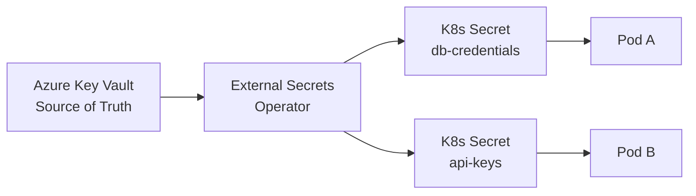

import {
  Info,
  Warning,
  Tip,
  BestPractice,
  Definition,
  Example,
  Analogy,
  CommonMistake,
  Debugging,
  Exercise,
  Quiz,
  CodeBlock,
  TerminalBlock,
  Flashcard,
  ProductionNote,
  ArchitectureNote,
  SecurityNote,
  CostNote,
  InterviewQuestion,
  CheatSheet,
  AIExplanation,
  AIQuiz,
  AIFlashcards,
} from "@site/src/components/shared/InteractiveBlocks";

export const CloudNova = ({ children }) => (
  <div
    style={{
      borderLeft: "4px solid #0ea5e9",
      padding: "1rem 1.5rem",
      margin: "1.5rem 0",
      background: "var(--ifm-color-emphasis-100)",
      borderRadius: "0 8px 8px 0",
    }}
  >
    <strong style={{ color: "#0ea5e9" }}>🏢 CloudNova Engineering</strong>
    <div style={{ marginTop: "0.5rem" }}>{children}</div>
  </div>
);

# Configuration & Secrets — Managing State

## The 12-Factor Principle

<Definition term="12-Factor App — Config">

**Store config in the environment.** Configuration (database URLs, credentials, feature flags) should be strictly separated from code. An app should be deployable to any environment without code changes — only config changes.

This means:

- ❌ No hardcoded values in source code
- ❌ No config baked into container images
- ✅ Config injected at runtime via environment variables, ConfigMaps, or Secrets

</Definition>

---

## ConfigMaps — Non-Secret Configuration

ConfigMaps store key-value pairs, configuration files, or command-line arguments:

## <CodeBlock language="yaml" title="configmap-examples.yaml">

# Key-value style

apiVersion: v1
kind: ConfigMap
metadata:
name: app-config
data:
APP_ENV: "production"
LOG_LEVEL: "info"
API_TIMEOUT: "30s"

---

# File-style

apiVersion: v1
kind: ConfigMap
metadata:
name: nginx-config
data:
nginx.conf: |
server {
listen 80;
server_name cloudnova.com;
location / {
proxy_pass http://api-service:8080;
}
}

</CodeBlock>

### Consuming ConfigMaps

<CodeBlock language="yaml" title="pod-using-configmap.yaml">
  apiVersion: v1 kind: Pod metadata: name: app spec: containers: - name: app image: myapp:latest #
  Method 1: Environment variables envFrom: - configMapRef: name: app-config # Method 2: Single env
  var env: - name: LOG_LEVEL valueFrom: configMapKeyRef: name: app-config key: LOG_LEVEL # Method 3:
  Mount as file volumeMounts: - name: nginx-conf mountPath: /etc/nginx/conf.d volumes: - name:
  nginx-conf configMap: name: nginx-config
</CodeBlock>

---

## Secrets — Handling Sensitive Data

<SecurityNote>

**Kubernetes Secrets are NOT encrypted by default.** They are stored as base64-encoded text in etcd. Anyone with etcd access can read all secrets.

A true production setup requires:

- Encryption at rest (enabled with `--encryption-provider-config` on API server)
- RBAC to restrict Secret access
- Ideally, an external secret manager (Key Vault, Vault)

</SecurityNote>

<CodeBlock language="yaml" title="secret.yaml">
  apiVersion: v1 kind: Secret metadata: name: db-credentials type: Opaque data: DB_USER:
  Y2xvdWRub3Zh # base64 of "cloudnova" DB_PASS: UzNjdXIzIVBhc3M= # base64 of "S3cur3!Pass" --- # Or
  create imperatively: kubectl create secret generic db-credentials \
  --from-literal=DB_USER=cloudnova \ --from-literal=DB_PASS='S3cur3!Pass'
</CodeBlock>

### Using Secrets in Pods

```yaml
spec:
  containers:
    - name: app
      env:
        - name: DB_PASSWORD
          valueFrom:
            secretKeyRef:
              name: db-credentials
              key: DB_PASS
```

---

## Production — External Secrets Operator

For real production, use the **External Secrets Operator (ESO)** to sync secrets from cloud secret stores:



```yaml
apiVersion: external-secrets.io/v1beta1
kind: ExternalSecret
metadata:
  name: db-credentials
spec:
  refreshInterval: 1h
  secretStoreRef:
    name: azure-keyvault
    kind: ClusterSecretStore
  target:
    name: db-credentials
  data:
    - secretKey: DB_PASS
      remoteRef:
        key: cloudnova-db-password
```

<ProductionNote>

**Secret rotation with ESO:**

1. Rotate secret in Azure Key Vault
2. ESO detects change (or on `refreshInterval`)
3. Updates the Kubernetes Secret
4. Pods need a mechanism to reload: use `stakater/Reloader` or roll restart deployments

</ProductionNote>

---

## GitOps-Friendly Secrets

### Sealed Secrets

Encrypt secrets so they can be safely committed to Git:

```bash
# Install Sealed Secrets controller
kubectl apply -f https://github.com/bitnami-labs/sealed-secrets/releases/download/v0.24.0/controller.yaml

# Create a normal secret
kubectl create secret generic api-key --from-literal=key=abc123 --dry-run=client -o yaml | \
  kubeseal --format yaml > sealed-api-key.yaml

# The sealed secret can be committed to Git!
# Only the cluster's Sealed Secrets controller can decrypt it
```

---

## CloudNova Scenario

<CloudNova>

CloudNova's security audit flagged a critical issue: database credentials are hardcoded in deployment YAML files committed to the repository. The CISO demands an immediate fix.

**Your remediation plan:**

1. Migrate all secrets to Azure Key Vault
2. Deploy External Secrets Operator
3. Create ExternalSecret resources for DB, Redis, and API keys
4. Update deployments to reference the synced Kubernetes Secrets
5. Rotate all credentials (assume the old ones are compromised)
6. Document the new secret rotation procedure for the team

</CloudNova>

---

## Quiz

<Quiz
  questions={[
    {
      question: "Are Kubernetes Secrets encrypted by default?",
      options: [
        "Yes, with AES-256",
        "Yes, with TLS",
        "No, they are base64-encoded only",
        "Only in managed Kubernetes services",
      ],
      correct: 2,
      explanation:
        "Secrets are stored as base64 in etcd — NOT encrypted. You must enable encryption at rest on the API server for true encryption.",
    },
    {
      question: "What is the primary advantage of External Secrets Operator?",
      options: [
        "It's faster than Kubernetes Secrets",
        "It syncs secrets from cloud secret stores, keeping the source of truth external",
        "It encrypts secrets automatically",
        "It replaces ConfigMaps",
      ],
      correct: 1,
      explanation:
        "ESO keeps the authoritative source of secrets in cloud secret stores (Azure Key Vault, AWS Secrets Manager), syncing them into Kubernetes automatically.",
    },
    {
      question: "How should you handle secrets in a GitOps workflow?",
      options: [
        "Commit them as base64 directly in Git",
        "Don't use secrets with GitOps",
        "Use Sealed Secrets or External Secrets to safely store encrypted/managed secrets",
        "Email them to the team",
      ],
      correct: 2,
      explanation:
        "Sealed Secrets encrypt secrets for Git storage, while External Secrets references external stores. Both enable GitOps without plaintext secrets in version control.",
    },
  ]}
/>

---

## Active Recall

<Flashcard
  front="What's the difference between a ConfigMap and a Secret in Kubernetes?"
  back="**ConfigMap**: Non-sensitive data (environment names, feature flags, config files). Stored as plaintext.
**Secret**: Sensitive data (passwords, tokens, keys). Base64-encoded (not encrypted by default). Can be encrypted at rest with API server configuration."
/>

<Flashcard
  front="Name three ways to provide configuration to a Kubernetes pod."
  back="1. **Environment variables** (from ConfigMap/Secret keys)
2. **Mounted files** (entire ConfigMap/Secret as a volume)
3. **Command-line arguments** (via ConfigMap keys referenced in pod spec)"
/>

---

## Related Content

<KnowledgeLinks>
  - **Next**: [Storage in Kubernetes](storage) - **Previous**: [Services &
  Networking](services-networking) - **Related**: [Secrets Management in Security
  module](../../04-security/secrets-management)
</KnowledgeLinks>
