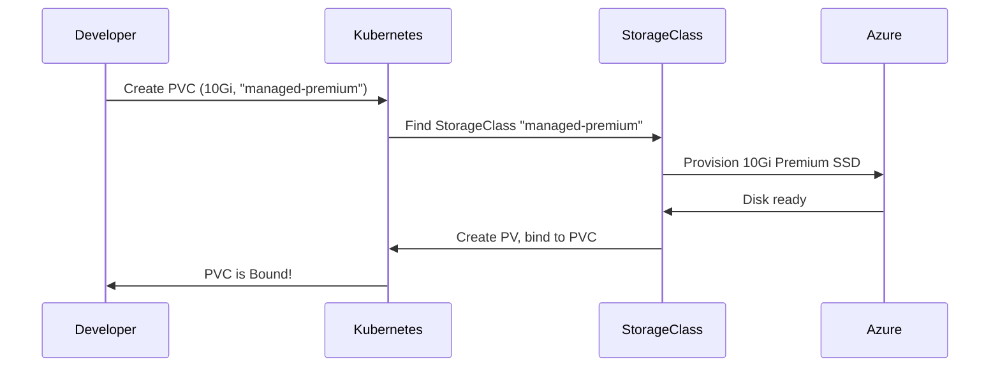
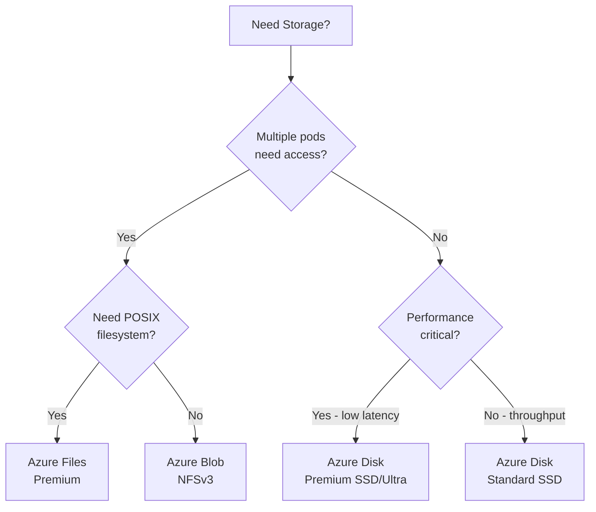

import {
  Info,
  Warning,
  Tip,
  BestPractice,
  Definition,
  Example,
  Analogy,
  CommonMistake,
  Debugging,
  Exercise,
  Quiz,
  CodeBlock,
  TerminalBlock,
  Flashcard,
  ProductionNote,
  ArchitectureNote,
  SecurityNote,
  CostNote,
  InterviewQuestion,
  CheatSheet,
  AIExplanation,
  AIQuiz,
  AIFlashcards,
} from "@site/src/components/shared/InteractiveBlocks";

export const CloudNova = ({ children }) => (
  <div
    style={{
      borderLeft: "4px solid #0ea5e9",
      padding: "1rem 1.5rem",
      margin: "1.5rem 0",
      background: "var(--ifm-color-emphasis-100)",
      borderRadius: "0 8px 8px 0",
    }}
  >
    <strong style={{ color: "#0ea5e9" }}>🏢 CloudNova Engineering</strong>
    <div style={{ marginTop: "0.5rem" }}>{children}</div>
  </div>
);

# Storage in Kubernetes — Persistent Data

## The Problem: Containers Are Ephemeral

Containers restart, pods get rescheduled, nodes die. Any data written inside a container's filesystem is **lost** when the container stops.

<Analogy>

Think of container storage like a hotel room. You can use the desk and closet during your stay, but when you check out, everything you left behind is thrown away. If you need storage that survives your stay, you need a **storage unit** — that's what Persistent Volumes provide.

</Analogy>

---

## PV and PVC — The Storage Abstraction

```mermaid
graph TB
    Admin[Cluster Admin] --> PV[PersistentVolume<br/>100Gi Azure Disk]
    Dev[Developer] --> PVC[PersistentVolumeClaim<br/>"I need 10Gi"]
    PVC -.->|Bound| PV
    Pod[Pod] --> PVC
    PV --> Disk[(Azure Disk)]
```

<Definition term="PersistentVolume (PV)">

A piece of storage in the cluster **provisioned by an administrator** or dynamically provisioned. It has a lifecycle independent of any pod. Think of it as the physical storage.

</Definition>

<Definition term="PersistentVolumeClaim (PVC)">

A **request for storage** by a user. It's like a pod's "ticket" for storage: "I need 10Gi of fast SSD storage." Kubernetes finds a matching PV and binds them.

</Definition>

### Static Provisioning

```yaml
# Step 1: Admin creates the PV
apiVersion: v1
kind: PersistentVolume
metadata:
  name: pv-azure-disk
spec:
  capacity:
    storage: 100Gi
  accessModes:
    - ReadWriteOnce
  persistentVolumeReclaimPolicy: Retain
  azureDisk:
    diskName: k8s-disk-001
    diskURI: /subscriptions/.../disks/k8s-disk-001

---
# Step 2: Developer creates a PVC
apiVersion: v1
kind: PersistentVolumeClaim
metadata:
  name: my-pvc
spec:
  accessModes:
    - ReadWriteOnce
  resources:
    requests:
      storage: 10Gi

---
# Step 3: Pod uses the PVC
apiVersion: v1
kind: Pod
metadata:
  name: postgres
spec:
  containers:
    - name: postgres
      image: postgres:16
      volumeMounts:
        - name: pgdata
          mountPath: /var/lib/postgresql/data
  volumes:
    - name: pgdata
      persistentVolumeClaim:
        claimName: my-pvc
```

---

## Dynamic Provisioning — StorageClasses

Static provisioning is tedious. **StorageClasses** enable automatic, on-demand storage provisioning:



## <CodeBlock language="yaml" title="storage-classes.yaml">

# Azure Premium SSD (fast, expensive)

apiVersion: storage.k8s.io/v1
kind: StorageClass
metadata:
name: managed-premium
provisioner: disk.csi.azure.com
parameters:
skuName: Premium_LRS
reclaimPolicy: Delete
volumeBindingMode: WaitForFirstConsumer
allowVolumeExpansion: true

---

# Azure Standard SSD (balanced)

apiVersion: storage.k8s.io/v1
kind: StorageClass
metadata:
name: managed-standard-ssd
provisioner: disk.csi.azure.com
parameters:
skuName: StandardSSD_LRS
reclaimPolicy: Delete
volumeBindingMode: WaitForFirstConsumer

---

# Azure Files (shared across pods - ReadWriteMany)

apiVersion: storage.k8s.io/v1
kind: StorageClass
metadata:
name: azurefile-premium
provisioner: file.csi.azure.com
parameters:
skuName: Premium_LRS
reclaimPolicy: Delete

</CodeBlock>

### Access Modes

| Mode          | Abbreviation | Meaning                   | Use Case                        |
| ------------- | ------------ | ------------------------- | ------------------------------- |
| ReadWriteOnce | RWO          | One node can read/write   | Standard DB, single pod         |
| ReadOnlyMany  | ROX          | Many nodes can read       | Shared config, static assets    |
| ReadWriteMany | RWX          | Many nodes can read/write | Shared file storage, CMS assets |

<Info>

**RWO vs RWX on Azure:**

- Azure Disk supports **only RWO** (one node at a time)
- Azure Files supports **RWX** (shared across multiple nodes)
- For shared storage needs (multiple pods), always use Azure Files

</Info>

---

## Production — Choosing the Right Storage



<ProductionNote>

**Volume Expansion**: StorageClasses with `allowVolumeExpansion: true` support growing PVCs without pod restart:

```bash
kubectl patch pvc my-pvc -p '{"spec":{"resources":{"requests":{"storage":"20Gi"}}}}'
```

**CSI Snapshots**: Create point-in-time snapshots for backup:

```yaml
apiVersion: snapshot.storage.k8s.io/v1
kind: VolumeSnapshot
metadata:
  name: db-snapshot-20260115
spec:
  volumeSnapshotClassName: csi-azuredisk-snapclass
  source:
    persistentVolumeClaimName: my-pvc
```

</ProductionNote>

<CloudNova>

CloudNova's PostgreSQL on Kubernetes ran out of disk space at 2 AM, causing a production outage. The on-call engineer had to manually resize the disk and restart the pod — 45 minutes of downtime.

**Your improvement plan:**

1. Set up StorageClasses with `allowVolumeExpansion: true`
2. Create a monitoring alert when PVC usage exceeds 80%
3. Implement CSI snapshotting for hourly backups
4. Document the volume expansion procedure for the runbook
5. Plan for migrating from RWO Azure Disk to Azure Files for future workloads needing multi-pod access

</CloudNova>

---

## Hands-On

<Exercise>

### Lab: Dynamic Storage in Action

```bash
# 1. Check available StorageClasses
kubectl get storageclass

# 2. Create a PVC
cat <<EOF | kubectl apply -f -
apiVersion: v1
kind: PersistentVolumeClaim
metadata:
  name: test-pvc
spec:
  accessModes:
    - ReadWriteOnce
  resources:
    requests:
      storage: 1Gi
EOF

# 3. Watch the PVC get bound
kubectl get pvc test-pvc -w

# 4. Inspect the dynamically created PV
kubectl get pv

# 5. Use in a pod
kubectl run test-pod --image=nginx --dry-run=client -o yaml | \
  sed 's/containers:/volumes:\n  - name: data\n    persistentVolumeClaim:\n      claimName: test-pvc\n  containers:/' | \
  kubectl apply -f -
```

</Exercise>

---

## Quiz

<Quiz
  questions={[
    {
      question: "What is the difference between a PV and a PVC?",
      options: [
        "They are the same thing",
        "PV is the storage; PVC is a request for storage",
        "PVC is the storage; PV is a request for storage",
        "PV is for Linux; PVC is for Windows",
      ],
      correct: 1,
      explanation:
        "PV represents actual storage (like an Azure Disk). PVC is a user's request for storage that gets bound to a matching PV.",
    },
    {
      question: "Which Azure storage option supports ReadWriteMany (RWX) in Kubernetes?",
      options: [
        "Azure Disk Premium",
        "Azure Disk Standard",
        "Azure Files",
        "Azure Blob (hot tier)",
      ],
      correct: 2,
      explanation:
        "Azure Files is the primary RWX option. Azure Disk only supports RWO (single node). Azure Blob can work with NFSv3 for RWX but Azure Files is simpler.",
    },
    {
      question: "What does `volumeBindingMode: WaitForFirstConsumer` do?",
      options: [
        "Waits until the first payment is processed",
        "Delays PV creation until a pod actually needs it, enabling topology-aware provisioning",
        "Creates the PV immediately regardless of use",
        "Binds the PVC to the first available PV in any zone",
      ],
      correct: 1,
      explanation:
        "This ensures the PV is provisioned in the same availability zone as the pod that will use it, avoiding zone-mismatch mounting failures.",
    },
  ]}
/>

---

## Active Recall

<Flashcard
  front="What is the CSI (Container Storage Interface)?"
  back="CSI is a standard interface that allows any storage vendor to write a driver (plugin) that works with any container orchestrator. In Kubernetes, CSI drivers handle provisioning, attaching, mounting, snapshotting, and resizing volumes. Azure Disk CSI, Azure Files CSI, and third-party drivers all implement CSI."
/>

<Flashcard
  front="What are the three reclaim policies for PersistentVolumes?"
  back="1. **Retain**: PV is NOT deleted when PVC is deleted. Manual cleanup required.
2. **Delete**: Both PV and backing storage (e.g., Azure Disk) are deleted.
3. **Recycle**: Deprecated. Basic scrub (rm -rf) and reuse."
/>

---

## Interview

<InterviewQuestion difficulty="medium" certification="CKA">

**Question**: "How would you provide persistent storage to a PostgreSQL database running on Kubernetes, ensuring data survives pod restarts and node failures?"

**Answer**: Create a StorageClass with the appropriate provisioner (e.g., `disk.csi.azure.com`) and SKU (Premium_LRS for database workloads). Deploy PostgreSQL as a StatefulSet with a `volumeClaimTemplate` referencing the StorageClass. Each pod gets its own PVC with a stable identity (postgres-0, postgres-1), ensuring data persistence across restarts and rescheduling. Use CSI snapshots for backup."

</InterviewQuestion>

---

## Related

<KnowledgeLinks>
  - **Next**: [RBAC & Security](rbac-security) - **Previous**: [Configuration &
  Secrets](configuration-secrets) - **Lab**: Stateful database on Kubernetes - **Certification**:
  CKA Domain 5 — Storage (10%)
</KnowledgeLinks>
