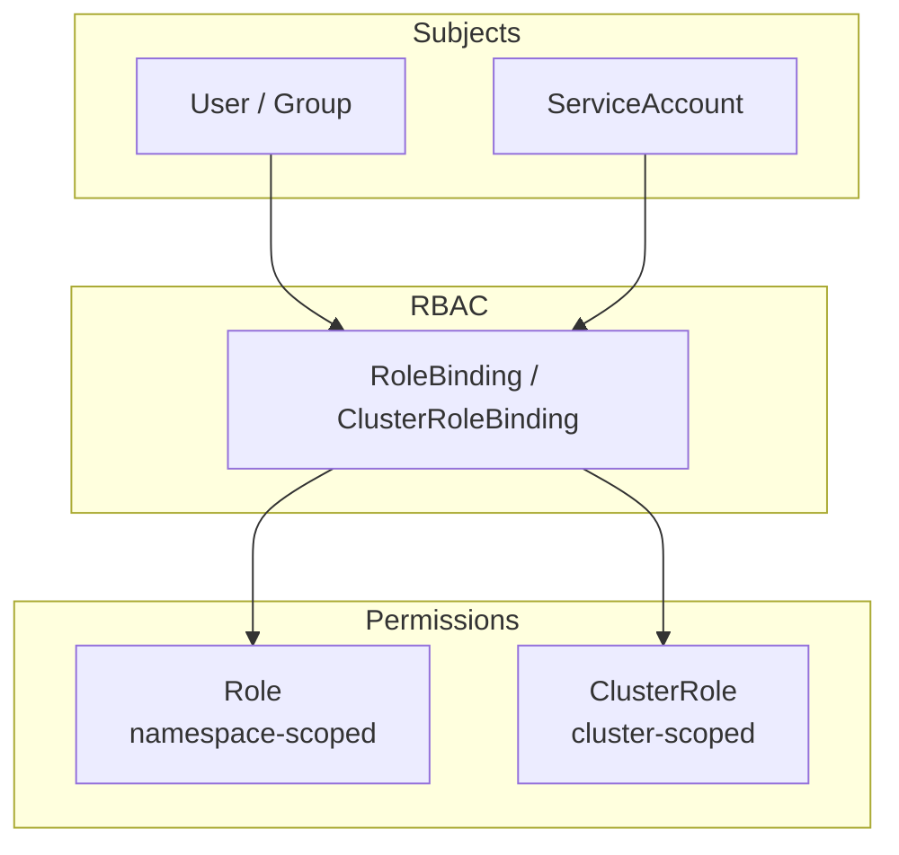

import {
  Info,
  Warning,
  Tip,
  BestPractice,
  Definition,
  Example,
  Analogy,
  CommonMistake,
  Debugging,
  Exercise,
  Quiz,
  CodeBlock,
  TerminalBlock,
  Flashcard,
  ProductionNote,
  ArchitectureNote,
  SecurityNote,
  CostNote,
  InterviewQuestion,
  CheatSheet,
  AIExplanation,
  AIQuiz,
  AIFlashcards,
} from "@site/src/components/shared/InteractiveBlocks";

export const CloudNova = ({ children }) => (
  <div
    style={{
      borderLeft: "4px solid #0ea5e9",
      padding: "1rem 1.5rem",
      margin: "1.5rem 0",
      background: "var(--ifm-color-emphasis-100)",
      borderRadius: "0 8px 8px 0",
    }}
  >
    <strong style={{ color: "#0ea5e9" }}>🏢 CloudNova Engineering</strong>
    <div style={{ marginTop: "0.5rem" }}>{children}</div>
  </div>
);

# RBAC & Security — Locking Down the Cluster

## The Principle of Least Privilege

<Definition>

**Least Privilege**: Every subject (user, pod, service) should have **only the permissions it needs** to do its job — and nothing more. In Kubernetes, this means:

- A frontend pod should not be able to list all secrets
- A CI/CD service account should only deploy to its namespace
- A developer should only see pods in their team's namespaces

</Definition>

---

## RBAC Architecture



<Definition term="Role">

Namespace-scoped set of permissions. A Role can only grant access to resources within a single namespace.

</Definition>

<Definition term="ClusterRole">

Cluster-wide set of permissions. Used for cluster-scoped resources (nodes, PVs, namespaces) or to grant access across all namespaces.

</Definition>

<Definition term="RoleBinding / ClusterRoleBinding">

The "glue" that connects subjects (users, groups, ServiceAccounts) to Roles/ClusterRoles.

</Definition>

### Practical RBAC Example

```yaml
---
# Step 1: Create a Role (what you can do, in one namespace)
apiVersion: rbac.authorization.k8s.io/v1
kind: Role
metadata:
  name: pod-reader
  namespace: development
rules:
  - apiGroups: [""]
    resources: ["pods", "pods/log"]
    verbs: ["get", "list", "watch"]

---
# Step 2: Create a ServiceAccount (who is doing it)
apiVersion: v1
kind: ServiceAccount
metadata:
  name: ci-bot
  namespace: development

---
# Step 3: Bind them together
apiVersion: rbac.authorization.k8s.io/v1
kind: RoleBinding
metadata:
  name: ci-bot-pod-reader
  namespace: development
subjects:
  - kind: ServiceAccount
    name: ci-bot
    namespace: development
roleRef:
  kind: Role
  name: pod-reader
  apiGroup: rbac.authorization.k8s.io
```

<BestPractice>

**RBAC Design Rules:**

1. **One ServiceAccount per application** — never share SAs between apps
2. **Namespace-scope when possible** — use Roles over ClusterRoles
3. **Avoid `verbs: ["*"]`** — list exactly what verbs are needed
4. **Avoid `resources: ["*"]`** — list exactly what resources are needed
5. **Regularly audit** with `kubectl auth can-i` and audit logs

</BestPractice>

---

## ServiceAccounts — Pod Authentication

Every pod automatically gets a ServiceAccount:

```bash
# Check a pod's ServiceAccount
kubectl get pod my-pod -o jsonpath='{.spec.serviceAccountName}'
# Output: default  (unless specified otherwise)

# The ServiceAccount token is mounted at:
# /var/run/secrets/kubernetes.io/serviceaccount/token
```

<SecurityNote>

**ServiceAccount Best Practices:**

- **Never use the `default` ServiceAccount** for application pods
- Disable automounting of SA tokens when the pod doesn't need API access:
  ```yaml
  automountServiceAccountToken: false
  ```
- Use **workload identity** (Azure AD Workload Identity) instead of long-lived SA tokens when possible
- Set `automountServiceAccountToken: false` on the ServiceAccount itself for defense in depth

</SecurityNote>

---

## Pod Security Standards

Kubernetes defines three security levels:

| Level          | What It Blocks              | Use Case                   |
| -------------- | --------------------------- | -------------------------- |
| **Privileged** | Nothing                     | System pods, node agents   |
| **Baseline**   | Known privilege escalations | Most applications          |
| **Restricted** | Everything risky            | Highly secure environments |

```yaml
apiVersion: v1
kind: Namespace
metadata:
  name: secure-app
  labels:
    pod-security.kubernetes.io/enforce: restricted
    pod-security.kubernetes.io/warn: baseline
```

<CodeBlock title="Restricted Pod Checklist">
  # A "Restricted" pod must: spec: containers: - name: app securityContext: runAsNonRoot: true #
  Must NOT run as root allowPrivilegeEscalation: false # No setuid binaries capabilities: drop:
  ["ALL"] # Drop all Linux capabilities seccompProfile: type: RuntimeDefault # Restrict syscalls
  volumes: - name: tmp emptyDir: {} # No hostPath volumes
</CodeBlock>

---

## Production — Auditing Your Cluster

```bash
# Check what YOU can do
kubectl auth can-i create deployments --namespace production
kubectl auth can-i delete nodes

# Check what a ServiceAccount can do
kubectl auth can-i list secrets --as=system:serviceaccount:default:ci-bot

# List all RoleBindings in a namespace
kubectl get rolebindings,clusterrolebindings --all-namespaces

# Find overly permissive bindings
kubectl get clusterrolebindings -o json | \
  jq '.items[] | select(.roleRef.name=="cluster-admin") | .subjects[]'
```

<CloudNova>

Security audit found a developer's ServiceAccount with `cluster-admin` privileges — a major violation. The developer had been testing and left it.

**Your incident response:**

1. Immediately revoke the cluster-admin binding
2. Create a properly scoped Role for the developer's CI pipeline
3. Audit ALL ServiceAccounts for over-privileged access
4. Set up a policy to block cluster-admin bindings for non-admin SAs
5. Add RBAC audit to the CI pipeline

</CloudNova>

---

## Hands-On

<Exercise>

### Lab: Create and Test RBAC

```bash
# 1. Create namespace
kubectl create namespace rbac-lab

# 2. Create ServiceAccount
kubectl create sa pod-reader -n rbac-lab

# 3. Create Role
kubectl create role pod-reader --verb=get,list,watch \
  --resource=pods -n rbac-lab

# 4. Create RoleBinding
kubectl create rolebinding pod-reader-binding \
  --role=pod-reader --serviceaccount=rbac-lab:pod-reader \
  -n rbac-lab

# 5. Test permissions
kubectl auth can-i get pods -n rbac-lab \
  --as=system:serviceaccount:rbac-lab:pod-reader
# Should return: yes

kubectl auth can-i delete pods -n rbac-lab \
  --as=system:serviceaccount:rbac-lab:pod-reader
# Should return: no (not in the Role!)
```

</Exercise>

---

## Quiz

<Quiz
  questions={[
    {
      question: "What is the difference between a Role and a ClusterRole?",
      options: [
        "Roles are more secure",
        "Roles are namespace-scoped; ClusterRoles are cluster-wide",
        "ClusterRoles don't exist in Kubernetes",
        "Roles can only read, ClusterRoles can write",
      ],
      correct: 1,
      explanation:
        "Roles grant permissions within a single namespace. ClusterRoles grant permissions cluster-wide or to cluster-scoped resources (nodes, PVs, namespaces).",
    },
    {
      question:
        "Which Pod Security Standard level should you target for most application workloads?",
      options: ["Privileged", "Baseline", "Restricted", "None"],
      correct: 1,
      explanation:
        "Baseline blocks known privilege escalations while allowing common application patterns. Restricted is ideal but may break applications that legitimately need some capabilities.",
    },
    {
      question: "Why should you avoid using the 'default' ServiceAccount for application pods?",
      options: [
        "It's slower",
        "It has no permissions at all",
        "It's shared across all pods in the namespace, breaking the principle of least privilege",
        "It doesn't exist in newer Kubernetes versions",
      ],
      correct: 2,
      explanation:
        "All pods in a namespace share the default SA by default. If one pod needs API access and gets it via the default SA, ALL pods get that access — a security risk.",
    },
  ]}
/>

---

## Active Recall

<Flashcard
  front="What are the three components of Kubernetes RBAC?"
  back="1. **Subjects** (who): Users, Groups, ServiceAccounts
2. **Roles/ClusterRoles** (what): Sets of permissions (verbs on resources)
3. **RoleBindings/ClusterRoleBindings** (connection): Links subjects to roles"
/>

---

## Related

<KnowledgeLinks>
  - **Next**: [Resource Management & Scaling](resource-scaling) - **Previous**: [Storage in
  Kubernetes](storage) - **Related**: [Security
  Fundamentals](../../04-security/security-fundamentals) - **Certification**: CKA Domain 6 —
  Security (30%)
</KnowledgeLinks>
