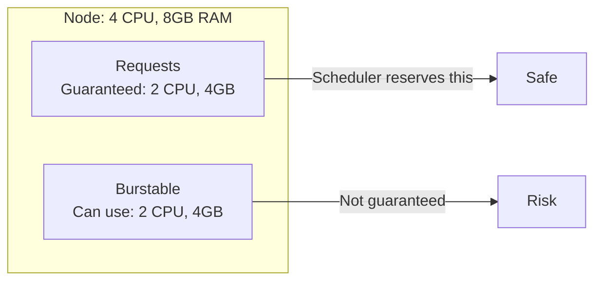
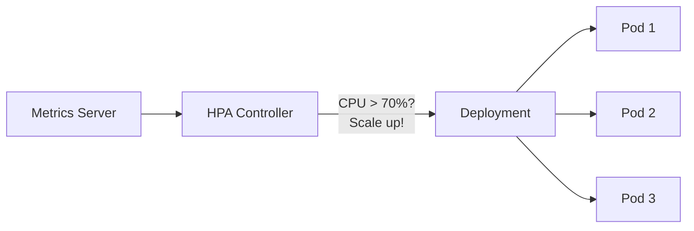
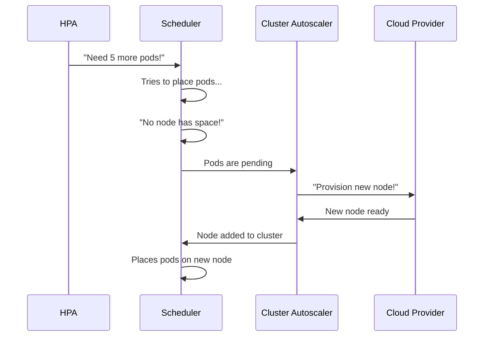

import { Info, Warning, Tip, BestPractice, Definition, Example, Analogy, CommonMistake, Debugging, Exercise, Quiz, CodeBlock, TerminalBlock, Flashcard, ProductionNote, ArchitectureNote, SecurityNote, CostNote, InterviewQuestion, CheatSheet } from '@site/src/components/shared/InteractiveBlocks';

export const CloudNova = ({ children }) => (
  <div style={{ borderLeft: '4px solid #0ea5e9', padding: '1rem 1.5rem', margin: '1.5rem 0', background: 'var(--ifm-color-emphasis-100)', borderRadius: '0 8px 8px 0' }}>
    <strong style={{ color: '#0ea5e9' }}>🏢 CloudNova Engineering</strong>
    <div style={{ marginTop: '0.5rem' }}>{children}</div>
  </div>
);

# Resource Management & Autoscaling

## Requests vs Limits

<Definition term="Resource Requests">

The amount of CPU/memory **guaranteed** to a container. The scheduler uses requests to decide which node can fit a pod. Think of it as the **minimum**.

</Definition>

<Definition term="Resource Limits">

The **hard cap** on CPU/memory a container can use. If a container exceeds its memory limit, it gets OOMKilled. CPU is throttled but not killed.

</Definition>

```yaml
resources:
  requests:
    memory: "128Mi"
    cpu: "250m"      # 0.25 CPU core
  limits:
    memory: "256Mi"
    cpu: "500m"      # 0.5 CPU core
```



### QoS Classes

| Class | Condition | Eviction Priority |
|-------|-----------|-------------------|
| **Guaranteed** | requests == limits for CPU and memory | Last to be evicted |
| **Burstable** | requests < limits (or one not set) | Evicted after BestEffort |
| **BestEffort** | No requests or limits set | First to be evicted |

<CommonMistake>

**The #1 resource mistake**: Deploying pods without any requests or limits. These pods get BestEffort QoS and are the FIRST to be killed under memory pressure. Your production workloads get evicted first.

**Always set requests at minimum.** Limits can be debated, but requests are non-negotiable.

</CommonMistake>

---

## Horizontal Pod Autoscaler (HPA)

HPA automatically scales pods based on metrics:



```yaml
apiVersion: autoscaling/v2
kind: HorizontalPodAutoscaler
metadata:
  name: api-hpa
spec:
  scaleTargetRef:
    apiVersion: apps/v1
    kind: Deployment
    name: api
  minReplicas: 3
  maxReplicas: 20
  metrics:
  - type: Resource
    resource:
      name: cpu
      target:
        type: Utilization
        averageUtilization: 70
  - type: Resource
    resource:
      name: memory
      target:
        type: Utilization
        averageUtilization: 80
  behavior:
    scaleDown:
      stabilizationWindowSeconds: 300  # Wait 5 min before scaling down
    scaleUp:
      stabilizationWindowSeconds: 0    # Scale up immediately
```

<BestPractice>

**HPA requires the Metrics Server** to be installed in your cluster. Without it, `kubectl top pods` and HPA won't work:
```bash
kubectl apply -f https://github.com/kubernetes-sigs/metrics-server/releases/latest/download/components.yaml
```

</BestPractice>

---

## Cluster Autoscaler

While HPA adds more pods, **Cluster Autoscaler** adds more nodes:



<CostNote>

**Cost optimization with autoscaling:**
- Set `minReplicas` low (2-3) for non-critical services
- Use `stabilizationWindowSeconds` to prevent rapid scale-down/up oscillations (flapping)
- Schedule non-production workloads to scale to zero overnight
- Use spot/preemptible node pools with cluster autoscaler for 60-80% cost savings

</CostNote>

---

## CloudNova Scenario

<CloudNova>

CloudNova's e-commerce platform crashed during Black Friday. Investigation revealed:
- No HPA configured — pods were fixed at 3 replicas
- No resource requests set — BestEffort QoS, pods evicted under memory pressure
- Cluster autoscaler had a max of 5 nodes — hit the ceiling

**Your fix:**
1. Configure HPA for all tier-1 services (min 3, max 30)
2. Set proper resource requests/limits for all workloads
3. Increase cluster autoscaler max to 50 nodes
4. Add KEDA (event-driven autoscaler) for queue-based scaling
5. Set up load testing to validate the scaling configuration

</CloudNova>

---

## Hands-On

<Exercise>

```bash
# 1. Enable metrics-server (if not installed)
kubectl apply -f https://github.com/kubernetes-sigs/metrics-server/releases/latest/download/components.yaml

# 2. Create an HPA
kubectl autoscale deployment nginx --cpu-percent=50 --min=3 --max=10

# 3. Check HPA status
kubectl get hpa -w

# 4. Generate load (from another terminal)
kubectl run load-generator --image=busybox -- /bin/sh -c \
  "while true; do wget -q -O- http://nginx-service; done"

# 5. Watch pods scale up
kubectl get pods -w
```

</Exercise>

---

## Quiz

<Quiz
  questions={[
    {
      question: "A pod with requests=200m and limits=800m has which QoS class?",
      options: ["Guaranteed", "Burstable", "BestEffort", "Unknown"],
      correct: 1,
      explanation: "Requests < Limits → Burstable. Guaranteed requires requests == limits for both CPU and memory."
    },
    {
      question: "What does HPA use to make scaling decisions?",
      options: ["Random guessing", "Metrics from the Metrics Server (CPU, memory, custom metrics)", "Node count", "Manual configuration only"],
      correct: 1,
      explanation: "HPA queries the Metrics Server for resource utilization and compares it to target thresholds to decide scaling actions."
    }
  ]}
/>

---

## Active Recall

<Flashcard
  front="What are the three Kubernetes QoS classes and what determines them?"
  back="1. **Guaranteed**: requests == limits for both CPU and memory on every container
2. **Burstable**: requests < limits or only one resource has limits set
3. **BestEffort**: No requests or limits at all. Evicted first under pressure."
/>

---

## Related

<KnowledgeLinks>
- **Next**: [Observability on K8s](observability)
- **Previous**: [RBAC & Security](rbac-security)
- **Certification**: CKA Domain 3 — Workloads & Scheduling (15%)
</KnowledgeLinks>
