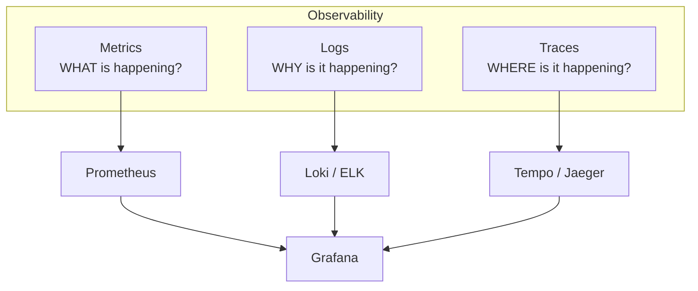

import {
  Info,
  Warning,
  Tip,
  BestPractice,
  Definition,
  Example,
  Analogy,
  CommonMistake,
  Debugging,
  Exercise,
  Quiz,
  CodeBlock,
  TerminalBlock,
  Flashcard,
  ProductionNote,
  ArchitectureNote,
  SecurityNote,
  CostNote,
  InterviewQuestion,
  CheatSheet,
} from "@site/src/components/shared/InteractiveBlocks";

export const CloudNova = ({ children }) => (
  <div
    style={{
      borderLeft: "4px solid #0ea5e9",
      padding: "1rem 1.5rem",
      margin: "1.5rem 0",
      background: "var(--ifm-color-emphasis-100)",
      borderRadius: "0 8px 8px 0",
    }}
  >
    <strong style={{ color: "#0ea5e9" }}>🏢 CloudNova Engineering</strong>
    <div style={{ marginTop: "0.5rem" }}>{children}</div>
  </div>
);

# Observability on Kubernetes

## The Three Pillars



<Definition term="Metrics">
  Numeric measurements over time: CPU usage, request rate, error count, latency percentiles. Answers
  **"what"**.
</Definition>
<Definition term="Logs">
  Timestamped event records: error messages, access logs, debug output. Answers **"why"**.
</Definition>
<Definition term="Traces">
  End-to-end request flows across services: spans, latency per service, bottlenecks. Answers
  **"where"**.
</Definition>

---

## Prometheus + Grafana — Metrics That Matter

```yaml
# Prometheus discovers pods via annotations
apiVersion: v1
kind: Pod
metadata:
  annotations:
    prometheus.io/scrape: "true"
    prometheus.io/port: "8080"
    prometheus.io/path: "/metrics"
```

<CodeBlock title="Golden Signals Dashboard">
# RED Method (for every service):
# Rate    - Requests per second
# Errors  - Failed requests
# Duration - Latency distribution (p50, p95, p99)

# USE Method (for every resource):

# Utilization - % of capacity used

# Saturation - Queue depth, pending work

# Errors - Hardware/software errors

</CodeBlock>

### Essential K8s Alerts

<ProductionNote>

```yaml
groups:
  - name: kubernetes-critical
    rules:
      - alert: PodCrashLooping
        expr: rate(kube_pod_container_status_restarts_total[15m]) > 0
        for: 5m
        labels:
          severity: critical
        annotations:
          summary: "Pod {{ $labels.pod }} is crash looping"

      - alert: NodeDiskPressure
        expr: kube_node_status_condition{condition="DiskPressure",status="true"} == 1
        for: 5m
        labels:
          severity: warning

      - alert: PersistentVolumeFilling
        expr: kubelet_volume_stats_available_bytes / kubelet_volume_stats_capacity_bytes < 0.15
        for: 10m
        labels:
          severity: warning
```

</ProductionNote>

---

## Centralized Logging Architecture

```mermaid
graph LR
    P1[Pod 1<br/>stdout/stderr] --> F1[Fluentd<br/>DaemonSet]
    P2[Pod 2<br/>stdout/stderr] --> F1
    F1 --> Loki[Loki<br/>Log Aggregator]
    Loki --> Grafana[Grafana<br/>Query: {app="api"} |= "error"]
```

<Info>

**Why not just `kubectl logs`?** Pod logs are ephemeral — they disappear when the pod is deleted. In production with hundreds of pods across dozens of nodes, you need centralized, searchable, persistent logging.

</Info>

### LogQL Quick Reference

```logql
# Loki query language
{app="api", namespace="production"}                    # All API logs
{app="api"} |= "ERROR"                                 # Contains "ERROR"
{app="api"} != "DEBUG"                                 # Exclude DEBUG
{app="api"} | json | status_code >= 500                # Parse JSON, filter
{app="api"} | logfmt | duration > 5s                   # Slow requests
rate({app="api"} |= "panic" [5m]) > 3                  # Panic rate alert
```

---

## CloudNova Incident

<CloudNova>

**Incident: The Silent Killer**

At 03:47, CloudNova's payment service started failing. No alerts fired. Customers reported errors on Twitter before the team knew anything was wrong.

**Root Cause Analysis:**

1. No latency alert — requests got slower but never errored
2. No error rate monitoring — errors were buried in logs, never surfaced
3. Logs only on pods — when pods restarted, the evidence was gone
4. No distributed tracing — couldn't find the bottleneck service

**Your observability implementation:**

1. Deploy Prometheus with RED alerts for all services (rate, errors, duration)
2. Deploy Loki with Fluentd DaemonSet for centralized logging
3. Set up Grafana dashboards showing real-time health
4. Create an on-call runbook linking alerts to dashboards and log queries

</CloudNova>

---

## Hands-On

<Exercise>

```bash
# Install Prometheus stack via Helm
helm repo add prometheus-community https://prometheus-community.github.io/helm-charts
helm install monitoring prometheus-community/kube-prometheus-stack \
  --namespace monitoring --create-namespace

# Port-forward to Grafana
kubectl port-forward -n monitoring svc/monitoring-grafana 3000:80

# Default credentials: admin / prom-operator
# Import dashboard ID: 315 (Kubernetes cluster monitoring)
```

</Exercise>

---

## Quiz

<Quiz
  questions={[
    {
      question: "What are the three pillars of observability?",
      options: [
        "CPU, Memory, Disk",
        "Metrics, Logs, Traces",
        "Pods, Services, Deployments",
        "Alerts, Dashboards, Runbooks",
      ],
      correct: 1,
      explanation:
        "Metrics tell WHAT (rate, errors, duration), Logs tell WHY (error messages, stack traces), Traces tell WHERE (which service is slow).",
    },
    {
      question: "Why is `kubectl logs` insufficient for production?",
      options: [
        "It requires cluster-admin permissions",
        "Logs disappear when pods are deleted; no centralized search across hundreds of pods",
        "Kubernetes doesn't support logging",
        "It only works on the control plane",
      ],
      correct: 1,
      explanation:
        "Pod logs are ephemeral and pod-specific. Production needs persistent, centralized, searchable logs across the entire cluster.",
    },
  ]}
/>

---

## Active Recall

<Flashcard
  front="What's the RED method for service monitoring?"
  back="**R**ate (requests per second), **E**rrors (failed requests), **D**uration (latency distribution — p50, p95, p99). Apply RED to every service."
/>

<Flashcard
  front="How does Prometheus discover targets in Kubernetes?"
  back="Prometheus uses **Service Discovery** — it watches the Kubernetes API for Pods, Services, and Endpoints. Pods with `prometheus.io/scrape: \"true\"` annotation are automatically discovered and scraped."
/>

---

## Related

<KnowledgeLinks>
  - **Next**: [Operators & CRDs](operators-crds) - **Previous**: [Resource
  Management](resource-scaling) - **Related**: [Monitoring & Observability
  Module](../../20-monitoring/)
</KnowledgeLinks>
