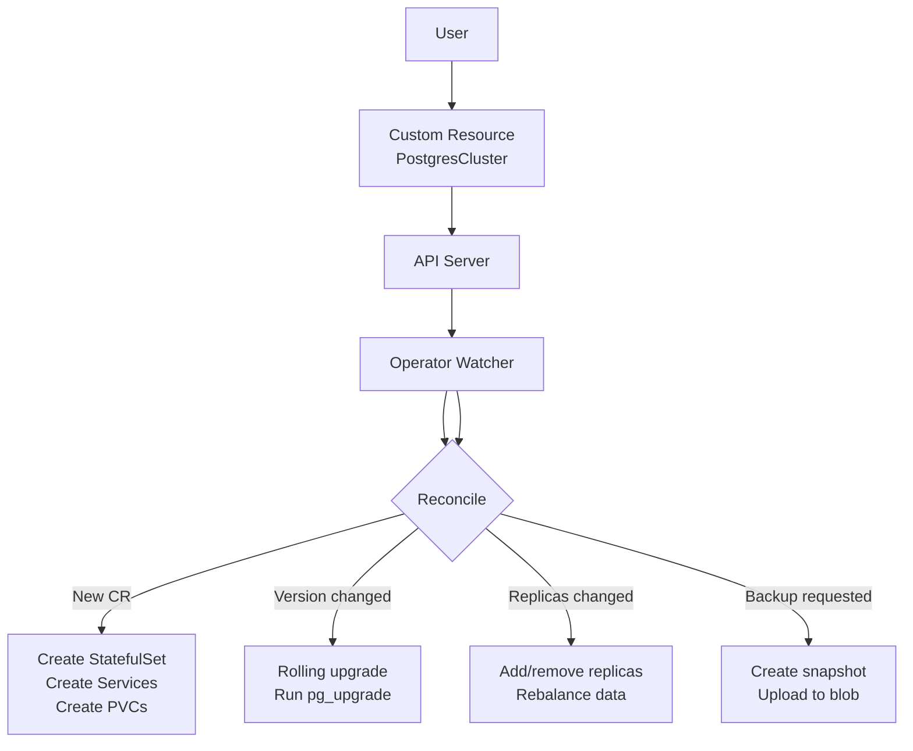

import { Info, Warning, Tip, BestPractice, Definition, Example, Analogy, CommonMistake, Debugging, Exercise, Quiz, CodeBlock, TerminalBlock, Flashcard, ProductionNote, ArchitectureNote, SecurityNote, CostNote, InterviewQuestion, CheatSheet } from '@site/src/components/shared/InteractiveBlocks';

export const CloudNova = ({ children }) => (
  <div style={{ borderLeft: '4px solid #0ea5e9', padding: '1rem 1.5rem', margin: '1.5rem 0', background: 'var(--ifm-color-emphasis-100)', borderRadius: '0 8px 8px 0' }}>
    <strong style={{ color: '#0ea5e9' }}>🏢 CloudNova Engineering</strong>
    <div style={{ marginTop: '0.5rem' }}>{children}</div>
  </div>
);

# Operators & Custom Resources

## The Problem: Day-2 Operations

Kubernetes handles Day-1 beautifully — deploying stateless apps is trivial. But Day-2 is hard:
- How do you upgrade PostgreSQL without downtime?
- How do you rebalance a Kafka cluster after adding nodes?
- How do you take a consistent backup and verify it?

An **Operator** encodes this operational knowledge in software.

<Analogy>

A regular Controller is like a thermostat — it keeps temperature at a set point. An Operator is like a **building management system** — it knows when to service the HVAC, rotate air filters, schedule maintenance, and can handle a power outage. It encodes the knowledge of an expert operator.

</Analogy>

---

## Custom Resource Definitions (CRDs)

CRDs extend the Kubernetes API with your own resource types:

```yaml
apiVersion: apiextensions.k8s.io/v1
kind: CustomResourceDefinition
metadata:
  name: postgresclusters.postgres.example.com
spec:
  group: postgres.example.com
  names:
    kind: PostgresCluster
    plural: postgresclusters
    singular: postgrescluster
    shortNames: ["pg"]
  scope: Namespaced
  versions:
  - name: v1
    served: true
    storage: true
    schema:
      openAPIV3Schema:
        type: object
        properties:
          spec:
            type: object
            properties:
              replicas:
                type: integer
                minimum: 1
                maximum: 5
              version:
                type: string
                pattern: '^\d+\.\d+$'
              storageGB:
                type: integer
                minimum: 10
```

<CodeBlock title="Using Your Custom Resource">
# Now users can create instances:
apiVersion: postgres.example.com/v1
kind: PostgresCluster
metadata:
  name: production-db
spec:
  replicas: 3
  version: "16.2"
  storageGB: 100
</CodeBlock>

---

## The Operator Pattern



<Definition term="Operator">

An Operator = **CRD** (the new API type) + **Controller** (the reconciliation logic) + **Domain Expertise** (encoded operational knowledge). The key difference from a plain controller is the domain-specific knowledge — a Postgres Operator knows how to safely upgrade Postgres, not just scale pods.

</Definition>

---

## When to Use Operators

<BestPractice>

| Situation | Use |
|-----------|-----|
| Stateless web app | ❌ Deployment + HPA is enough |
| Redis for caching | ❌ Helm chart is fine |
| PostgreSQL with automated failover | ✅ Operator |
| Kafka with rebalancing | ✅ Operator |
| Elasticsearch cluster management | ✅ Operator |
| Simple CRUD API | ❌ Just a Deployment |
| Automated cert management (cert-manager) | ✅ Operator |

**Rule of thumb**: If you'd need a human DBA/SRE to manage it, it needs an Operator. If `kubectl scale` is all you need, you don't.

</BestPractice>

---

## Popular Operators

| Operator | What It Manages |
|----------|----------------|
| **cert-manager** | TLS certificates (auto-renew, auto-issue) |
| **Prometheus Operator** | Prometheus, Alertmanager, Grafana config |
| **Postgres Operator (Zalando/Crunchy)** | PostgreSQL HA, backups, failover |
| **Strimzi** | Kafka clusters on Kubernetes |
| **Elastic Cloud on K8s (ECK)** | Elasticsearch, Kibana, APM |
| **External Secrets Operator** | Sync secrets from cloud providers |
| **Ingress NGINX** | (Actually a controller, often confused as an operator) |

---

## Simple Operator in 5 Minutes

<CodeBlock title="kopf Python Operator (simplest!)">
# requirements: pip install kopf kubernetes

import kopf
import kubernetes.client as k8s

@kopf.on.create('cloudnova.io', 'v1', 'websites')
def create_website(spec, name, namespace, **kwargs):
    """When someone creates a Website CR, deploy it."""
    
    deployment = k8s.V1Deployment(
        metadata=k8s.V1ObjectMeta(name=name),
        spec=k8s.V1DeploymentSpec(
            replicas=spec.get('replicas', 1),
            selector={'matchLabels': {'app': name}},
            template=k8s.V1PodTemplateSpec(
                metadata={'labels': {'app': name}},
                spec=k8s.V1PodSpec(
                    containers=[k8s.V1Container(
                        name='web',
                        image=spec['image'],
                        ports=[k8s.V1ContainerPort(container_port=80)]
                    )]
                )
            )
        )
    )
    
    api = k8s.AppsV1Api()
    api.create_namespaced_deployment(namespace, deployment)
    print(f"✅ Created deployment {name}")
</CodeBlock>

<Info>

Run it with: `kopf run operator.py --verbose`

This watches for `Website` custom resources and creates Deployments. It's the simplest possible operator — no state management, no upgrades, but it demonstrates the pattern.

</Info>

---

## CloudNova

<CloudNova>

CloudNova's platform team manages 50+ PostgreSQL instances manually — upgrades take hours, failover is manual, and a bad upgrade once caused 4 hours of downtime.

**Your proposal:**
1. Deploy the CloudNativePG (or Zalando) Postgres Operator
2. Define a PostgresCluster CRD with replicas, version, backup config
3. Demonstrate a zero-downtime minor version upgrade
4. Show automated failover when the primary pod is killed
5. Present the ROI: reducing operational toil from ~20 hours/month to ~2

</CloudNova>

---

## Quiz

<Quiz
  questions={[
    {
      question: "What distinguishes an Operator from a regular Controller?",
      options: [
        "Operators run outside the cluster",
        "Operators encode domain-specific operational knowledge (e.g., how to safely upgrade Postgres)",
        "Operators only work with StatefulSets",
        "There is no difference"
      ],
      correct: 1,
      explanation: "An Operator encodes an expert operator's knowledge — it knows how to upgrade, backup, failover, and manage the full lifecycle of a complex stateful application."
    },
    {
      question: "When should you NOT use an Operator?",
      options: [
        "For stateless, scalable web applications",
        "For managing PostgreSQL",
        "For managing TLS certificates",
        "For managing Kafka clusters"
      ],
      correct: 0,
      explanation: "Stateless apps can be managed with Deployments + HPA. Operators are for stateful, complex applications requiring operational expertise."
    }
  ]}
/>

---

## Active Recall

<Flashcard
  front="What's the Operator pattern equation?"
  back="**Operator = CRD + Controller + Domain Expertise**
- CRD: New API type the user interacts with
- Controller: Reconciliation loop (observe → compare → act)
- Domain Expertise: Encoded operational knowledge (how to safely upgrade Postgres, not just scale pods)"
/>

---

## Related

<KnowledgeLinks>
- **Next**: [CKA/CKAD Preparation](cka-ckad-prep)
- **Previous**: [Observability](observability)
- **Certification**: CKA Domain 4 — Troubleshooting (30%)
</KnowledgeLinks>
