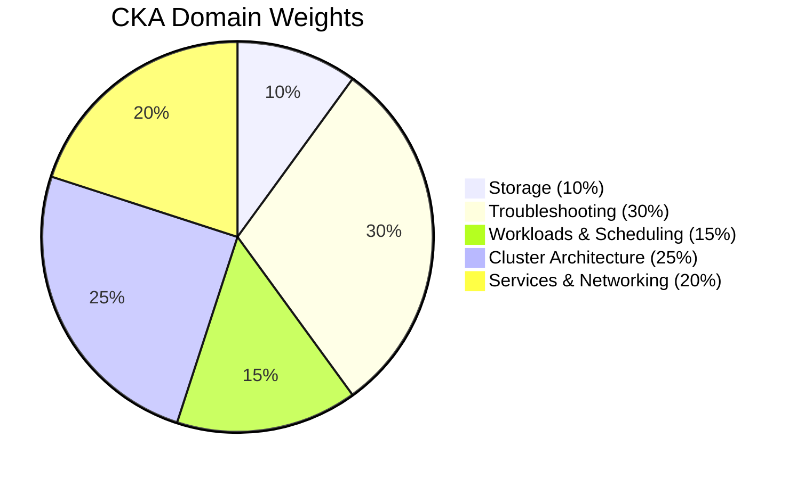

import { Info, Warning, Tip, BestPractice, Definition, Example, Analogy, CommonMistake, Debugging, Exercise, Quiz, CodeBlock, TerminalBlock, Flashcard, ProductionNote, ArchitectureNote, InterviewQuestion, CheatSheet } from '@site/src/components/shared/InteractiveBlocks';

# CKA/CKAD Exam Preparation

## Exam Overview

| | CKA | CKAD |
|---|-----|------|
| **Focus** | Cluster administration | Application development |
| **Duration** | 2 hours | 2 hours |
| **Format** | Hands-on, performance-based | Hands-on, performance-based |
| **Environment** | Remote Linux command line | Remote Linux command line |
| **Passing Score** | ~66% | ~66% |
| **Cost** | $395 (includes 1 retake) | $395 |

<Definition term="CKA (Certified Kubernetes Administrator)">

Tests your ability to **install, configure, and manage** production Kubernetes clusters. Focus: cluster architecture, networking, storage, security, troubleshooting.

</Definition>

<Definition term="CKAD (Certified Kubernetes Application Developer)">

Tests your ability to **design, build, and deploy** applications on Kubernetes. Focus: pods, deployments, config, services, troubleshooting apps.

</Definition>

---

## CKA Exam Domains (Weight)



---

## Critical Speed Tips

<BestPractice>

**1. Use imperative commands (NEVER write YAML from scratch)**

```bash
# DO THIS (fast):
kubectl create deployment nginx --image=nginx --replicas=3 --dry-run=client -o yaml > deploy.yaml

# NOT THIS (slow):
# Manually typing out 20 lines of YAML...
```

**2. Master `kubectl` dry-run + output**
```bash
kubectl run pod --image=nginx --dry-run=client -o yaml  # Pod
kubectl create deployment dep --image=nginx --dry-run=client -o yaml  # Deployment
kubectl create service clusterip svc --tcp=80:80 --dry-run=client -o yaml  # Service
```

**3. Set up aliases and autocomplete BEFORE the exam starts**
```bash
alias k=kubectl
export do="--dry-run=client -o yaml"
export now="--force --grace-period=0"
source <(kubectl completion bash)
```

**4. Use `kubectl explain` instead of searching docs**
```bash
kubectl explain deployment.spec.strategy
kubectl explain pod.spec.containers.resources --recursive
```

</BestPractice>

---

## Hands-On Practice Scenarios

<Exercise>

### Scenario A: CKA — Cluster Setup & Troubleshooting

```bash
# Task 1: Upgrade a cluster node
kubectl drain node-1 --ignore-daemonsets --delete-emptydir-data
# (Upgrade kubeadm/kubelet on node)
kubectl uncordon node-1

# Task 2: Fix a broken node
kubectl get nodes  # One is NotReady
ssh broken-node
systemctl status kubelet
journalctl -u kubelet -f
# Fix the issue, restart kubelet

# Task 3: Backup and restore etcd
ETCDCTL_API=3 etcdctl snapshot save /backup/etcd.db \
  --endpoints=https://127.0.0.1:2379 \
  --cacert=/etc/kubernetes/pki/etcd/ca.crt \
  --cert=/etc/kubernetes/pki/etcd/server.crt \
  --key=/etc/kubernetes/pki/etcd/server.key
```

### Scenario B: CKAD — Application Deployment

```bash
# Task: Deploy a multi-container pod with specific requirements
# Pod: web-app
# Container 1: nginx:1.25, port 80, env APP_ENV=production
# Container 2: redis:7, port 6379
# Volume: shared emptyDir at /cache (both containers)
# Resource: nginx requests 128Mi/250m, limits 256Mi/500m

# Fastest approach:
kubectl run web-app --image=nginx:1.25 --dry-run=client -o yaml > pod.yaml
# Edit pod.yaml to add the second container, volume, resources
kubectl apply -f pod.yaml
```

</Exercise>

---

## Common Exam Mistakes

<CommonMistake>

1. **Reading documentation too much**: The exam is 2 hours. Don't spend 30 minutes reading docs for one question. Flag it and move on.

2. **Not switching contexts**: Every question specifies the cluster context. Always run: `kubectl config use-context <context>` first.

3. **Forgetting to save**: Changes are auto-saved, but always verify your work: `kubectl get <resource> -o yaml` to confirm.

4. **Perfect YAML**: The exam isn't a YAML formatting contest. If it works, it scores. Imperative commands are your friend.

5. **Not practicing with a timer**: Take at least 2 timed practice exams before the real thing.

</CommonMistake>

---

## Recommended Practice Flow

<Tip>

**30-Day Study Plan:**

| Week | Focus | Activities |
|------|-------|------------|
| 1 | Core concepts | Pods, Deployments, Services, ConfigMaps |
| 2 | Advanced | Storage, RBAC, NetworkPolicies, Ingress |
| 3 | Cluster ops | etcd backup, cluster upgrade, node management |
| 4 | Practice | Timed exams, troubleshooting drills, speed practice |

**Daily practice**: Killercoda, Play with Kubernetes, or local `kind` cluster.

</Tip>

---

## Quiz

<Quiz
  questions={[
    {
      question: "What's the most important speed technique for the CKA/CKAD exams?",
      options: [
        "Writing YAML from scratch correctly",
        "Using kubectl imperative commands with --dry-run to generate YAML",
        "Reading the Kubernetes documentation",
        "Using the Kubernetes dashboard"
      ],
      correct: 1,
      explanation: "Imperative commands with `--dry-run=client -o yaml` save enormous time. You generate the skeleton and tweak it, rather than writing 20+ lines from memory."
    },
    {
      question: "Which exam domain has the highest weight in CKA?",
      options: ["Storage", "Troubleshooting", "Workloads", "Cluster Architecture"],
      correct: 1,
      explanation: "Troubleshooting is 30% of the CKA exam — the largest single domain. Practice diagnosing broken clusters, pods, and networking issues extensively."
    },
    {
      question: "Before starting any exam question, what should you ALWAYS do first?",
      options: [
        "Read the Kubernetes docs",
        "Switch to the correct cluster context",
        "Create a backup",
        "Check the node status"
      ],
      correct: 1,
      explanation: "Every question specifies a context. If you answer in the wrong context, you get zero points even if your solution is perfect."
    }
  ]}
/>

---

## Active Recall

<Flashcard
  front="What are the 5 CKA exam domains and their weights?"
  back="1. **Cluster Architecture, Installation & Configuration**: 25%
2. **Workloads & Scheduling**: 15%
3. **Services & Networking**: 20%
4. **Storage**: 10%
5. **Troubleshooting**: 30%"
/>

<Flashcard
  front="What's the fastest way to create a Deployment with specific settings in the exam?"
  back="```bash
kubectl create deployment NAME --image=IMG --replicas=X --port=Y \
  --dry-run=client -o yaml > deploy.yaml
# Edit as needed, then apply
kubectl apply -f deploy.yaml
```
This generates the YAML skeleton in seconds. Never hand-type YAML from scratch."
/>

---

## Interview

<InterviewQuestion difficulty="medium" certification="CKA">

**Question**: "You notice one node in your cluster is NotReady. Walk me through your troubleshooting process."

**Answer**: 
1. `kubectl describe node <name>` — check Conditions section
2. SSH to node, check `systemctl status kubelet` and `journalctl -u kubelet`
3. Check disk (`df -h`), memory (`free -m`), CPU (`top`)
4. Check container runtime: `crictl ps`, `systemctl status containerd`
5. Verify network connectivity to API server
6. Common fixes: restart kubelet, clear disk space, fix DNS, restart container runtime

</InterviewQuestion>

---

## Related

<KnowledgeLinks>
- **Previous**: [Operators & CRDs](operators-crds)
- **Start of Module**: [Kubernetes Architecture](k8s-architecture)
- **Related**: [Certification Center](/certifications)
- **Practice**: [Killer.sh](https://killer.sh) — official exam simulator
</KnowledgeLinks>
