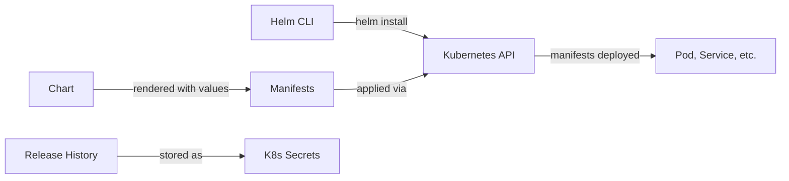
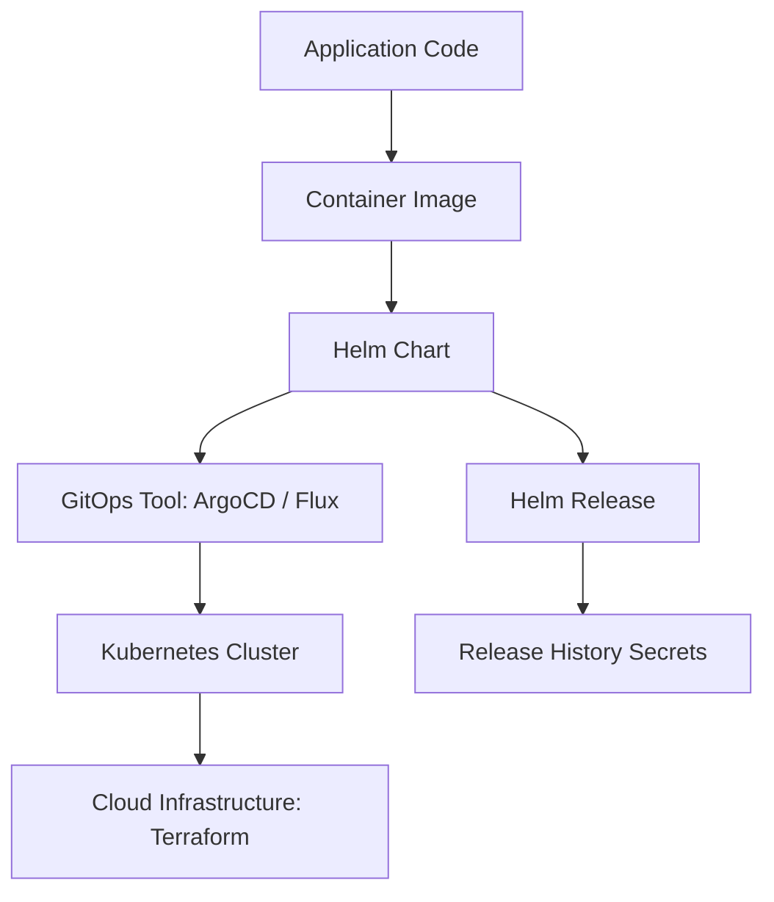

## The Package Management Problem in Kubernetes

### Simple

Imagine you need to deploy WordPress on Kubernetes. Without Helm, you'd need:

- A Deployment manifest for WordPress (~50 lines)
- A Service manifest (~20 lines)
- A ConfigMap for wp-config.php (~15 lines)
- A Secret for database credentials (~10 lines)
- A PersistentVolumeClaim (~15 lines)
- A Deployment for MySQL (~50 lines)
- A Service for MySQL (~20 lines)
- An Ingress (~15 lines)

That's **~200 lines of YAML** for a simple app. Now multiply by 50 microservices. You'd drown in YAML.

**Helm solves this by packaging all of that into a single installable unit** — a chart.

One command replaces 200 lines:

```bash
helm install my-blog bitnami/wordpress
```

### Core

Helm is more than just a templating engine. Its architecture consists of:

1. **Helm CLI** — the client binary you run on your machine
2. **Helm SDK** — a Go library for programmatic Helm usage (used by tools like ArgoCD, Flux)
3. **Charts** — the package format; a directory with `Chart.yaml`, `templates/`, `values.yaml`
4. **Releases** — an installed instance of a chart in a Kubernetes cluster
5. **Repositories** — HTTP servers serving `index.yaml` that list available charts

The flow is:



### Professional

Helm's release lifecycle is critical for production operations:

| Action        | Command          | What Happens                            |
| ------------- | ---------------- | --------------------------------------- |
| **Install**   | `helm install`   | First deploy of a release               |
| **Upgrade**   | `helm upgrade`   | Apply changes to existing release       |
| **Rollback**  | `helm rollback`  | Revert to previous revision             |
| **Uninstall** | `helm uninstall` | Remove release + optionally its history |
| **List**      | `helm list`      | See all releases in namespace           |
| **History**   | `helm history`   | View all revisions of a release         |
| **Test**      | `helm test`      | Run chart-defined tests                 |

Revisions are stored as Kubernetes Secrets (by default) — one per revision. This is why you can always rollback.

### Production

**Production Helm patterns:**

1. **OCI registries over legacy repos** — `helm push` to Azure Container Registry, not an HTTP server. OCI supports signing, retention policies, and RBAC.

```bash
# OCI pattern (modern)
helm push mychart-1.0.tgz oci://myregistry.azurecr.io/helm
helm install myapp oci://myregistry.azurecr.io/helm/mychart --version 1.0
```

2. **Umbrella charts** — one chart that depends on others. Deploy an entire application stack as one unit.

3. **Library charts** — reusable template helpers. Write once, use everywhere.

4. **Values hierarchy** — values are merged: `chart default values.yaml < parent chart values < user --values file < --set flags`. Always know your merge order.

### Architect

Helm sits at a specific layer in the cloud-native stack. Understanding this helps you make architectural decisions:



**Key architectural insight:** Helm is NOT an infrastructure tool. It manages Kubernetes resources, not cloud resources. The boundary is:

- **Terraform/Crossplane** → Cloud resources (AKS, VNets, databases)
- **Helm** → Kubernetes-native resources (Deployments, Services, Ingresses)
- **Together** → Complete application platform

---

## CloudNova Scenario

> **Ticket #CN-1147** — The CloudNova DevOps team is drowning. Every deployment needs 12 separate YAML files to be applied in the correct order. Last week, a junior engineer applied a Deployment without the corresponding Service, and the monitoring went down for 45 minutes. Your tech lead asks you to evaluate Helm and propose a rollout strategy for the Spring PetClinic microservices app.

**Your task:** Install Helm, add the Bitnami repo, and deploy a sample application to prove the concept. Document the commands and estimate time savings.

---

## Deep Dive: Template Rendering

Helm uses Go templates with Sprig functions. The template pipeline:

```yaml
# templates/service.yaml
apiVersion: v1
kind: Service
metadata:
  name: {{ include "mychart.fullname" . }}
  labels:
    {{- include "mychart.labels" . | nindent 4 }}
spec:
  type: {{ .Values.service.type }}
  ports:
    - port: {{ .Values.service.port }}
      targetPort: http
      protocol: TCP
  selector:
    {{- include "mychart.selectorLabels" . | nindent 4 }}
```

**Key template functions:**

- `{{ .Values.x }}` — access values
- `{{ include "named-template" . }}` — reuse named templates
- `{{-` vs `{{` — dash trims whitespace
- `| nindent N` — indent with newline
- `| quote` — add quotes
- `| default "fallback"` — provide defaults

---

## Hands-On Exercise

```bash
# 1. Install Helm (Linux/macOS)
curl https://raw.githubusercontent.com/helm/helm/main/scripts/get-helm-3 | bash

# 2. Verify installation
helm version

# 3. Add stable repos
helm repo add bitnami https://charts.bitnami.com/bitnami
helm repo update

# 4. Search for packages
helm search repo nginx

# 5. Install with custom values
helm install my-nginx bitnami/nginx \
  --set service.type=ClusterIP \
  --set replicaCount=2

# 6. Inspect the release
helm list
helm status my-nginx
helm get values my-nginx
helm get manifest my-nginx

# 7. View revision history
helm history my-nginx

# 8. Clean up
helm uninstall my-nginx
```

---

## Active Recall

1. What problem does Helm solve that plain kubectl cannot?
2. Where does Helm store release history? Why is this important?
3. What's the difference between a chart, a release, and a repository?
4. How does the values merge order work during `helm install`?
5. Why would you use an OCI registry instead of a traditional Helm repo?

---

## Feynman Exercise

Explain Helm to a developer who has never used Kubernetes but understands npm. Cover: charts (like packages), repositories (like npm registry), releases (like installed packages), and values (like package.json config). Keep it under 3 minutes.

---

## Flashcards

**Q:** What command installs a Helm chart for the first time?
**A:** `helm install <release-name> <chart>`

**Q:** What command applies changes to an existing Helm release?
**A:** `helm upgrade <release-name> <chart>`

**Q:** Where are Helm release revisions stored by default?
**A:** As Kubernetes Secrets in the release's namespace

**Q:** What is the modern alternative to traditional HTTP Helm repositories?
**A:** OCI registries (e.g., Azure Container Registry, Docker Hub)

---

## Interview Questions

1. **"Walk me through how Helm renders a chart."** — Explain the template engine (Go templates + Sprig), the `.Values` object, helper templates, and how the combined YAML is sent to the Kubernetes API.

2. **"How do you manage secrets in Helm?"** — Discuss secrets management options: `values.yaml` (bad), `--set` (worse), `helm-secrets` plugin with SOPS/Mozilla, external secrets operator, and referencing Key Vault from templates.

3. **"What happens when `helm upgrade` fails?"** — Helm automatically rolls back to the last successful revision. You can also manually `helm rollback`.

---

## Related Content

- [Kubernetes Architecture →](/alp-001/10-kubernetes/lessons/01-kubernetes-architecture)
- [GitOps with ArgoCD →](/alp-001/18-gitops)
- [Container Registries & CI/CD →](/alp-001/09-docker/lessons/04-container-registries)

---

**Next Lesson:** [Chart Development →](./02-chart-development)
