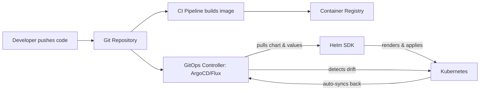
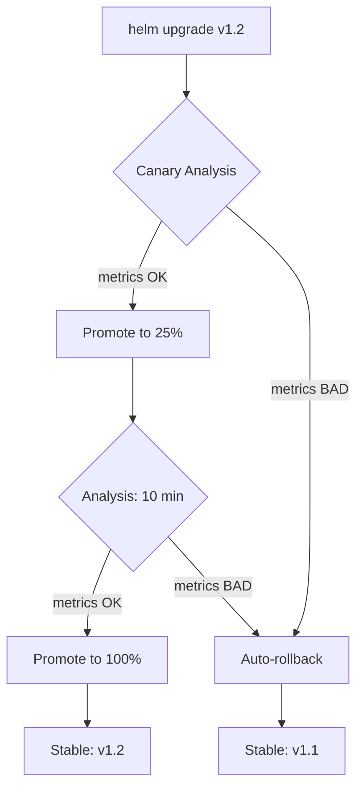

## Helm in Production: Beyond the Basics

### Simple

In production, "just run `helm install`" isn't enough. You need:

1. **Version pinning** — every chart and app version locked
2. **Secret management** — no secrets in values.yaml (ever)
3. **GitOps integration** — Git as source of truth, not CLI
4. **Release tracking** — who deployed what and when
5. **Safe rollback** — guaranteed recovery from bad deployments

### Core

**The GitOps pattern with Helm:**



The key difference from manual Helm: **the cluster state is continuously reconciled against the Git repository**. If someone manually changes a Deployment, the GitOps controller reverts it.

**Flux HelmRelease example:**

```yaml
apiVersion: helm.toolkit.fluxcd.io/v2
kind: HelmRelease
metadata:
  name: petclinic
  namespace: production
spec:
  interval: 5m
  chart:
    spec:
      chart: petclinic
      version: "1.2.3"
      sourceRef:
        kind: HelmRepository
        name: cloudnova-charts
      interval: 1m
  values:
    replicaCount: 3
    ingress:
      enabled: true
      host: petclinic.cloudnova.io
```

### Professional

**Helmfile** — manage dozens of Helm releases declaratively:

```yaml
# helmfile.yaml
repositories:
  - name: bitnami
    url: oci://myregistry.azurecr.io/helm

releases:
  - name: ingress-nginx
    namespace: ingress
    chart: bitnami/nginx-ingress-controller
    version: 9.x.x

  - name: cert-manager
    namespace: cert-manager
    chart: bitnami/cert-manager
    version: 1.x.x
    needs:
      - ingress/ingress-nginx

  - name: petclinic-db
    namespace: petclinic
    chart: bitnami/postgresql
    version: 15.x.x
    values:
      - ./environments/prod/petclinic-db-values.yaml

  - name: petclinic-app
    namespace: petclinic
    chart: ./charts/petclinic
    version: 1.2.3
    needs:
      - petclinic/petclinic-db
    values:
      - ./environments/prod/petclinic-values.yaml
```

Key Helmfile commands:
```bash
helmfile diff          # Show what would change
helmfile apply         # Apply all releases in order
helmfile destroy       # Remove all releases
helmfile --environment prod apply  # Environment-specific
```

### Production

**Secret management strategies ranked:**

| Strategy | Security | Complexity | Recommendation |
|----------|----------|------------|----------------|
| `values.yaml` plaintext | ❌ Dangerous | Low | Never in production |
| `--set` on CLI | ❌ In shell history | Low | Never |
| `helm-secrets` + SOPS | ✅ Good | Medium | Good for encrypted values in Git |
| External Secrets Operator | ✅✅ Better | Medium | Syncs from Key Vault to K8s Secrets |
| CSI Secret Store Driver | ✅✅✅ Best | Higher | Mounts secrets directly, never stored in K8s |

**CSI Secret Store example:**

```yaml
apiVersion: secrets-store.csi.x-k8s.io/v1
kind: SecretProviderClass
metadata:
  name: azure-kv-petclinic
spec:
  provider: azure
  parameters:
    keyvaultName: cloudnova-kv
    objects: |
      array:
        - |
          objectName: db-password
          objectType: secret
    tenantId: ${TENANT_ID}
```

Then in your Deployment, mount the secret as a volume — no Helm values involved at all.

### Architect

**Progressive delivery with Helm:**



Argo Rollouts integrates with Helm for blue-green and canary deployments:

```yaml
apiVersion: argoproj.io/v1alpha1
kind: Rollout
metadata:
  name: petclinic
spec:
  strategy:
    canary:
      steps:
        - setWeight: 10
        - pause: { duration: 10m }
        - setWeight: 50
        - pause: { duration: 10m }
        - setWeight: 100
```

---

## CloudNova Scenario

> **INCIDENT #CN-2024** — The PetClinic Helm chart was upgraded to v2.0 last night. This morning, customers report 500 errors on the `/owners` endpoint. The database migration hook timed out, but the deployment proceeded anyway because the hook wasn't configured with `hook-failed` deletion policy. You need to diagnose, rollback safely, and implement proper hook failure handling.

**Your task:** Rollback to v1.9, investigate the migration timeout, and configure the hook with proper failure policies and resource limits.

---

## Hands-On: OCI Registry Setup

```bash
# 1. Create Azure Container Registry (if not exists)
az acr create -n cloudnovaregistry -g cloudnova-rg --sku Premium

# 2. Login to ACR with Helm
export HELM_EXPERIMENTAL_OCI=1
helm registry login cloudnovaregistry.azurecr.io \
  --username $(az acr credential show -n cloudnovaregistry --query username -o tsv) \
  --password $(az acr credential show -n cloudnovaregistry --query passwords[0].value -o tsv)

# 3. Push a chart to OCI
helm package ./charts/petclinic
helm push petclinic-2.0.0.tgz oci://cloudnovaregistry.azurecr.io/helm

# 4. Verify in registry
helm registry list

# 5. Install from OCI
helm install petclinic-prod oci://cloudnovaregistry.azurecr.io/helm/petclinic \
  --version 2.0.0 \
  --values environments/prod/values.yaml
```

---

## Active Recall

1. What's the fundamental difference between using Helm directly vs Helm through a GitOps controller?
2. How does Helmfile manage release ordering with `needs`?
3. What are the four secret management strategies for Helm, ranked by security?
4. Why pin chart versions in production instead of using semver ranges?
5. How does the CSI Secret Store Driver avoid storing secrets in Kubernetes Secrets?

---

## Feynman Exercise

Explain GitOps with Helm to a traditional sysadmin. Cover: why Git becomes the source of truth, how the controller continuously reconciles, and why this prevents configuration drift. Use the analogy of a thermostat (desired state vs actual state).

---

## Flashcards

**Q:** What is the recommended way to distribute Helm charts in production today?
**A:** OCI registries (e.g., Azure Container Registry)

**Q:** What tool manages multiple Helm releases declaratively with ordering?
**A:** Helmfile

**Q:** What's the most secure way to handle secrets in Helm charts?
**A:** CSI Secret Store Driver — mounts secrets from Key Vault, never stored in K8s

**Q:** What command safely checks what a Helm upgrade would change?
**A:** `helm diff upgrade` (helm-diff plugin) or `helm upgrade --dry-run`

---

## Interview Questions

1. **"A Helm release failed mid-upgrade. Walk me through your response."** — Cover: check release status (`helm list`, `helm history`), review pod logs for hook failures, `helm rollback`, investigate hook deletion policies, fix root cause, and improve hook resilience (timeouts, retries, failure policies).

2. **"How do you prevent configuration drift when using Helm in a team?"** — Discuss GitOps with ArgoCD/Flux, drift detection, auto-sync, notifications, and RBAC to prevent direct kubectl access.

3. **"Compare Helmfile, Kustomize, and raw Helm — when would you choose each?"** — Helm for packaging and templating, Kustomize for patching without templates, Helmfile for multi-release orchestration.

---

## Related Content

- [Helm Architecture →](./01-helm-architecture)
- [Chart Development →](./02-chart-development)
- [GitOps →](/alp-001/18-gitops)
- [Kubernetes RBAC →](/alp-001/10-kubernetes/lessons/06-rbac-security)

---

**Previous Lesson:** [Chart Development ←](./02-chart-development)
