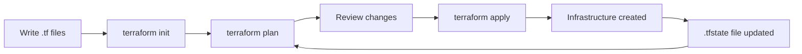
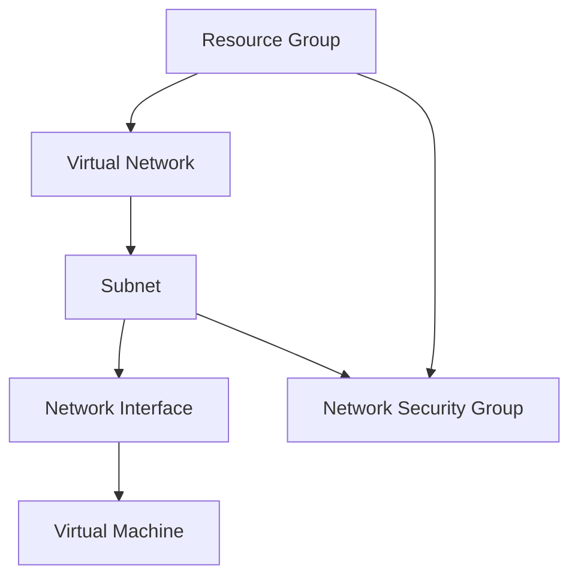
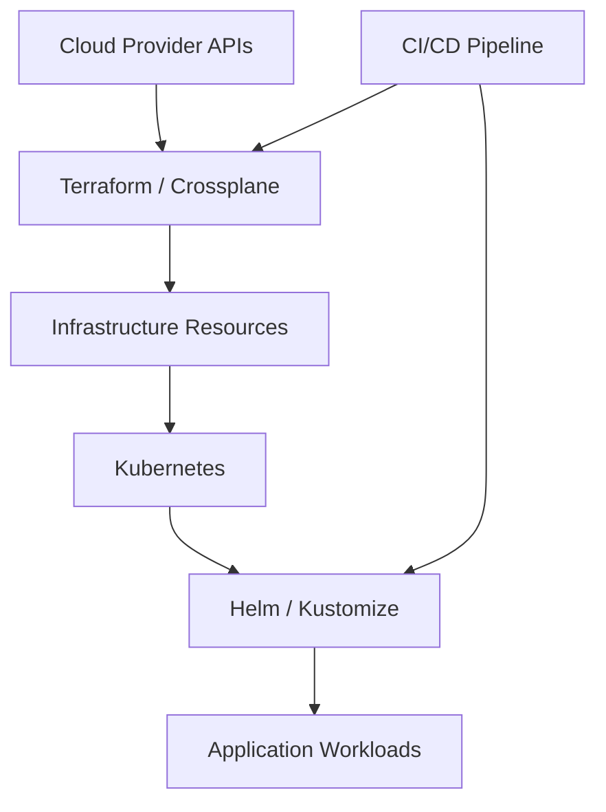

## Infrastructure as Code: The Foundation

### Simple

Before IaC, you deployed infrastructure by clicking through portals or running CLI commands. It worked — until you needed to recreate the exact same setup 6 months later. Or your coworker needed to deploy it. Or an auditor asked for your infrastructure inventory.

**Terraform solves this:** you write configuration files describing what you want (a VNet with these subnets, a VM with this size), and Terraform makes it real.

Basic Terraform for an Azure resource group:

```hcl
terraform {
  required_providers {
    azurerm = {
      source  = "hashicorp/azurerm"
      version = "~> 3.0"
    }
  }
}

provider "azurerm" {
  features {}
  subscription_id = var.subscription_id
}

resource "azurerm_resource_group" "main" {
  name     = "cloudnova-rg"
  location = "West Europe"
}
```

### Core

Terraform's core workflow:



**The four essential Terraform commands:**

| Command             | Purpose                                       |
| ------------------- | --------------------------------------------- |
| `terraform init`    | Download providers, initialize backend        |
| `terraform plan`    | Show what will change (create/update/destroy) |
| `terraform apply`   | Execute the plan, make changes real           |
| `terraform destroy` | Tear down everything                          |

### Professional

**The HCL language constructs you need daily:**

```hcl
# Variables: parameterize your configuration
variable "environment" {
  type        = string
  description = "Deployment environment (dev/staging/prod)"
  default     = "dev"

  validation {
    condition     = contains(["dev", "staging", "prod"], var.environment)
    error_message = "Environment must be dev, staging, or prod"
  }
}

# Locals: computed values, don't expose to callers
locals {
  resource_prefix = "${var.project}-${var.environment}"
  common_tags = {
    Environment = var.environment
    Project     = var.project
    ManagedBy   = "Terraform"
  }
}

# Resource with dynamic expressions
resource "azurerm_virtual_network" "main" {
  name                = "${local.resource_prefix}-vnet"
  location            = azurerm_resource_group.main.location
  resource_group_name = azurerm_resource_group.main.name
  address_space       = var.vnet_address_space

  tags = local.common_tags
}

# Outputs: expose values to users and other modules
output "vnet_id" {
  value       = azurerm_virtual_network.main.id
  description = "The ID of the VNet for use in other configurations"
}
```

**Resource dependencies** are automatic — Terraform reads your configuration and builds a dependency graph:



### Production

Production Terraform requires discipline:

1. **Never store state locally** — use remote backends (Azure Storage, Terraform Cloud)
2. **Lock state during operations** — prevent two people applying simultaneously
3. **Use modules** — don't copy-paste; build reusable infrastructure blocks
4. **Version pin providers** — `~> 3.0` not `>= 3.0`
5. **Tag everything** — cost tracking, ownership, environment
6. **Use workspaces or separate directories** — isolate dev/staging/prod

### Architect

Where Terraform fits in the infrastructure continuum:



Terraform manages **cloud resources** (VMs, VNets, databases, AKS). Helm manages **Kubernetes resources** (Deployments, Services). Together they form a complete platform pipeline.

---

## CloudNova Scenario

> **SPRINT TASK #CN-1301** — CloudNova's infrastructure has been manually provisioned since the startup's founding. Now with 47 resources across 3 environments, nobody knows what's deployed where. The CTO mandates that all new infrastructure must be provisioned via Terraform starting with the AKS staging cluster. You've been assigned to write the Terraform configuration.

**Your task:** Write Terraform to provision: Resource Group → VNet → Subnet → AKS cluster. Use variables for environment-specific values. Run `terraform plan` and verify the output before applying.

---

## Hands-On Exercise

```bash
# 1. Install Terraform
wget https://releases.hashicorp.com/terraform/1.7.0/terraform_1.7.0_linux_amd64.zip
unzip terraform_1.7.0_linux_amd64.zip
sudo mv terraform /usr/local/bin/
terraform --version

# 2. Create your first configuration
mkdir terraform-demo && cd terraform-demo

cat > main.tf << 'EOF'
terraform {
  required_providers {
    azurerm = { source = "hashicorp/azurerm", version = "~> 3.0" }
  }
}
provider "azurerm" { features {} }
resource "azurerm_resource_group" "demo" {
  name     = "terraform-demo-rg"
  location = "West Europe"
}
EOF

# 3. Initialize (downloads Azure provider)
terraform init

# 4. Plan (see what will be created)
terraform plan

# 5. Apply (create resources)
terraform apply

# 6. Verify in Azure
az group show --name terraform-demo-rg

# 7. Clean up
terraform destroy
```

---

## Active Recall

1. What problem does Infrastructure as Code solve?
2. What does `terraform init` do and when must you run it?
3. How does Terraform know the order to create resources?
4. What is the Terraform state file and why must you never delete it?
5. What's the difference between a variable and a local in HCL?

---

## Feynman Exercise

Explain Terraform to a traditional datacenter admin who provisions servers by racking hardware and running shell scripts. Cover: how writing .tf files is like writing a server build sheet, how `terraform plan` is like dry-running your build procedure, and how state is like your inventory spreadsheet.

---

## Flashcards

**Q:** What command downloads providers and initializes the Terraform working directory?
**A:** `terraform init`

**Q:** What command shows infrastructure changes before making them?
**A:** `terraform plan`

**Q:** What file type holds Terraform configuration?
**A:** `.tf` files, written in HCL (HashiCorp Configuration Language)

**Q:** Where should Terraform state be stored in production?
**A:** A remote backend like Azure Storage or Terraform Cloud

---

## Interview Questions

1. **"Walk me through what happens from `terraform init` to `terraform apply`."** — Cover: init downloads providers, validates syntax, plan queries current state and builds dependency graph, plan shows diff, apply executes changes via provider API calls, state file updated.

2. **"How do you manage Terraform state in a team?"** — Discuss remote backends, state locking, workspaces, access control on the storage account, and never storing state in Git.

3. **"What's the difference between Terraform and Ansible?"** — Terraform: declarative provisioning (create infrastructure). Ansible: procedural configuration management (configure servers). They complement each other — Terraform provisions the VM, Ansible configures it.

---

## Related Content

- [State Management →](./02-state-management)
- [Azure Core Services →](/alp-001/07-azure-core)
- [CI/CD →](/alp-001/15-cicd)

---

**Next Lesson:** [State Management →](./02-state-management)
