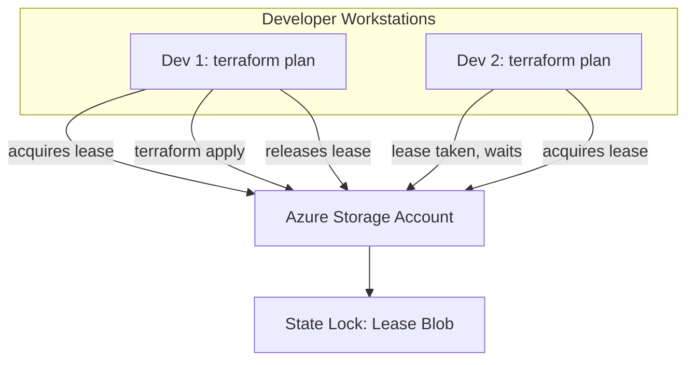

## State: Terraform's Source of Truth

### Simple

When you run `terraform apply`, Terraform writes a file called `terraform.tfstate`. This file maps your `.tf` configuration to real cloud resources. Think of it as Terraform's memory — without it, Terraform can't know what it has already created.

**Never delete terraform.tfstate.** If you do, Terraform will try to create duplicate resources or lose track of existing ones.

### Core

The state file contains:

```json
{
  "version": 4,
  "terraform_version": "1.7.0",
  "serial": 15,
  "resources": [
    {
      "mode": "managed",
      "type": "azurerm_resource_group",
      "name": "main",
      "provider": "provider[\"registry.terraform.io/hashicorp/azurerm\"]",
      "instances": [
        {
          "attributes": {
            "id": "/subscriptions/.../resourceGroups/cloudnova-rg",
            "location": "westeurope",
            "name": "cloudnova-rg"
          }
        }
      ]
    }
  ]
}
```

Every time you run `terraform plan`, Terraform:

1. Refreshes state from the cloud (verifying resources still exist)
2. Compares your `.tf` files to the state
3. Shows you the difference

### Professional

**Remote backends are mandatory for teams.** Local state leads to conflicts, lost state, and infrastructure drift.

**Azure Storage backend configuration:**

```hcl
terraform {
  backend "azurerm" {
    resource_group_name  = "terraform-rg"
    storage_account_name = "cloudnovaterraform"
    container_name       = "tfstate"
    key                  = "prod/aks.terraform.tfstate"
  }
}
```

**Benefits of remote backends:**

- **Shared state** — entire team sees the same infrastructure picture
- **State locking** — prevents two people applying simultaneously
- **Encryption** — state at rest is encrypted (may contain secrets!)
- **Versioning** — Azure Storage blob versioning keeps state history



### Production

**State migration** — moving from local to remote:

```bash
# 1. Add backend block to your configuration
# 2. Initialize with migration
terraform init -migrate-state

# This moves your local state to Azure Storage
# and switches to the remote backend
```

**Workspaces** provide environment isolation within a single configuration:

```bash
terraform workspace new dev
terraform workspace new staging
terraform workspace new prod

# Each workspace has its own state file
terraform workspace select prod
terraform apply  # Applies only to prod workspace
```

**Workspace vs directory isolation:**

| Approach    | When to Use                                      |
| ----------- | ------------------------------------------------ |
| Workspaces  | Same config, different parameters (environments) |
| Directories | Completely different infrastructure (components) |

### Architect

**State file contains secrets — protect it:**

- Use Azure Storage with encryption enabled
- Apply RBAC — only pipeline service principal + platform engineers
- Enable storage account firewall
- Never store state in public Git repositories
- Consider Terraform Cloud for built-in state security

**State surgery — the nuclear option (only when absolutely necessary):**

```bash
# Remove a resource from state without destroying it
terraform state rm azurerm_virtual_network.old_vnet

# Import an existing resource into state
terraform import azurerm_resource_group.main \
  /subscriptions/.../resourceGroups/cloudnova-rg

# Move a resource to a different address
terraform state mv azurerm_vm.old_name azurerm_vm.new_name

# List everything in state
terraform state list
```

> **⚠️ Warning:** State surgery is dangerous. Always back up state first. Always run `terraform plan` after surgery to verify.

---

## Hands-On: Setting Up Azure Remote Backend

```bash
#!/bin/bash
# One-time setup of the backend infrastructure
RESOURCE_GROUP="terraform-rg"
STORAGE_ACCOUNT="cloudnova$(openssl rand -hex 4)"  # Must be globally unique
CONTAINER="tfstate"
LOCATION="westeurope"

# Create resource group and storage account
az group create -n $RESOURCE_GROUP -l $LOCATION
az storage account create -n $STORAGE_ACCOUNT -g $RESOURCE_GROUP \
  --sku Standard_LRS --kind StorageV2
az storage container create -n $CONTAINER \
  --account-name $STORAGE_ACCOUNT

echo "Backend configured:"
echo "  storage_account_name: $STORAGE_ACCOUNT"
echo "  container_name: $CONTAINER"
echo "  key: prod/terraform.tfstate"
```

---

## Active Recall

1. What happens if you delete `terraform.tfstate`?
2. How does state locking prevent conflicts in a team?
3. What's the difference between workspaces and separate directories?
4. Why should you never commit state files to Git?
5. What command lets you import existing cloud resources into Terraform?

---

## Flashcards

**Q:** What command migrates state from local to a remote backend?
**A:** `terraform init -migrate-state`

**Q:** What Azure service is commonly used as a Terraform remote backend?
**A:** Azure Storage Account (blob storage with lease-based locking)

**Q:** How do you import an existing resource into Terraform state?
**A:** `terraform import <resource_type.resource_name> <resource_id>`

**Q:** What command lists all resources currently tracked in state?
**A:** `terraform state list`

---

## Related Content

- [Terraform Fundamentals ←](./01-terraform-fundamentals)
- [Modules & Composition →](./03-modules-composition)
- [Azure Storage →](/alp-001/07-azure-core/lessons/03-storage-services)

---

**Previous:** [Terraform Fundamentals ←](./01-terraform-fundamentals)
**Next:** [Modules & Composition →](./03-modules-composition)
