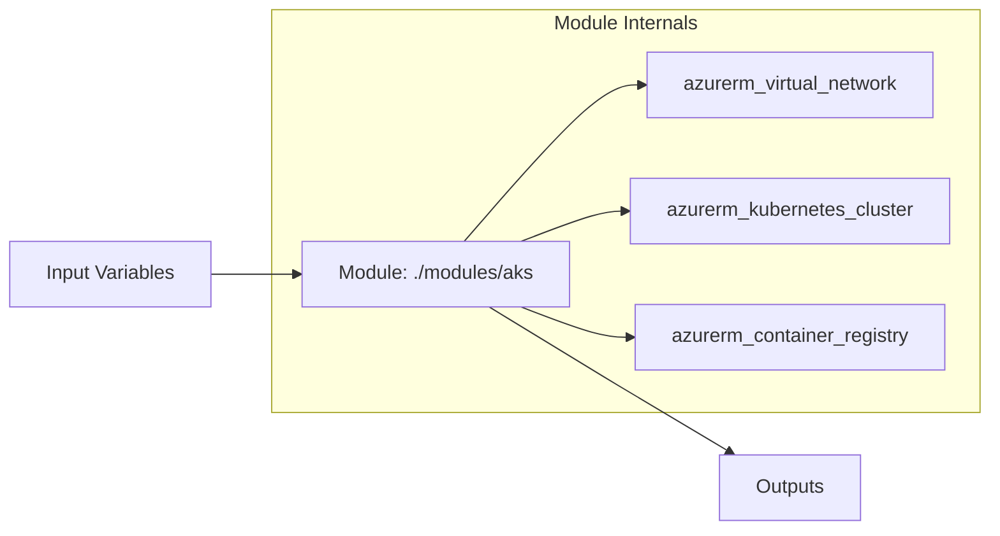

## Don't Copy-Paste Infrastructure

### Simple

When you need to provision 3 identical AKS clusters (dev, staging, prod), you could copy-paste the same 200 lines of HCL three times. But then every change requires updating 3 files. You'll miss one. Things will drift.

**Modules solve this.** Write once. Instantiate many times with different parameters.

```hcl
# Without modules: 600 lines across 3 files
# With modules: 50 lines calling the same module 3 times

module "dev_cluster" {
  source      = "./modules/aks"
  environment = "dev"
  node_count  = 2
  vm_size     = "Standard_B2s"
}

module "staging_cluster" {
  source      = "./modules/aks"
  environment = "staging"
  node_count  = 3
  vm_size     = "Standard_D2s_v3"
}

module "prod_cluster" {
  source      = "./modules/aks"
  environment = "prod"
  node_count  = 5
  vm_size     = "Standard_D4s_v3"
}
```

### Core

A Terraform module is simply a directory with `.tf` files. It takes input variables, creates resources, and exposes outputs:



**Module structure:**

```
modules/aks/
├── main.tf           # Core resources
├── variables.tf      # Input variable declarations
├── outputs.tf        # Output value declarations
├── versions.tf       # Provider version constraints
└── README.md         # Usage documentation
```

### Professional

**Module composition patterns:**

```hcl
# Layer 1: Networking foundation
module "network" {
  source = "./modules/network"
  vnet_address_space = ["10.0.0.0/16"]
  subnets = {
    aks      = "10.0.1.0/24"
    database = "10.0.2.0/24"
    appgw    = "10.0.3.0/24"
  }
}

# Layer 2: AKS cluster (depends on network)
module "aks" {
  source     = "./modules/aks"
  subnet_id  = module.network.subnet_ids["aks"]
  depends_on = [module.network]
}

# Layer 3: Applications (depends on AKS)
module "petclinic" {
  source              = "./modules/helm-release"
  aks_cluster_id      = module.aks.cluster_id
  chart_name          = "petclinic"
  chart_version       = "2.1.0"
  depends_on          = [module.aks]
}
```

**Module sources:**

| Source Type | Example                                                           |
| ----------- | ----------------------------------------------------------------- |
| Local       | `source = "./modules/network"`                                    |
| Git         | `source = "github.com/cloudnova/terraform-modules//aks?ref=v2.0"` |
| Registry    | `source = "Azure/aks/azurerm"`                                    |
| S3/GCS      | `source = "s3::https://..."`                                      |

### Production

**Module design principles:**

1. **Single responsibility** — one module = one infrastructure concern
2. **Sensible defaults** — module should work with minimal input
3. **Validation** — validate inputs aggressively
4. **Output everything needed** — consumers shouldn't need provider data sources
5. **Version with semver** — use Git tags for module versions
6. **Document** — README with usage examples, required inputs, outputs

**Module validation example:**

```hcl
variable "node_count" {
  type        = number
  description = "Number of AKS worker nodes"
  default     = 3

  validation {
    condition     = var.node_count >= 1 && var.node_count <= 100
    error_message = "Node count must be between 1 and 100."
  }
}

variable "environment" {
  type        = string
  description = "Deployment environment"

  validation {
    condition     = can(regex("^(dev|staging|prod)$", var.environment))
    error_message = "Environment must be dev, staging, or prod."
  }
}
```

---

## Hands-On: Build an AKS Module

```bash
mkdir -p modules/aks
cd modules/aks

# variables.tf
cat > variables.tf << 'EOF'
variable "environment" { type = string }
variable "location" { type = string; default = "West Europe" }
variable "node_count" { type = number; default = 3 }
variable "vm_size" { type = string; default = "Standard_D2s_v3" }
variable "kubernetes_version" { type = string; default = "1.28" }
EOF

# outputs.tf
cat > outputs.tf << 'EOF'
output "cluster_id" { value = azurerm_kubernetes_cluster.main.id }
output "kube_config" {
  value     = azurerm_kubernetes_cluster.main.kube_config_raw
  sensitive = true
}
output "fqdn" { value = azurerm_kubernetes_cluster.main.fqdn }
EOF

# main.tf - core AKS resource with node pool
cat > main.tf << 'EOF'
resource "azurerm_kubernetes_cluster" "main" {
  name                = "aks-${var.environment}"
  location            = var.location
  resource_group_name = var.resource_group_name
  dns_prefix          = "aks-${var.environment}"
  kubernetes_version  = var.kubernetes_version

  default_node_pool {
    name       = "default"
    node_count = var.node_count
    vm_size    = var.vm_size
  }

  identity { type = "SystemAssigned" }
}
EOF

echo "Module created. Use it:"
echo 'module "aks" { source = "./modules/aks"; environment = "dev" }'
```

---

## Active Recall

1. What problem do Terraform modules solve?
2. What are the 5 essential files in a well-structured module?
3. How do you consume a module from a Git repository?
4. What validation should every module input variable include?
5. How does module composition create layered infrastructure?

---

## Related Content

- [Terraform Fundamentals ←](./01-terraform-fundamentals)
- [State Management ←](./02-state-management)
- [Terraform in CI/CD →](./04-terraform-cicd)

---

**Next:** [Terraform in CI/CD →](./04-terraform-cicd)
