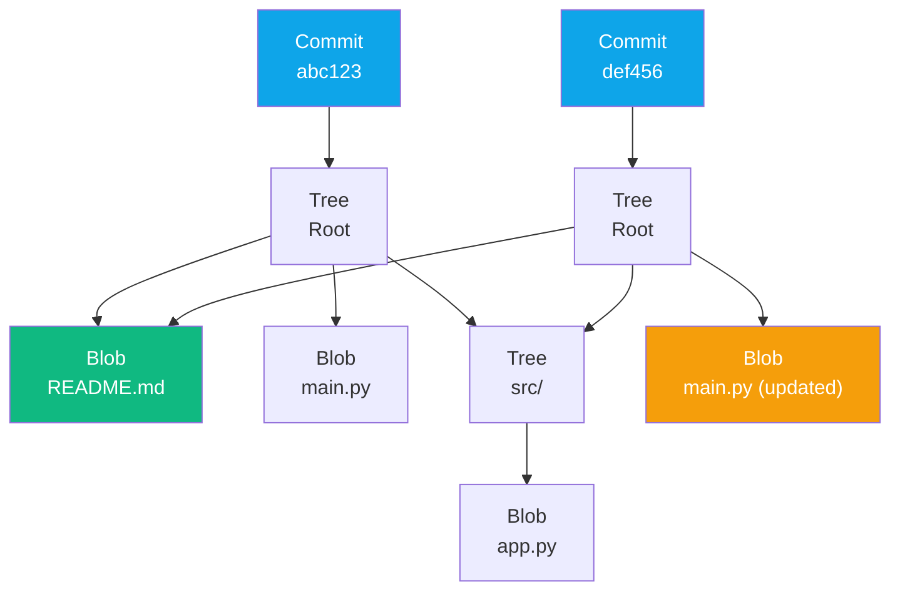
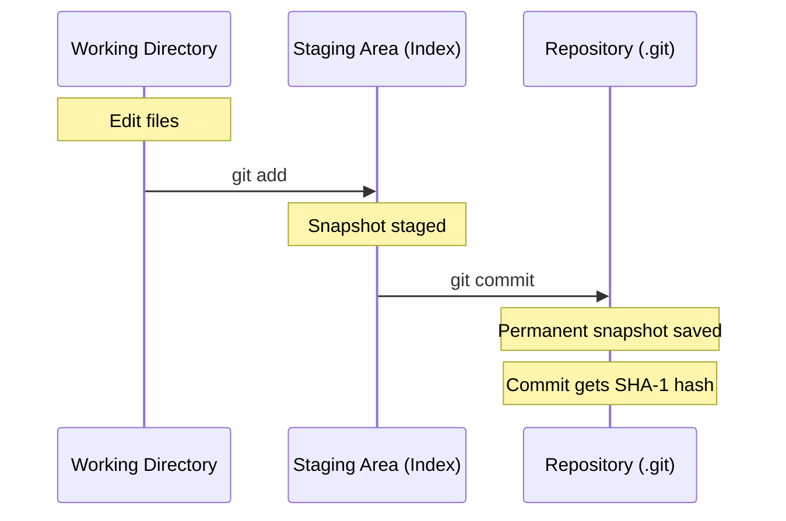

import {
  Info, Warning, Tip, BestPractice, Definition, Example, Analogy,
  CommonMistake, Debugging, Exercise, Challenge, Quiz, CodeBlock,
  TerminalBlock, Flashcard, ProductionNote, ArchitectureNote,
  SecurityNote, CostNote, InterviewQuestion, AITutor
} from '@site/src/components/shared/InteractiveBlocks';

# Git Fundamentals: Beyond the Basics

<Definition>

**Git** is a distributed version control system that tracks changes to files as **snapshots**, not diffs. Every clone contains the full history of the project.

</Definition>

<Analogy>

**Git is like a time machine for your code.** You can travel back to any point in history, create parallel timelines (branches), merge them back together, and never lose anything — as long as you've committed it.

</Analogy>

---

## 🎯 Learning Objectives

By the end of this lesson, you will:

- Understand Git's snapshot-based data model
- Master the working directory → staging area → repository flow
- Configure Git properly for team collaboration
- Trace exactly what happens during `git add` and `git commit`

---

## 🧠 Simple Explanation

Git remembers every version of every file you've ever told it to care about. Instead of saving *what changed* between versions (like a list of edits), it saves a complete snapshot of all files each time you commit. This makes operations like branching, merging, and reverting incredibly fast.

When you type `git add`, you're telling Git: "Remember this version of this file." When you type `git commit`, you're saying: "Take a permanent snapshot of everything I've added."

---

## 🔥 Core Explanation

### Git's Data Model

Git thinks in **objects**:

```
.git/objects/
├── blob       ← file contents
├── tree       ← directory listing (names + blob references)
├── commit     ← snapshot metadata (tree + parent + author + message)
└── tag        ← named reference to a commit
```



> Notice: `README.md` (blob B1) is **shared** between commits — it wasn't duplicated because it didn't change.

### The Three States

| State | Location | Command | Description |
|-------|----------|---------|-------------|
| **Working Directory** | Your disk | edit files | Files you're actively editing |
| **Staging Area** | `.git/index` | `git add` | Snapshot ready for next commit |
| **Repository** | `.git/objects/` | `git commit` | Permanent snapshot history |



---

## 🏗️ Professional Explanation

### Essential Git Configuration

<CodeBlock language="bash" title="First-Time Git Setup">
git config --global user.name "Alex Chen"
git config --global user.email "alex.chen@cloudnova.io"
git config --global core.editor "code --wait"
git config --global init.defaultBranch main
git config --global pull.rebase true
git config --global fetch.prune true
</CodeBlock>

<Tip>

**Why `pull.rebase true`?** It keeps your history linear. Instead of "merge spaghetti," each rebase replays your commits on top of the remote branch, producing a clean, readable history.

</Tip>

### Initializing a Repository

<CodeBlock language="bash" title="Starting a New Project with Git">
# Create project directory
mkdir cloudnova-infra
cd cloudnova-infra

# Initialize Git
git init

# Create .gitignore BEFORE first commit
cat > .gitignore << 'EOF'
# Python
__pycache__/
*.pyc
.venv/

# Terraform
.terraform/
*.tfstate*
*.tfvars
.terraform.lock.hcl

# IDE
.vscode/
.idea/

# Secrets
*.pem
.env
credentials.json
EOF

git add .gitignore
git commit -m "chore: initial commit with .gitignore"
</CodeBlock>

<BestPractice>

**Create `.gitignore` before your first real commit.** Once a file is tracked, adding it to `.gitignore` won't stop tracking it — you'd need `git rm --cached` to remove it.

</BestPractice>

---

## 🏭 Production Explanation

### What Actually Happens During `git add`

<CodeBlock language="bash" title="Peeking under the hood">
# 1. Create a file
echo "print('Hello CloudNova')" > app.py

# 2. What's in the working directory?
git status
# Untracked files: app.py

# 3. Hash the file content (blob hash)
git hash-object app.py
# e.g., 8d0e412...

# 4. Stage the file
git add app.py

# 5. Now it's in .git/index as a staged entry
git ls-files --stage
# 100644 8d0e412... 0  app.py

# 6. The object already exists in .git/objects/
git cat-file -p 8d0e412
# print('Hello CloudNova')
</CodeBlock>

<ProductionNote>

**The blob object is created during `git add`, not `git commit`.** The commit just records which tree (directory snapshot) to point to. This means `git add` can be expensive for large files since it computes the SHA-1 hash and compresses the content.

</ProductionNote>

### The Commit Object

```mermaid
graph LR
    subgraph "Commit abc123"
        direction TB
        TREE[tree: a1b2c3]
        PARENT[parent: (none - root commit)]
        AUTHOR[author: Alex Chen]
        MSG[message: "feat: initial infra code"]
        TIME[timestamp: 2026-07-15T10:00:00Z]
    end
```

<CodeBlock language="bash" title="Inspecting a commit object">
git log -1 --format=raw
# commit abc123...
# tree a1b2c3...
# author Alex Chen <alex@cloudnova.io> 1750000000 +0000
# committer Alex Chen <alex@cloudnova.io> 1750000000 +0000
# 
#     feat: initial infra code
</CodeBlock>

---

## 🏛️ Architect Explanation

### Why Snapshots Beat Diffs

| Approach | Tool | Branch Switch | History Rewrite | Storage |
|----------|------|---------------|-----------------|---------|
| **Snapshot** | Git | O(1) — just update HEAD | Fast — recompute tree | Packfiles compress well |
| **Delta/Diff** | SVN, CVS | O(n) — replay all changes | Slow — recalculate deltas | Smaller per-revision |

Git's snapshot model is the reason `git checkout` takes milliseconds regardless of project size — it just updates the working tree to match the target commit's tree.

<ArchitectureNote>

**Git's true genius is the content-addressable filesystem.** Every object is identified by its SHA-1 hash, making it impossible to corrupt the repository undetected. The hash IS the address — no central index needed.

</ArchitectureNote>

### Understanding `.git` Structure

```
.git/
├── HEAD              ← Points to current branch
├── config            ← Repository-specific configuration
├── index             ← Staging area (binary)
├── objects/          ← All commits, trees, blobs, tags
│   ├── 8d/           ← First two hex chars of SHA
│   │   └── 0e412...  ← Object file
│   └── pack/         ← Compressed packfiles
├── refs/
│   ├── heads/        ← Branch pointers (main, feature/...)
│   ├── tags/         ← Tag pointers
│   └── remotes/      ← Remote tracking branches
└── logs/             ← Reflog (safety net)
```

---

## ☁️ CloudNova Scenario

> **Context:** You're Alex Chen, Junior Cloud Engineer at CloudNova. Your first task is to set up version control for the new infrastructure automation repository.

Your team lead Sarah walks over: "Alex, we're starting fresh on the Terraform modules for Project Phoenix. I need you to set up the repo properly — `.gitignore`, branch protection rules, the works. This repo will be used by the entire platform team."

**Your task:** Initialize the Git repository, configure it with best practices, and make the first commit.

<Exercise title="CloudNova Git Setup">

1. Create a directory called `cloudnova-phoenix-infra`
2. Initialize Git
3. Create a comprehensive `.gitignore` for Terraform, Python, and IDE files
4. Set up your Git identity
5. Create a `README.md` with the project description
6. Make your first commit with a conventional commit message

<details>
<summary>Solution</summary>

```bash
mkdir cloudnova-phoenix-infra && cd cloudnova-phoenix-infra
git init
git config user.name "Alex Chen"
git config user.email "alex.chen@cloudnova.io"

cat > .gitignore << 'EOF'
# Terraform
.terraform/
*.tfstate*
*.tfvars
override.tf
.terraform.lock.hcl

# Python
__pycache__/
*.pyc
.venv/
venv/

# Secrets
*.pem
.env
*.auto.tfvars

# IDE
.vscode/
.idea/
*.swp
EOF

echo "# CloudNova Project Phoenix — Infrastructure" > README.md
echo "## Overview" >> README.md
echo "Terraform modules for the multi-region deployment platform." >> README.md

git add .
git commit -m "chore: initial repository setup

- Add .gitignore for Terraform/Python/IDE
- Add README with project overview"
```
</details>
</Exercise>

---

## 🔍 Common Mistakes & Debugging

<CommonMistake title="Forgetting .gitignore Until It's Too Late">

```bash
# ❌ Wrong: .gitignore added AFTER committing secrets
git add .
git commit -m "initial"
# ...later realize .env is tracked

# ✅ Correct: Use git rm --cached to untrack without deleting
echo ".env" >> .gitignore
git rm --cached .env
git commit -m "chore: remove .env from tracking"
```
</CommonMistake>

<CommonMistake title="Committing Large Binary Files">

```bash
# ❌ Wrong: Large files bloat the repo forever
git add video-demo.mp4   # 200MB!

# ✅ Correct: Use Git LFS for binaries
git lfs track "*.mp4"
git add .gitattributes video-demo.mp4
git commit -m "add video demo with LFS"
```

</CommonMistake>

<Debugging title="Recovering a Lost Commit">

```bash
# Scenario: You did `git reset --hard` and lost work

# 1. Check the reflog (Git's safety net)
git reflog
# abc1234 HEAD@{0}: reset: moving to HEAD~1
# def5678 HEAD@{1}: commit: important work!!

# 2. Recover the lost commit
git checkout def5678
git checkout -b recovered-work

# 3. Or cherry-pick it back
git cherry-pick def5678
```

</Debugging>

---

## 🧪 Active Recall

<Flashcard
  front="What are the three states in Git's workflow?"
  back="1. **Working Directory** — files you edit on disk
2. **Staging Area (Index)** — files staged with `git add`, ready for commit
3. **Repository (.git)** — permanent snapshot history stored as objects"
/>

<Flashcard
  front="What type of Git object stores file contents?"
  back="**Blob** (Binary Large Object) — identified by its SHA-1 hash. Same content = same hash = no duplication across commits."
/>

<Flashcard
  front="What is the difference between `git add` and `git commit`?"
  back="`git add` creates a blob object and updates the index (staging area). `git commit` creates a commit object + tree object, linking them all together permanently. The blob is created during add, not commit."
/>

---

## 📝 Feynman Exercise

> Explain Git's snapshot model to someone who has only used "Save As" in Word. Use no jargon. If you can't explain it simply, you don't understand it well enough.

<details>
<summary>Example Feynman explanation</summary>

"Imagine you're writing a book. Every day, instead of writing down 'changed paragraph 3 from X to Y,' you take a photo of every page in your manuscript. That's what Git does — it takes a complete photo of your project every time you commit. If you want to go back to Tuesday's version, you don't replay all the edits — you just look at Tuesday's photo."

</details>

---

## 🎯 Quiz

<Quiz>
  <Question
    question="What does the staging area (index) contain?"
    options={[
      "Only file names",
      "Complete copies of files ready for the next commit",
      "Differences from the last commit",
      "References to the working directory"
    ]}
    correct={1}
    explanation="The staging area holds complete file snapshots, not diffs. These are the exact file versions that will be in the next commit."
  />
  
  <Question
    question="Which Git object type represents a directory?"
    options={["Blob", "Tree", "Commit", "Tag"]}
    correct={1}
    explanation="A tree object represents a directory and contains pointers to blobs (files) and other trees (subdirectories), along with file names and modes."
  />
  
  <Question
    question="When is the blob object created — during `git add` or `git commit`?"
    options={["git add", "git commit", "git push", "Neither"]}
    correct={0}
    explanation="The blob object (hashed and compressed file content) is created during `git add`. The commit just references the already-existing tree and blobs."
  />
</Quiz>

---

## 🎤 Interview Preparation

<InterviewQuestion level="mid" topic="Git Internals">

**Q:** "Explain how Git stores data internally. Why is it called a content-addressable filesystem?"

**A:** Git stores every piece of data as an object identified by its SHA-1 hash. There are four object types:
- **Blobs** — file contents
- **Trees** — directory listings
- **Commits** — snapshots with metadata
- **Tags** — named references

It's "content-addressable" because the content determines the address (hash). Give Git the same content, you get the same hash. This enables deduplication, integrity verification, and distributed operation without a central server.

</InterviewQuestion>

<InterviewQuestion level="senior" topic="Git Internals">

**Q:** "What happens internally when you run `git add` followed by `git commit`?"

**A:** `git add`:
1. Computes SHA-1 hash of file content
2. Creates a blob object in `.git/objects/`
3. Compresses it with zlib
4. Updates `.git/index` with the file path, mode, and blob hash

`git commit`:
1. Creates a tree object from the current index
2. Creates a commit object referencing the tree, parent commit(s), author, committer, timestamp, and message
3. Updates the current branch reference (e.g., `.git/refs/heads/main`)
4. Updates HEAD (if detached, writes directly)

</InterviewQuestion>

---

## 🤖 AI Prompt Suggestions

<AITutor>

Try these prompts with your favorite AI assistant:

> "Explain Git's content-addressable filesystem to me like I'm a junior engineer who knows basic Git commands but not internals."

> "Walk me through the `.git` directory structure and explain what each subdirectory contains."

> "Compare the snapshot model (Git) vs the delta model (SVN) for version control. Use diagrams."

</AITutor>

---

## 📚 Related Content

- **Next Lesson:** [Git Branching & Merging Strategies](branching-merging)
- **Module:** [GitHub & Collaboration](../14-github/)
- **Related:** [Terraform State Management](../../12-terraform/lessons/02-state-management) — Git-like concepts applied to infrastructure
- **Glossary:** [Version Control](/docs/reference/glossary#version-control), [SHA-1 Hash](/docs/reference/glossary#sha-1)

---

## 📋 Summary

| Concept | Key Takeaway |
|---------|-------------|
| **Data Model** | Git stores snapshots, not diffs |
| **Three States** | Working dir → Staging (index) → Repository |
| **Object Types** | Blob (file), Tree (directory), Commit (snapshot), Tag (label) |
| **Content Addressing** | SHA-1 hash of content = object address |
| **Best Practice** | `.gitignore` before first commit, conventional commits, Git LFS for binaries |
