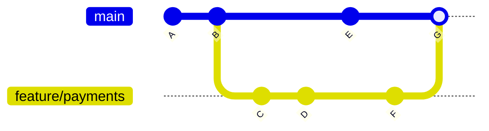
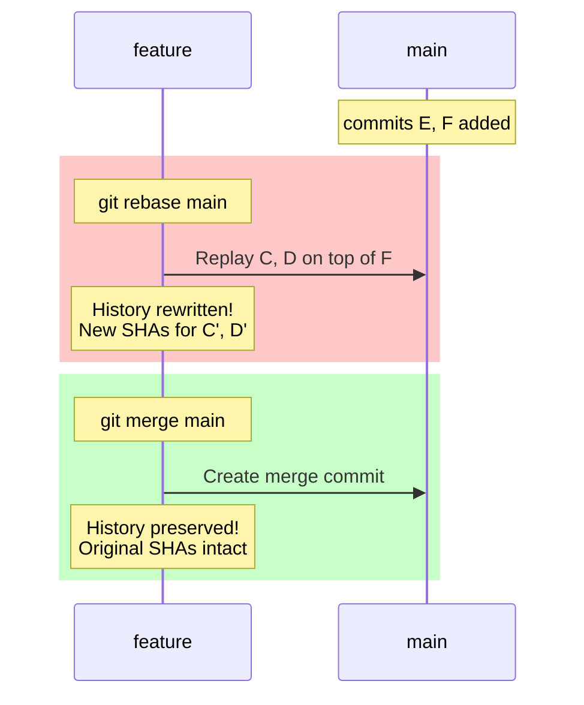
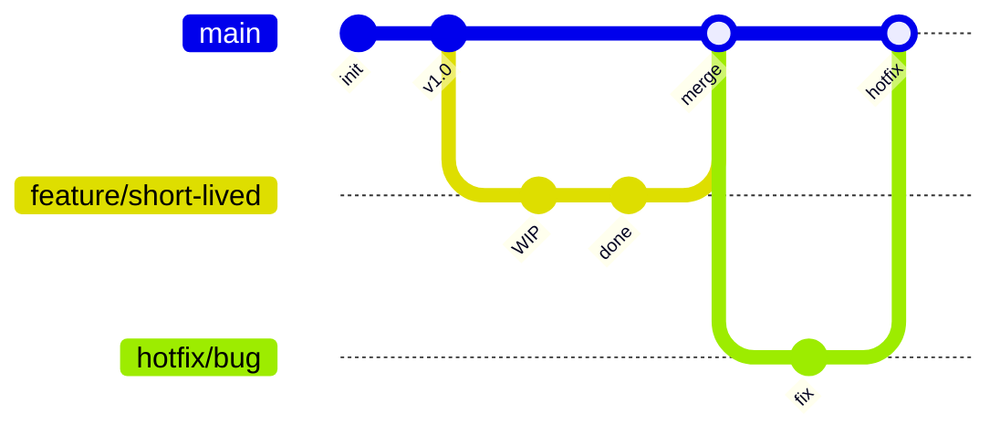
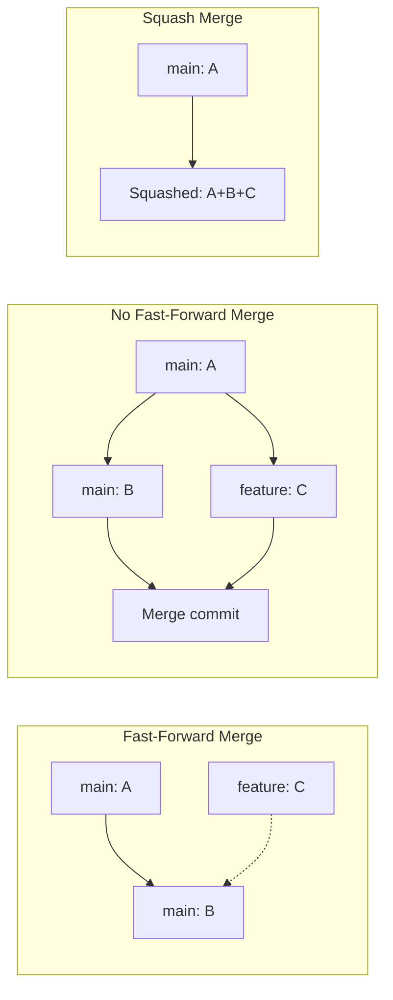
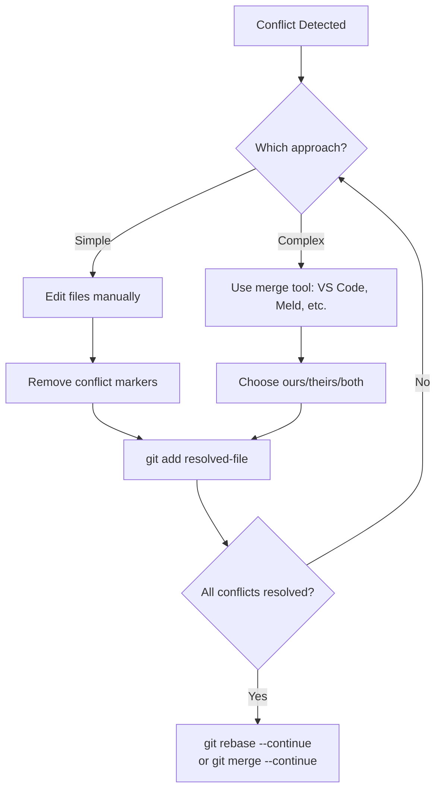

import {
  Info,
  Warning,
  Tip,
  BestPractice,
  Definition,
  Example,
  Analogy,
  CommonMistake,
  Debugging,
  Exercise,
  Challenge,
  Quiz,
  CodeBlock,
  TerminalBlock,
  Flashcard,
  ProductionNote,
  ArchitectureNote,
  SecurityNote,
  CostNote,
  InterviewQuestion,
  AITutor,
} from "@site/src/components/shared/InteractiveBlocks";

# Branching & Merging Strategies

<Definition>

A **branch** in Git is a lightweight, movable pointer to a specific commit. Creating a branch takes milliseconds and consumes almost no disk space.

</Definition>

<Analogy>

**Branches are like parallel universes.** In one universe, you're refactoring the database layer. In another, you're adding a new API endpoint. Neither affects the other until you decide to merge the universes back together.

</Analogy>

---

## 🎯 Learning Objectives

By the end of this lesson, you will:

- Understand Git's branch model and why it's so fast
- Master `git merge` vs `git rebase` — when to use each
- Apply trunk-based development and GitFlow in real teams
- Resolve merge conflicts like a pro

---

## 🧠 Simple Explanation

A branch is just a sticky note that says "this is the latest commit." When you make a new commit on a branch, the sticky note moves to the new commit. Creating a branch just means writing a new sticky note — no copying of files required.

Merging combines two branches. Rebasing rewrites history so your changes look like they were made on top of the latest main — like time-traveling your work to start from a different point.

---

## 🔥 Core Explanation

### How Git Branches Work



<CodeBlock language="bash" title="Branch Operations">
# Create and switch in one command
git checkout -b feature/payments

# List all branches

git branch -a

# See branch graph

git log --graph --oneline --all --decorate

# Delete a merged branch

git branch -d feature/payments

# Force delete (even if unmerged)

git branch -D feature/payments

</CodeBlock>

---

## 🏗️ Professional Explanation

### Merge vs Rebase

| Feature       | `git merge`                    | `git rebase`                      |
| ------------- | ------------------------------ | --------------------------------- |
| **Result**    | Merge commit joining histories | Linear history (commits replayed) |
| **History**   | Preserves exact timeline       | Clean, linear history             |
| **Conflicts** | Resolve once at merge commit   | May resolve per rebased commit    |
| **Safety**    | Never loses context            | Rewrites commit SHAs              |
| **Best for**  | Public/shared branches         | Private feature branches          |

<Warning title="The Golden Rule of Rebase">

**Never rebase commits that exist outside your local repository.** If you've pushed a branch and others are working on it, rebasing rewrites history and will cause chaos.

</Warning>



---

## 🏭 Production Explanation

### Trunk-Based Development (CloudNova's Workflow)



<BestPractice>

**Trunk-based development** means short-lived branches (hours, not days) merged directly to main. This is CloudNova's standard — it enables continuous deployment and minimizes merge hell.

</BestPractice>

<CodeBlock language="bash" title="CloudNova's Daily Branch Workflow">
# Morning: pull latest main
git checkout main
git pull --rebase

# Create feature branch (short-lived!)

git checkout -b feat/add-cost-tagging

# Work, commit frequently

git add terraform/variables.tf
git commit -m "feat: add cost center tagging variables"

git add terraform/modules/compute/main.tf
git commit -m "feat: apply cost tags to compute resources"

# Before pushing, rebase on latest main

git fetch origin
git rebase origin/main

# Push and create PR

git push -u origin feat/add-cost-tagging

# After PR review and merge, clean up

git checkout main
git pull --rebase
git branch -d feat/add-cost-tagging

</CodeBlock>

---

## 🏛️ Architect Explanation

### Merge Strategies

| Strategy            | Flag             | When to Use                      | Result                          |
| ------------------- | ---------------- | -------------------------------- | ------------------------------- |
| **Fast-forward**    | `--ff` (default) | Branch hasn't diverged           | Linear — just moves pointer     |
| **No fast-forward** | `--no-ff`        | Always create merge commit       | Explicit merge commit preserved |
| **Squash**          | `--squash`       | Collapse feature into one commit | Single commit on target         |
| **Rebase**          | `--rebase`       | Private branches only            | Replayed linear history         |



<ArchitectureNote>

**Choose your merge strategy based on your team's traceability needs.** No fast-forward preserves the branch context (who worked on what, when). Squash merges produce a clean mainline but lose granular history. Most enterprise teams use `--no-ff` or `--squash` on the remote (GitHub/GitLab PR merge button).

</ArchitectureNote>

---

## ☁️ CloudNova Scenario

> Sarah merges a critical security patch to main while you're mid-feature. You need to integrate her changes without losing your work or creating merge spaghetti.

<Exercise title="Handling Upstream Changes">

You're working on `feat/cost-tagging` when Sarah pushes a critical fix to main:

```bash
# Your feature branch has 3 commits
git log --oneline feat/cost-tagging
# d4e5f6 feat: apply cost tags to compute
# c3d4e5 feat: add cost tagging variables
# b2c3d4 feat: initial cost module

# Sarah merged to main
git log --oneline origin/main -1
# e5f6a7 fix: patch IAM role vulnerability (Sarah)
```

**Task:** Integrate Sarah's fix into your feature branch using rebase.

<details>
<summary>Solution</summary>

```bash
# Fetch latest from remote
git fetch origin

# Rebase your feature onto updated main
git checkout feat/cost-tagging
git rebase origin/main

# If conflicts arise, resolve them:
# 1. Edit conflicted files (marked with <<<<<<<, =======, >>>>>>>)
# 2. git add <resolved-files>
# 3. git rebase --continue

# Force push your rebased branch (safe because only you use it)
git push --force-with-lease origin feat/cost-tagging
```

</details>
</Exercise>

---

## 🔧 Conflict Resolution Mastery



<CodeBlock language="bash" title="Conflict Resolution Commands">
# See what files have conflicts
git status

# Abort if you want to start over

git merge --abort
git rebase --abort

# Use "ours" (your version) for a specific file

git checkout --ours path/to/file

# Use "theirs" (incoming version) for a specific file

git checkout --theirs path/to/file

# After resolving, continue

git add .
git rebase --continue # or git merge --continue

</CodeBlock>

<CommonMistake title="Using `--force` Instead of `--force-with-lease`">

```bash
# ❌ Dangerous: Overwrites remote unconditionally
git push --force

# ✅ Safe: Only force-pushes if remote hasn't changed
git push --force-with-lease
```

`--force` will happily overwrite a teammate's commits if they pushed while you were rebasing. `--force-with-lease` checks first.

</CommonMistake>

---

## 🧪 Active Recall

<Flashcard
  front="What is a Git branch (internally)?"
  back="A lightweight, movable pointer to a commit. Stored as a file in `.git/refs/heads/` containing the 40-character SHA of the commit it points to."
/>

<Flashcard
  front="When should you use rebase instead of merge?"
  back="Use rebase for **private/personal** branches to maintain a clean, linear history. Never rebase public/shared branches — use merge instead to preserve the true history."
/>

<Flashcard
  front="What's the Golden Rule of Rebase?"
  back="**Never rebase commits that exist outside your local repository.** If someone else might have based work on your branch, rebasing will rewrite history and break their work."
/>

---

## 📝 Quiz

<Quiz>
  <Question
    question="What does `git checkout -b feature/x` do?"
    options={[
      "Deletes branch feature/x",
      "Creates and switches to branch feature/x",
      "Merges feature/x into current branch",
      "Lists all branches named feature/x",
    ]}
    correct={1}
  />

<Question
  question="Why is `git push --force-with-lease` safer than `git push --force`?"
  options={[
    "It's the same command with a different name",
    "It checks that your local copy of the remote matches the actual remote before pushing",
    "It creates a backup of the remote branch",
    "It sends an email notification to teammates",
  ]}
  correct={1}
  explanation="`--force-with-lease` verifies that nobody else has pushed to the branch since you last fetched. If they have, the push is rejected — preventing accidental overwrites."
/>

  <Question
    question="In trunk-based development, how long should feature branches typically live?"
    options={[
      "Several weeks",
      "Hours to a day maximum",
      "At least one sprint",
      "Until the feature is code-complete",
    ]}
    correct={1}
    explanation="Trunk-based development uses very short-lived branches (hours, not days) that are frequently integrated to main. This minimizes merge conflicts and enables continuous deployment."
  />
</Quiz>

---

## 🎤 Interview Preparation

<InterviewQuestion level="mid" topic="Git Workflows">

**Q:** "Compare GitFlow and trunk-based development. When would you choose each?"

**A:** **GitFlow** uses long-lived branches (develop, release, hotfix) with strict branching rules. Best for:

- Products with versioned releases (mobile apps, on-prem software)
- Large teams needing release coordination
- When you need to support multiple versions simultaneously

**Trunk-based development** uses short-lived branches merged directly to main. Best for:

- Continuous deployment to SaaS/web apps
- Smaller, autonomous teams
- When you can feature-flag incomplete work

CloudNova uses trunk-based with short-lived feature branches because we deploy continuously to Azure.

</InterviewQuestion>

<InterviewQuestion level="senior" topic="Git Internals">

**Q:** "Walk me through exactly what happens to `.git/refs/heads/` during a merge."

**A:** During a fast-forward merge, the target branch pointer (e.g., `refs/heads/main`) is simply updated to point to the same commit as the source branch. No new commit is created.

During a `--no-ff` merge, a new merge commit is created with two parents. The target branch pointer moves to this new commit. The source branch pointer is unchanged — it still points to its original tip.

</InterviewQuestion>

---

## 🤖 AI Prompt Suggestions

<AITutor>

> "I'm working on a feature branch and main has moved ahead with 5 new commits. Walk me through rebasing my branch — show me the commands and explain what happens at each step."

> "I got a merge conflict in a Terraform file. Here's the conflict marker output: [paste]. Help me understand what each section means and how to resolve it properly for infrastructure code."

</AITutor>

---

## 📋 Summary

| Concept                 | Key Takeaway                                          |
| ----------------------- | ----------------------------------------------------- |
| **Branches**            | Lightweight pointers, not copies                      |
| **Merge**               | Preserves history, creates merge commit               |
| **Rebase**              | Linear history, rewrite SHAs — private branches only  |
| **Conflict Resolution** | Edit → `git add` → `git merge/rebase --continue`      |
| **Force Push**          | Always use `--force-with-lease`, never bare `--force` |
| **CloudNova Standard**  | Trunk-based, short-lived branches, rebase before PR   |
