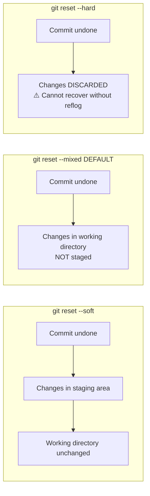

import {
  Info,
  Warning,
  Tip,
  BestPractice,
  Definition,
  Example,
  Analogy,
  CommonMistake,
  Debugging,
  Exercise,
  Challenge,
  Quiz,
  CodeBlock,
  TerminalBlock,
  Flashcard,
  ProductionNote,
  ArchitectureNote,
  SecurityNote,
  CostNote,
  InterviewQuestion,
  AITutor,
} from "@site/src/components/shared/InteractiveBlocks";

# Rewriting History: Amend, Reset, Rebase Interactive

<Definition>

**Rewriting history** in Git means modifying existing commits — changing messages, squashing multiple commits into one, reordering them, or even removing them entirely. It's powerful but dangerous on shared branches.

</Definition>

---

## 🧠 Simple Explanation

Sometimes you make a typo in a commit message, forget to include a file, or make 10 tiny "WIP" commits that should be one clean commit. Git gives you tools to fix all of these — like an "edit" button for your commit history. But just like editing a shared document after others have seen it, you shouldn't rewrite history that other people are using.

---

## 🔥 Core Explanation

### The Undo Toolbox

| Command                    | What it does                              | Safe for shared branches? |
| -------------------------- | ----------------------------------------- | ------------------------- |
| `git commit --amend`       | Modify the last commit (message or files) | Only if not pushed        |
| `git reset --soft HEAD~1`  | Undo commit, keep changes staged          | Only if not pushed        |
| `git reset --mixed HEAD~1` | Undo commit, unstage changes              | Only if not pushed        |
| `git reset --hard HEAD~1`  | Undo commit, DISCARD changes              | Only if not pushed        |
| `git revert HEAD`          | Create new commit that undoes HEAD        | **Yes — always safe**     |
| `git rebase -i`            | Squash, reorder, edit, drop commits       | Only if not pushed        |

<Warning title="The Reflog is Your Safety Net">

```bash
# If you mess up a reset/rebase, check the reflog
git reflog
# Find the commit you want to return to
git reset --hard HEAD@{2}  # Go back 2 reflog entries
```

Git's reflog keeps a 90-day (default) log of every HEAD movement. Almost nothing is truly lost.

</Warning>

---

## 🏗️ Professional Explanation

### `git commit --amend`

<CodeBlock language="bash" title="Amending the Last Commit">
# Fix a commit message
git commit --amend -m "feat: add proper cost tagging to compute"

# Add a forgotten file to the last commit

git add forgotten-file.tf
git commit --amend --no-edit # Keep the same message

# ⚠️ If you already pushed, you'll need --force-with-lease

git push --force-with-lease origin feat/cost-tagging

</CodeBlock>

### `git reset` — Three Levels



<CodeBlock language="bash" title="Reset Examples">
# Soft: undo last commit, keep changes staged (ready to recommit)
git reset --soft HEAD~1

# Mixed (default): undo last commit, changes unstaged

git reset HEAD~1

# Same as: git reset --mixed HEAD~1

# Hard: undo last commit, discard ALL changes

git reset --hard HEAD~1

# ⚠️ THINK TWICE before --hard

</CodeBlock>

---

## 🏭 Production Explanation

### Interactive Rebase — The Swiss Army Knife

<CodeBlock language="bash" title="Squashing 3 commits into 1">
# Your branch has messy history:
# abc1234 fix typo
# def5678 WIP: almost done
# ghi9012 feat: add cost tagging

# Start interactive rebase (last 3 commits)

git rebase -i HEAD~3

# Editor opens:

# pick ghi9012 feat: add cost tagging

# squash def5678 WIP: almost done

# squash abc1234 fix typo

#

# Save and close → editor opens for combined commit message

# feat: add cost tagging to all compute resources

#

# Result: 1 clean commit instead of 3 messy ones

</CodeBlock>

<BestPractice>

**Squash before merge.** Your PR should tell a clean story. Nobody needs to see your "fix typo" and "WIP" commits. Squash them into logical units before requesting review.

</BestPractice>

### Interactive Rebase Operations

| Command   | Effect                                       |
| --------- | -------------------------------------------- |
| `pick`    | Use the commit as-is                         |
| `reword`  | Change only the commit message               |
| `edit`    | Pause to amend the commit (add/remove files) |
| `squash`  | Combine with previous commit, merge messages |
| `fixup`   | Like squash, but discard the message         |
| `drop`    | Remove the commit entirely                   |
| `reorder` | Move commits to different positions          |

---

## 🏛️ Architect Explanation

### `git revert` — The Safe Undo

<ArchitectureNote>

**`git revert` is the only "undo" safe for shared branches.** Instead of removing commits (which changes history), it creates a NEW commit that reverses the changes. This preserves the audit trail — you can see both what was done and when it was undone.

</ArchitectureNote>

```bash
# Undo a specific commit safely
git revert abc1234

# Undo a range of commits (each gets its own revert)
git revert abc1234..def5678

# Revert a merge commit (need to specify parent)
git revert -m 1 merge-commit-sha
# -m 1 means: keep the first parent (usually main)
```


> Commit D undoes B's changes while keeping B in the history for audit purposes.

---

## ☁️ CloudNova Scenario

> You pushed a Terraform commit with `terraform.tfstate` accidentally included. Sarah spotted it in your PR. You need to remove it from history — not just add a new commit.

<Challenge title="Removing a Secret from Git History">

Your branch `feat/tf-modules` has this history:

```
abc1234 feat: add Terraform modules
def5678 feat: configure backend (includes terraform.tfstate 😱)
ghi9012 chore: update README
```

**Task:** Remove `terraform.tfstate` from the second commit without losing the rest of the work.

<details>
<summary>Solution</summary>

```bash
# 1. Start interactive rebase to edit the offending commit
git rebase -i HEAD~3

# 2. Mark the commit as "edit":
# edit def5678 feat: configure backend

# 3. Git pauses at that commit. Remove the file:
git rm --cached terraform.tfstate

# 4. Add terraform.tfstate to .gitignore
echo "*.tfstate" >> .gitignore
git add .gitignore

# 5. Amend the commit with the removal
git commit --amend --no-edit

# 6. Continue the rebase
git rebase --continue

# 7. Force push (safe — only you use this branch)
git push --force-with-lease origin feat/tf-modules
```

</details>
</Challenge>

---

## 🧪 Active Recall

<Flashcard
  front="What's the difference between `git reset` and `git revert`?"
  back="`reset` moves the branch pointer backward, potentially discarding commits (history rewrite — unsafe for shared branches). `revert` creates a NEW commit that undoes changes (history preserved — always safe)."
/>

<Flashcard
  front="What does `git reset --soft HEAD~1` do?"
  back="Undoes the last commit but keeps all changes staged in the index. You can immediately recommit with a different message or amend files."
/>

<Flashcard
  front="What is the reflog and why is it important?"
  back="The reflog (`.git/logs/`) records every movement of HEAD for 90 days. It's a safety net — even after a destructive `reset --hard`, you can recover commits by referencing `HEAD@{n}` in the reflog."
/>

---

## 📝 Quiz

<Quiz>
  <Question
    question="Which undo command is safe to use on a shared branch?"
    options={["git reset --hard", "git rebase -i", "git revert", "git commit --amend"]}
    correct={2}
    explanation="`git revert` is the only safe option — it creates a new commit instead of rewriting history."
  />

  <Question
    question="What does 'squash' do in interactive rebase?"
    options={[
      "Deletes the commit",
      "Combines the commit with the previous one and opens editor for merged message",
      "Reorders commits",
      "Changes only the commit message",
    ]}
    correct={1}
  />
</Quiz>

---

## 🎤 Interview Preparation

<InterviewQuestion level="senior" topic="Git History">

**Q:** "A developer accidentally committed and pushed a file containing credentials. The commit is 5 commits back in main. How do you handle this?"

**A:** 1. **Immediately rotate the credentials** — the secret is compromised regardless of Git cleanup. 2. Use `git filter-branch` or `git filter-repo` (preferred) to remove the file from all history. 3. Force push main after coordinating with the team. 4. All team members must rebase their branches onto the cleaned main. 5. Implement pre-commit hooks to prevent secrets from being committed.

</InterviewQuestion>

---

## 📋 Summary

| Command          | Purpose                  | Shared Branch Safe? |
| ---------------- | ------------------------ | ------------------- |
| `commit --amend` | Fix last commit          | ❌ After push       |
| `reset --soft`   | Undo commit, keep staged | ❌ After push       |
| `reset --hard`   | Undo commit, discard     | ❌ Never            |
| `rebase -i`      | Squash/reorder/edit      | ❌ After push       |
| `revert`         | Safe undo                | ✅ Always           |
