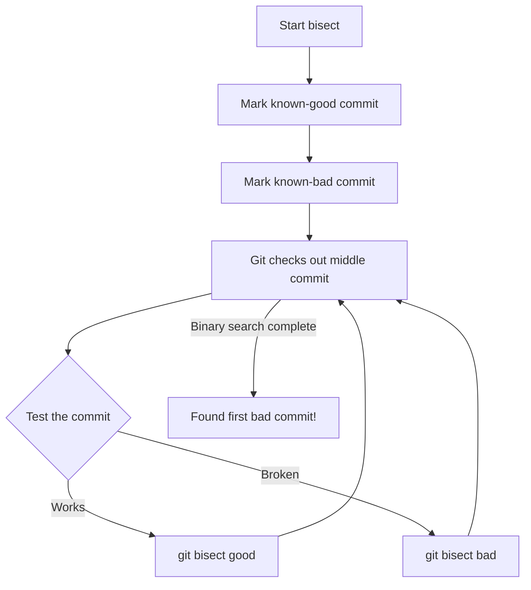

import {
  Info,
  Warning,
  Tip,
  BestPractice,
  Definition,
  Example,
  CommonMistake,
  Debugging,
  Exercise,
  Challenge,
  Quiz,
  CodeBlock,
  TerminalBlock,
  Flashcard,
  ProductionNote,
  InterviewQuestion,
  AITutor,
} from "@site/src/components/shared/InteractiveBlocks";

# Advanced Git Operations

<Definition>

**Advanced Git** covers the operations that separate senior engineers from juniors: context switching with stash, surgical commits with cherry-pick, scientific debugging with bisect, and automated enforcement with hooks.

</Definition>

---

## 🎯 Learning Objectives

- Context-switch with confidence using `git stash`
- Apply specific commits across branches with `git cherry-pick`
- Find bugs in minutes — not hours — using `git bisect`
- Automate quality gates with Git hooks

---

## 🏗️ `git stash` — Context Switching

<CodeBlock language="bash" title="Stash Basics">
# Save current work and return to clean working directory
git stash
# Equivalent to: git stash push

# Save with a descriptive message

git stash push -m "WIP: cost tagging refactor"

# List all stashes

git stash list

# stash@{0}: WIP: cost tagging refactor

# stash@{1}: WIP: IAM policy updates

# Apply most recent stash (keeps it in the list)

git stash apply

# Apply and remove from stash list

git stash pop

# Apply a specific stash

git stash apply stash@{1}

# Stash untracked files too

git stash push -u

# Create a branch from a stash

git stash branch feat/cost-tagging stash@{0}

</CodeBlock>

<Tip>

**Stash is your "pause button."** Sarah asks you to fix a production issue while you're mid-refactor? `git stash`, fix the bug on a new branch, `git stash pop`, continue where you left off.

</Tip>

---

## 🏭 `git cherry-pick` — Surgical Commits

```mermaid
gitGraph
    commit id: "A"
    commit id: "B"
    branch hotfix
    checkout hotfix
    commit id: "C (critical fix)"
    checkout main
    commit id: "D"
    commit id: "E"
    cherry-pick id: "C' (same fix)"
```

<CodeBlock language="bash" title="Cherry-Pick Examples">
# Apply a specific commit to current branch
git cherry-pick abc1234

# Cherry-pick a range (exclusive of start)

git cherry-pick abc1234..def5678

# Cherry-pick without committing (for review)

git cherry-pick -n abc1234
git diff --staged # Review before committing

# Cherry-pick a merge commit (must specify parent)

git cherry-pick -m 1 merge-commit-sha

</CodeBlock>

<ProductionNote>

**Cherry-pick is essential for hotfixes.** CloudNova uses it when a security fix in `main` needs to be backported to the `release/v2.3` branch without merging everything else.

</ProductionNote>

---

## 🏛️ `git bisect` — Scientific Debugging



<CodeBlock language="bash" title="Bisect Example — Finding a Terraform Bug">
# Start bisect session
git bisect start

# Mark current as bad (deployment fails)

git bisect bad HEAD

# Mark 2 weeks ago as good (last known working deploy)

git bisect good abc1234

# Git checks out a commit halfway between. Test:

terraform plan

# If it works: git bisect good

# If it fails: git bisect bad

# Repeat ~5-7 times for 100+ commits

# Git reports the exact commit that introduced the bug

# abc5678 is the first bad commit

# End bisect session

git bisect reset

</CodeBlock>

<BestPractice>

**Automate bisect with a test script:**

```bash
git bisect start HEAD abc1234
git bisect run ./scripts/test-deploy.sh
# Git runs the script on each bisect step automatically
```

</BestPractice>

---

## 🔧 Git Hooks — Automation

| Hook         | Trigger                         | Use Case                             |
| ------------ | ------------------------------- | ------------------------------------ |
| `pre-commit` | Before commit is created        | Lint, format, check for secrets      |
| `commit-msg` | After commit message is written | Enforce conventional commits         |
| `pre-push`   | Before push to remote           | Run tests, check for secrets         |
| `post-merge` | After successful merge          | Install dependencies, run migrations |

<CodeBlock language="bash" title="pre-commit Hook for Secrets Detection">
#!/bin/bash
# .git/hooks/pre-commit

# Check for AWS/Azure keys

if git diff --cached | grep -E "(AKIA[0-9A-Z]{16}|sk-[a-zA-Z0-9]{32})"; then
echo "❌ Secret keys detected! Commit blocked."
exit 1
fi

# Check for terraform state files

if git diff --cached --name-only | grep "\.tfstate"; then
echo "❌ Terraform state file detected! Commit blocked."
exit 1
fi

echo "✅ Pre-commit checks passed"

</CodeBlock>

---

## ☁️ CloudNova Scenario

<Challenge title="Emergency Hotfix Deployment">

**Context:** You're working on a major Terraform refactor (15 uncommitted changes) when Sarah messages:

> "The cost-tagging module has a bug — it's tagging resources with the wrong environment. We need this fix in production ASAP. The fix is in commit `abc1234` on the `fix/cost-tags` branch. Don't merge the whole branch — it has experimental features."

**Task:** Save your in-progress work, cherry-pick only the fix commit, push, and resume your refactor.

<details>
<summary>Solution</summary>

```bash
# 1. Save current work
git stash push -m "WIP: Terraform refactor"

# 2. Cherry-pick ONLY the fix commit
git cherry-pick abc1234

# 3. Run tests
terraform validate
terraform plan

# 4. Push the fix
git push origin main

# 5. Resume your refactor
git stash pop

# Continue where you left off!
```

</details>
</Challenge>

---

## 🧪 Active Recall

<Flashcard
  front="What's the difference between `git stash apply` and `git stash pop`?"
  back="`apply` applies the stash but keeps it in the stash list. `pop` applies AND removes it from the list. Use `apply` when you want the safety net of keeping a copy."
/>

<Flashcard
  front="When is `git cherry-pick` preferred over `git merge`?"
  back="When you need only specific commits from another branch — not everything. Common for hotfix backports and security patches."
/>

<Flashcard
  front="How does `git bisect` reduce debugging time?"
  back="It performs binary search over the commit history. Instead of checking 100 commits one-by-one (O(n)), bisect finds the bug in ~7 steps (O(log n))."
/>

---

## 📝 Quiz

<Quiz>
  <Question
    question="What command saves uncommitted work and returns to a clean working directory?"
    options={["git save", "git stash", "git shelve", "git backup"]}
    correct={1}
  />

  <Question
    question="`git bisect` uses what search algorithm to find bugs?"
    options={["Linear search", "Binary search", "Depth-first search", "Breadth-first search"]}
    correct={1}
    explanation="Binary search halves the search space each round. Finding a bug in 1000 commits takes only ~10 test iterations."
  />
</Quiz>

---

## 🎤 Interview Preparation

<InterviewQuestion level="senior">

**Q:** "Describe a time you used `git bisect` to solve a production issue."

**A:** "During a Terraform deployment, our apply started failing with an obscure Azure API error. We knew the last successful deploy was 3 days ago (~50 commits). Instead of reading through diffs, I ran `git bisect` with an automated script that ran `terraform plan`. It identified the exact commit in 6 iterations — a change to a storage account SKU that wasn't available in our region."

</InterviewQuestion>

---

## 📋 Summary

| Tool          | When to Use                            |
| ------------- | -------------------------------------- |
| `stash`       | Context switching mid-work             |
| `cherry-pick` | Apply specific commits without merging |
| `bisect`      | Find which commit introduced a bug     |
| `hooks`       | Automate quality checks                |
