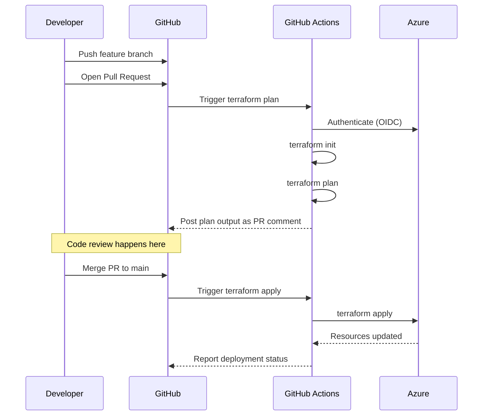

import {
  Info,
  Warning,
  Tip,
  BestPractice,
  Definition,
  Example,
  CommonMistake,
  Debugging,
  Exercise,
  Challenge,
  Quiz,
  CodeBlock,
  TerminalBlock,
  Flashcard,
  ProductionNote,
  ArchitectureNote,
  SecurityNote,
  InterviewQuestion,
  AITutor,
} from "@site/src/components/shared/InteractiveBlocks";

# Git for Infrastructure as Code

<Definition>

**Git for IaC** applies version control best practices specifically to infrastructure code — Terraform, Bicep, Pulumi, Ansible. IaC repos have unique requirements around state management, secrets handling, and deployment safety.

</Definition>

---

## 🎯 Learning Objectives

- Structure IaC repositories for scale
- Implement safe collaboration patterns for infrastructure code
- Handle Terraform state files, secrets, and sensitive outputs
- Set up Git-based IaC deployment workflows

---

## 🧠 Simple Explanation

Infrastructure as Code means your servers, networks, and databases are defined in files — just like application code. Git becomes the source of truth for your entire cloud infrastructure. Change a Terraform file, open a PR, get it reviewed, merge it — and your infrastructure updates automatically.

---

## 🔥 Core Explanation

### IaC Repository Structure

<CodeBlock language="bash" title="CloudNova's IaC Repository Layout">
  cloudnova-infra/ ├── terraform/ │ ├── modules/ # Reusable modules │ │ ├── compute/ │ │ ├──
  networking/ │ │ └── database/ │ ├── environments/ # Per-environment configs │ │ ├── dev/ │ │ ├──
  staging/ │ │ └── prod/ │ └── global/ # Shared resources │ ├── dns/ │ └── monitoring/ ├── bicep/ │
  └── modules/ ├── policies/ │ └── azure-policy/ ├── scripts/ │ └── deploy.sh ├── .github/ │ └──
  workflows/ │ ├── terraform-plan.yml │ └── terraform-apply.yml └── .gitignore
</CodeBlock>

---

## 🏗️ Professional Explanation

### The .gitignore for IaC

<CodeBlock language="bash" title="Essential .gitignore for Terraform Projects">
# Local .terraform directories
**/.terraform/*

# Terraform state files — NEVER commit these!

_.tfstate
_.tfstate.\*

# Terraform variable files (may contain secrets)

\*.tfvars
!example.tfvars

# Terraform plan output

\*.tfplan

# Terraform lock file (optional — team decision)

# .terraform.lock.hcl

# CLI config with credentials

.terraformrc
terraform.rc

# Environment files

.env
.env.\*
\*.env

# IDE

.vscode/
.idea/
\*.swp

</CodeBlock>

<SecurityNote>

**Terraform state files contain secrets in plaintext.** The state file stores resource IDs, connection strings, and sometimes even passwords. Never commit `*.tfstate` to Git. Use remote state backends (Azure Storage, S3) with encryption.

</SecurityNote>

---

## 🏭 Production Explanation

### Git-Based IaC Deployment Workflow



<CodeBlock language="yaml" title="GitHub Actions: Terraform Plan on PR">
name: Terraform Plan
on:
  pull_request:
    paths:
      - 'terraform/**'

jobs:
plan:
runs-on: ubuntu-latest
steps: - uses: actions/checkout@v4

      - name: Terraform Plan
        uses: hashicorp/setup-terraform@v3

      - run: terraform init
        working-directory: ./terraform/environments/dev

      - run: terraform plan -no-color
        working-directory: ./terraform/environments/dev

</CodeBlock>

---

## 🏛️ Architect Explanation

### Branch Protection for IaC

<ArchitectureNote>

**IaC repos need stronger protection than application repos.** A bad Terraform apply can destroy production infrastructure. Implement these protections:

1. **Require PR reviews** — at least 1 senior engineer for prod changes
2. **Require status checks** — `terraform plan` and `terraform validate` must pass
3. **Require up-to-date branches** — prevent merging stale code
4. **Restrict who can push to main** — only CI/CD and leads
5. **Enable branch protection for state/config branches** — gitops branches need special care

</ArchitectureNote>

---

## ☁️ CloudNova Scenario

<Challenge title="IaC Code Review">

**Context:** A teammate opens a PR with Terraform changes:

```hcl
resource "azurerm_storage_account" "data" {
  name                     = "cloudnovadata${var.environment}"
  resource_group_name      = azurerm_resource_group.main.name
  location                 = azurerm_resource_group.main.location
  account_tier             = "Standard"
  account_replication_type = "LRS"

  # Missing: network_rules, min_tls_version, infrastructure_encryption
}
```

**Task:** Review this PR as a senior engineer. What security and production issues do you flag?

<details>
<summary>Review Comments</summary>

1. ❌ **No network restrictions** — storage account will be publicly accessible. Add `network_rules` with `default_action = "Deny"`.

2. ❌ **Default TLS version** — should explicitly set `min_tls_version = "TLS1_2"`.

3. ❌ **No infrastructure encryption** — add `infrastructure_encryption_enabled = true` for double encryption at rest.

4. ⚠️ **LRS only** — for production data, consider GRS or ZRS for durability.

5. ⚠️ **Naming convention** — verify this follows CloudNova's naming standard.

6. ✅ **Using variables** — good for environment parameterization.
      </details>
</Challenge>

---

## 🧪 Active Recall

<Flashcard
  front="Why should you NEVER commit Terraform state files?"
  back="State files contain all resource attributes including secrets, connection strings, and keys in plaintext. They're also large, conflict-prone binary files that should be managed remotely via backend storage."
/>

<Flashcard
  front="What checks should be required on a PR that changes Terraform code?"
  back="1. `terraform fmt` (formatting)
2. `terraform validate` (syntax)
3. `terraform plan` (preview changes)
4. At least 1 senior review (for production environments)
5. Security scanning (Checkov, tfsec)"
/>

---

## 📝 Quiz

<Quiz>
  <Question
    question="Which file should NEVER be committed to an IaC repository?"
    options={["main.tf", "terraform.tfstate", "variables.tf", "outputs.tf"]}
    correct={1}
    explanation="Terraform state files contain secrets and resource metadata. Always use remote backends."
  />

  <Question
    question="What's the best practice for IaC code review?"
    options={[
      "Review the code, merge, then run terraform apply manually",
      "Automate terraform plan on PR, review the plan output, merge triggers apply",
      "Skip review for infrastructure — it's just config",
      "Review only the terraform apply step",
    ]}
    correct={1}
    explanation="Automated plan on PR lets reviewers see exactly what will change. Manual apply after merge prevents untested changes."
  />
</Quiz>

---

## 🎤 Interview Preparation

<InterviewQuestion level="senior">

**Q:** "How do you structure an IaC repository for a multi-environment setup with Terraform?"

**A:** I use an environment-based directory structure where each environment (dev, staging, prod) has its own directory with environment-specific variable files. Shared modules live in a `modules/` directory. CI/CD triggers plan on PR and apply on merge — with production requiring additional approval gates. State is stored remotely (Azure Storage Account) with per-environment state files and locking enabled."

</InterviewQuestion>

---

## 📋 Summary

| Principle                | Practice                              |
| ------------------------ | ------------------------------------- |
| **Never commit state**   | Remote backends with encryption       |
| **Never commit secrets** | Key Vault references, CI/CD injection |
| **Automate plan on PR**  | Reviewers see infrastructure diffs    |
| **Protect main branch**  | Require reviews + passing plans       |
| **Structure for scale**  | Modules + environments + CI/CD        |
