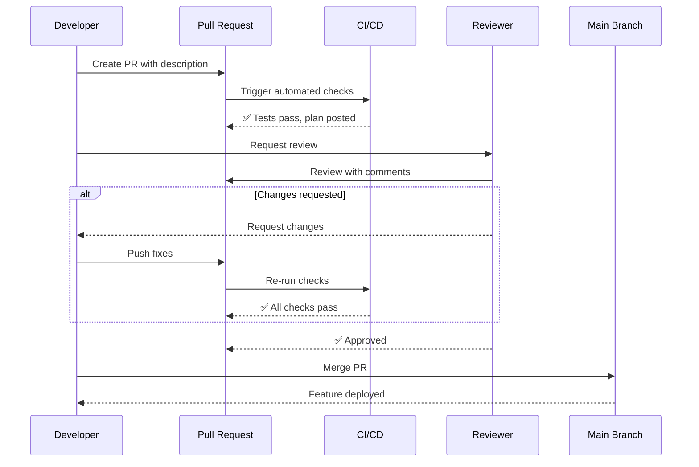

import {
  Info,
  Warning,
  Tip,
  BestPractice,
  Definition,
  Example,
  CommonMistake,
  Debugging,
  Exercise,
  Challenge,
  Quiz,
  CodeBlock,
  TerminalBlock,
  Flashcard,
  ProductionNote,
  InterviewQuestion,
  AITutor,
} from "@site/src/components/shared/InteractiveBlocks";

# GitHub Workflows: PRs, Issues, Projects

<Definition>

**GitHub** is the collaboration layer on top of Git. Issues track work, Pull Requests enable code review, Projects organize sprints, and Actions automates everything. Together, they form the backbone of modern software delivery.

</Definition>

---

## 🎯 Learning Objectives

- Create and review Pull Requests effectively
- Use Issues with templates and labels for work tracking
- Organize work with GitHub Projects and Milestones
- Apply code review best practices that actually improve code quality

---

## 🔥 Pull Requests — The Heart of Collaboration



<BestPractice title="Effective PR Descriptions">

```markdown
## What

- Added cost center tagging to all compute resources
- Created new `cost_center` variable with validation

## Why

CloudNova Finance needs per-department cost tracking for Q3 audit

## Testing

- [x] `terraform plan` shows only tagging changes
- [x] Applied in dev environment — resources tagged correctly
- [x] Destroyed dev resources — no orphaned tags

## Screenshots

[Optional: UI changes, plan output]

## Related

- Closes #42 (Finance cost tracking epic)
- Depends on PR #38 (variable validation module)
```

</BestPractice>

<Warning>

**Never merge your own PR without review.** Even for trivial changes, a second pair of eyes catches things you won't see. At CloudNova, every PR needs at least one approval.

</Warning>

---

## 🏗️ Issues — Work Tracking

<CodeBlock language="yaml" title="Issue Templates (.github/ISSUE_TEMPLATE/bug.yml)">
  name: Bug Report description: File a bug report for CloudNova infrastructure labels: [bug, triage]
  body: - type: input attributes: label: Environment description: Which environment?
  (dev/staging/prod) - type: textarea attributes: label: Expected Behavior - type: textarea
  attributes: label: Actual Behavior - type: textarea attributes: label: Terraform Plan Output
  render: shell
</CodeBlock>

<Tip>

**Conventional labels** speed up triage:

- `bug` / `feature` / `docs` — work type
- `priority:high` / `priority:low` — urgency
- `good-first-issue` — onboarding
- `blocked` — waiting on external dependency

</Tip>

---

## 🏭 Code Review Best Practices

| Do ✅                                    | Don't ❌                             |
| ---------------------------------------- | ------------------------------------ |
| Review for logic, security, performance  | Nitpick formatting (use automation!) |
| Ask questions, suggest alternatives      | Make demands without explanation     |
| Review in < 24 hours                     | Let PRs sit for days                 |
| Praise good solutions                    | Only point out problems              |
| Test the changes locally for complex PRs | Trust the CI blindly for everything  |

<CodeBlock language="markdown" title="Effective Review Comments">
# ✅ Good review comments:

"Does this handle the case where the resource group
doesn't exist yet? We had issues with that in PR #38."

"Could we use a `for_each` here instead of duplicating
the resource block? It would reduce to 4 lines."

"Nice use of `coalesce()` to handle the default value.
Clean pattern."

# ❌ Bad review comments:

"Fix the indentation." → Use `terraform fmt` in CI!

"This is wrong." → WHY is it wrong? Suggest the fix.

"Rewrite this entire module." → Scope is too vague.

</CodeBlock>

---

## ☁️ CloudNova Scenario

<Exercise title="Your First PR Review">

Sarah opened a PR adding a new Terraform module for Azure Kubernetes Service. Review it:

```hcl
resource "azurerm_kubernetes_cluster" "main" {
  name                = "cloudnova-aks"
  location            = azurerm_resource_group.main.location
  resource_group_name = azurerm_resource_group.main.name
  dns_prefix          = "cloudnova"

  default_node_pool {
    name       = "default"
    node_count = 1
    vm_size    = "Standard_B2s"
  }

  identity {
    type = "SystemAssigned"
  }
}
```

**What do you flag?**

<details>
<summary>Review Comments</summary>

1. ❌ **Missing network plugin** — default is `kubenet`. Should use `azure` CNI for production.
2. ❌ **No node pool autoscaling** — add `enable_auto_scaling`, `min_count`, `max_count`.
3. ⚠️ **Single node** — `node_count = 1` means no HA. Minimum 2 for production.
4. ⚠️ **Missing Kubernetes version** — should pin a specific version.
5. ⚠️ **No tags** — missing cost center and environment tags.
6. ❌ **Missing RBAC configuration** — should enable Azure AD integration.
      </details>
</Exercise>

---

## 🧪 Active Recall

<Flashcard
  front="What are the essential elements of a good PR description?"
  back="1. **What** — summary of changes
2. **Why** — business/technical reason
3. **Testing** — how it was verified
4. **Related issues/PRs** — dependencies
5. **Screenshots/plan output** — visual evidence for complex changes"
/>

<Flashcard
  front="What's the difference between 'Request Changes' and 'Comment' in a PR review?"
  back="**Request Changes** blocks merging until the reviewer re-approves. **Comment** is feedback that doesn't block. Use 'Request Changes' for security issues, bugs, or architectural concerns. Use 'Comment' for suggestions and questions."
/>

---

## 📝 Quiz

<Quiz>
  <Question
    question="What should you do before merging a PR?"
    options={[
      "Just merge it — CI passed",
      "Ensure CI passes AND at least one reviewer approved",
      "Wait 24 hours regardless",
      "Merge first, review later",
    ]}
    correct={1}
    explanation="Both automated checks AND human review are required for safe merging."
  />

  <Question
    question="What's the purpose of Issue Templates?"
    options={[
      "They're optional documentation",
      "They ensure bug reports and feature requests contain necessary context",
      "They replace PR descriptions",
      "They're purely cosmetic",
    ]}
    correct={1}
  />
</Quiz>

---

## 🎤 Interview Preparation

<InterviewQuestion level="mid">

**Q:** "Describe your ideal code review process."

**A:** "Automated checks run on PR creation (linting, tests, terraform plan). The author fills out a PR template with context. Reviewers focus on logic, security, and architecture — not formatting. Reviews happen within one business day. Comments are constructive and specific. At least one approval is required. Once approved, the author merges — they own their code."

</InterviewQuestion>

---

## 📋 Summary

| Component         | Purpose                                      |
| ----------------- | -------------------------------------------- |
| **Pull Requests** | Code review gateway before merge             |
| **Issues**        | Track bugs, features, tasks                  |
| **Projects**      | Sprint/kanban board for work organization    |
| **Code Review**   | Quality gate — logic, security, architecture |
