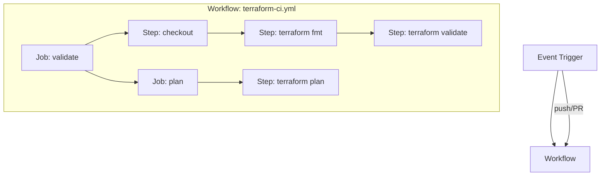
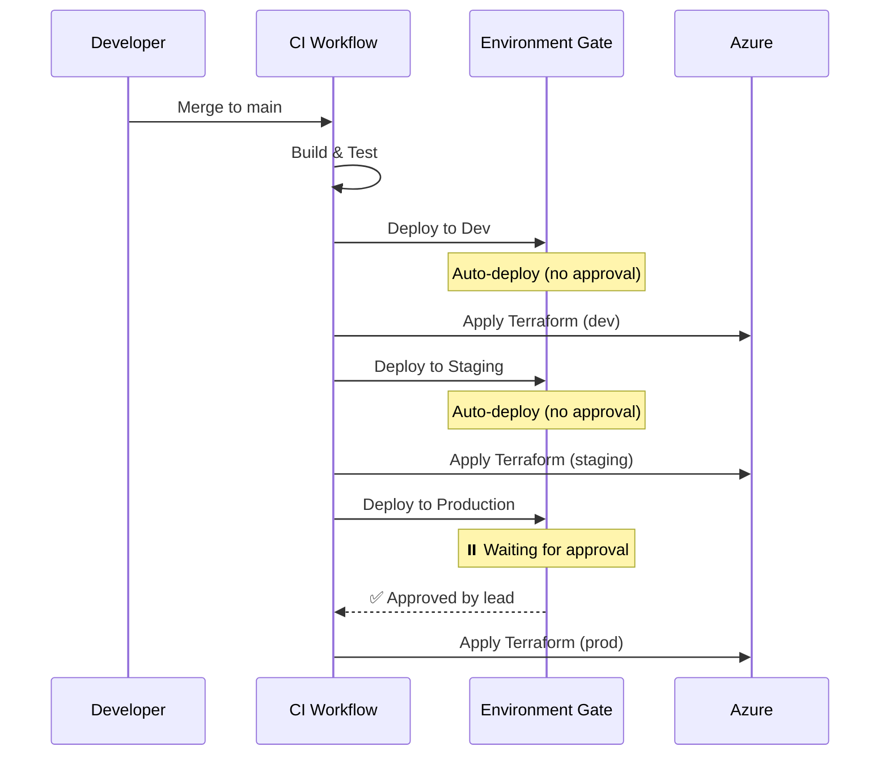

import {
  Info,
  Warning,
  Tip,
  BestPractice,
  Definition,
  Example,
  CommonMistake,
  Debugging,
  Exercise,
  Challenge,
  Quiz,
  CodeBlock,
  TerminalBlock,
  Flashcard,
  ProductionNote,
  SecurityNote,
  InterviewQuestion,
  AITutor,
} from "@site/src/components/shared/InteractiveBlocks";

# GitHub Actions: CI/CD Automation

<Definition>

**GitHub Actions** is an event-driven automation platform. Push code, open a PR, create a release — Actions responds by running workflows. It's the CI/CD engine built directly into GitHub.

</Definition>

---

## 🎯 Learning Objectives

- Understand Actions architecture: workflows, jobs, steps, runners
- Build Terraform CI workflows (fmt → validate → plan)
- Implement CD pipelines with environment approvals
- Secure workflows with secrets and OIDC

---

## 🔥 Core Explanation

### Actions Architecture



<CodeBlock language="yaml" title="Terraform CI Workflow">
name: Terraform CI

on:
pull_request:
paths: - 'terraform/\*\*'
branches: [main]

env:
ARM_CLIENT_ID: ${{ secrets.AZURE_CLIENT_ID }}
ARM_TENANT_ID: ${{ secrets.AZURE_TENANT_ID }}
ARM_SUBSCRIPTION_ID: ${{ secrets.AZURE_SUBSCRIPTION_ID }}

jobs:
validate:
runs-on: ubuntu-latest
steps: - uses: actions/checkout@v4

      - uses: hashicorp/setup-terraform@v3
        with:
          terraform_version: "1.7"

      - name: Terraform Format
        run: terraform fmt -check -recursive
        working-directory: ./terraform

      - name: Terraform Init
        run: terraform init -backend=false
        working-directory: ./terraform

      - name: Terraform Validate
        run: terraform validate
        working-directory: ./terraform

plan:
needs: validate
runs-on: ubuntu-latest
permissions:
contents: read
pull-requests: write
steps: - uses: actions/checkout@v4

      - uses: hashicorp/setup-terraform@v3

      - name: Terraform Plan
        id: plan
        run: |
          terraform init
          terraform plan -no-color -out=tfplan
        working-directory: ./terraform

      - name: Post Plan to PR
        uses: actions/github-script@v7
        with:
          script: |
            const output = `#### Terraform Plan 📋\n
            \`\`\`\n${process.env.PLAN}\n\`\`\``;
            github.rest.issues.createComment({
              issue_number: context.issue.number,
              owner: context.repo.owner,
              repo: context.repo.repo,
              body: output
            });
        env:
          PLAN: ${{ steps.plan.outputs.stdout }}

</CodeBlock>

---

## 🏗️ Professional Explanation

### Environments & Approval Gates



<ProductionNote>

**Protect your production environment** with GitHub Environments. Set required reviewers, wait timers, and deployment branch restrictions. This prevents accidental production deployments.

</ProductionNote>

---

## 🏭 Production Explanation

### OIDC — Passwordless Azure Authentication

<CodeBlock language="yaml" title="OIDC Authentication (No Secrets!)">
name: Terraform Deploy

permissions:
id-token: write # Required for OIDC
contents: read

jobs:
deploy:
runs-on: ubuntu-latest
steps: - name: Azure Login (OIDC)
uses: azure/login@v2
with:
client-id: ${{ secrets.AZURE_CLIENT_ID }}
tenant-id: ${{ secrets.AZURE_TENANT_ID }}
subscription-id: ${{ secrets.AZURE_SUBSCRIPTION_ID }} # No secrets needed! Token federated from GitHub

      - name: Terraform Apply
        run: |
          terraform init
          terraform apply -auto-approve

</CodeBlock>

<SecurityNote>

**OIDC eliminates long-lived credentials.** Instead of storing Azure passwords, GitHub and Azure exchange short-lived tokens. Federation is configured once in Azure, and Actions authenticates using the GitHub token — no secrets to rotate.

</SecurityNote>

---

## ☁️ CloudNova Scenario

<Challenge title="Production Deployment Pipeline">

**Context:** CloudNova needs a deployment pipeline for their Terraform infrastructure:

1. On PR → validate and plan (post plan as PR comment)
2. On merge to main → apply to dev automatically
3. Apply to staging automatically after dev succeeds
4. Apply to production requires Sarah's approval

**Task:** Design the workflow file structure.

<details>
<summary>Solution Architecture</summary>

Two workflow files working together:

**`terraform-ci.yml`** (runs on PR):

- `terraform fmt -check`
- `terraform validate`
- `terraform plan` → post to PR

**`terraform-cd.yml`** (runs on merge):

```yaml
jobs:
  dev:
    runs-on: ubuntu-latest
    environment: dev
    steps: [checkout, azure-login, terraform-apply]

  staging:
    needs: dev
    runs-on: ubuntu-latest
    environment: staging
    steps: [checkout, azure-login, terraform-apply]

  production:
    needs: staging
    runs-on: ubuntu-latest
    environment: production # Has required reviewers configured
    steps: [checkout, azure-login, terraform-apply]
```

</details>
</Challenge>

---

## 🧪 Active Recall

<Flashcard
  front="What are the three core components of a GitHub Actions workflow?"
  back="1. **Workflow** — YAML file in `.github/workflows/`
2. **Job** — runs on a runner, contains steps
3. **Step** — individual task (action or shell command)"
/>

<Flashcard
  front="Why use OIDC instead of storing Azure credentials as GitHub secrets?"
  back="OIDC exchanges short-lived, auto-expiring tokens between GitHub and Azure. No long-lived credentials to store, rotate, or leak. Federation is configured once. If a token is compromised, it expires in minutes."
/>

<Flashcard
  front="How do you require human approval before deploying to production?"
  back="Configure a **GitHub Environment** (Settings → Environments → production) with required reviewers. The workflow job references `environment: production`, which pauses deployment until an approved reviewer approves."
/>

---

## 📝 Quiz

<Quiz>
  <Question
    question="What triggers a GitHub Actions workflow?"
    options={[
      "Only manual button clicks",
      "Events: push, pull_request, schedule, workflow_dispatch, etc.",
      "Only on merge to main",
      "It runs continuously",
    ]}
    correct={1}
  />

  <Question
    question="What does `needs: [job-name]` do in a workflow?"
    options={[
      "It's a comment, does nothing",
      "Makes the current job wait until the specified job(s) complete successfully",
      "Creates a dependency on external services",
      "Duplicates the specified job",
    ]}
    correct={1}
  />
</Quiz>

---

## 🎤 Interview Preparation

<InterviewQuestion level="senior">

**Q:** "Walk me through a CI/CD pipeline you've built for infrastructure deployments."

**A:** "At CloudNova, I built a two-workflow system. On PR, `terraform fmt` checks formatting, `terraform validate` checks syntax, and `terraform plan` posts the infrastructure diff as a PR comment. On merge, the CD workflow deploys to dev and staging automatically, then pauses at production for a senior engineer's approval via GitHub Environments. Authentication uses OIDC federation — no stored Azure credentials. The whole pipeline catches misconfigurations before they hit production and gives reviewers a clear view of infrastructure changes."

</InterviewQuestion>

---

## 📋 Summary

| Component       | What it does                                  |
| --------------- | --------------------------------------------- |
| **Workflow**    | YAML file defining CI/CD logic                |
| **Event**       | Trigger (push, PR, schedule)                  |
| **Job**         | Runs on a GitHub-hosted or self-hosted runner |
| **Environment** | Deployment target with protection rules       |
| **OIDC**        | Passwordless cloud authentication             |
