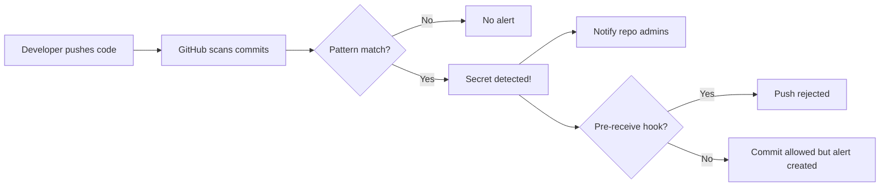
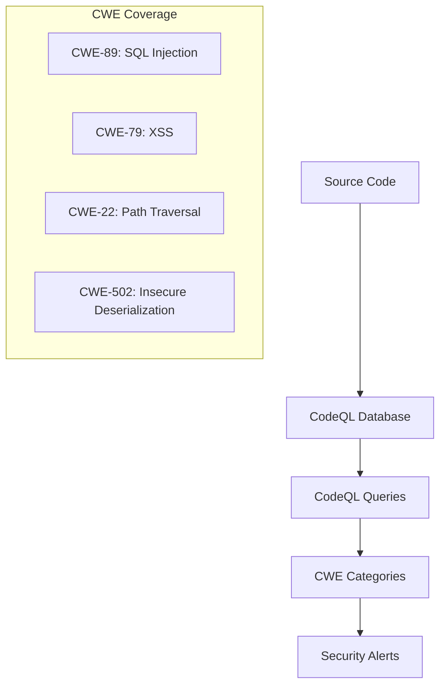

import {
  Info, Warning, Tip, BestPractice, Definition, Example,
  CommonMistake, Exercise, Challenge, Quiz, CodeBlock,
  SecurityNote, ProductionNote, InterviewQuestion, AITutor
} from '@site/src/components/shared/InteractiveBlocks';

# GitHub Advanced Security & Secret Scanning

<Definition>

**GitHub Advanced Security** provides automated tools to find secrets before they're committed, detect vulnerabilities in your code, and protect your supply chain — all integrated into your existing PR workflow.

</Definition>

---

## 🎯 Learning Objectives

- Enable secret scanning to catch credentials before they reach the repo
- Configure CodeQL for automated vulnerability detection
- Automate dependency updates with Dependabot
- Harden branches with protection rules

---

## 🔥 Core Explanation

### Secret Scanning — Your First Line of Defense



<CodeBlock language="yaml" title="Enabling Secret Scanning (.github/workflows/secret-scan.yml)">
name: Secret Scan
on: [push, pull_request]

jobs:
  trufflehog:
    runs-on: ubuntu-latest
    steps:
      - uses: actions/checkout@v4
        with:
          fetch-depth: 0
      
      - uses: trufflesecurity/trufflehog@main
        with:
          path: ./
          base: ${{ github.event.before }}
          head: ${{ github.sha }}
</CodeBlock>

<SecurityNote>

**Partner patterns** detect 200+ credential types automatically (Azure, AWS, GCP, GitHub tokens, etc.). **Push protection** (beta) blocks secrets before they even reach the repository. Enable both for every production repository.

</SecurityNote>

---

## 🏗️ Professional Explanation

### CodeQL — Semantic Code Analysis



<CodeBlock language="yaml" title="CodeQL Setup">
name: CodeQL Analysis
on:
  push:
    branches: [main]
  pull_request:
    branches: [main]
  schedule:
    - cron: '0 8 * * 1'  # Weekly scan

jobs:
  analyze:
    runs-on: ubuntu-latest
    permissions:
      security-events: write
    
    steps:
      - uses: actions/checkout@v4
      
      - uses: github/codeql-action/init@v3
        with:
          languages: python, javascript
      
      - uses: github/codeql-action/analyze@v3
</CodeBlock>

---

## 🏭 Production Explanation

### Dependabot — Never Miss a Patch

<CodeBlock language="yaml" title=".github/dependabot.yml">
version: 2
updates:
  # Terraform modules
  - package-ecosystem: "terraform"
    directory: "/terraform"
    schedule:
      interval: "weekly"
      day: "monday"
    labels:
      - "dependencies"
      - "terraform"
    reviewers:
      - "team/platform"
  
  # Python dependencies
  - package-ecosystem: "pip"
    directory: "/scripts"
    schedule:
      interval: "daily"
    open-pull-requests-limit: 5
  
  # GitHub Actions themselves
  - package-ecosystem: "github-actions"
    directory: "/"
    schedule:
      interval: "weekly"
</CodeBlock>

<ProductionNote>

**Dependabot saves real production incidents.** A critical `hashicorp/aws` provider CVE was patched and Dependabot opened a PR within hours. Without automation, that vulnerability might sit unpatched for weeks.

</ProductionNote>

---

## 🏛️ Branch Protection Rules

| Rule | Recommendation |
|------|---------------|
| **Require PR before merging** | ✅ Always enabled |
| **Require approvals** | ✅ At least 1 (2 for production) |
| **Dismiss stale approvals** | ✅ When new commits are pushed |
| **Require status checks** | ✅ `terraform validate`, `terraform plan` |
| **Require conversation resolution** | ✅ All review threads resolved |
| **Require signed commits** | ✅ For compliance |
| **Require linear history** | ✅ For clean git history |
| **Do not allow bypass** | ✅ Include administrators |

---

## ☁️ CloudNova Scenario

<Challenge title="Secret Exposure Response">

Sarah pushes a commit and immediately sees a GitHub alert: "Azure Storage Key detected in commit `abc1234`." The key is in `terraform.tfvars` which was accidentally committed.

**Task:** Respond to the incident — rotate the key, remove from history, prevent recurrence.

<details>
<summary>Incident Response</summary>

```bash
# 1. IMMEDIATELY: Rotate the exposed key in Azure Portal
# Storage Account → Access Keys → Regenerate key1

# 2. Remove the file from Git history
git filter-branch --force --index-filter \
  "git rm --cached --ignore-unmatch terraform.tfvars" \
  --prune-empty --tag-name-filter cat -- --all

# 3. Force push (coordinate with team!)
git push origin --force --all

# 4. Add terraform.tfvars to .gitignore
echo "*.tfvars" >> .gitignore
git add .gitignore
git commit -m "chore: prevent .tfvars from being committed"

# 5. Enable push protection in GitHub
# Settings → Code Security → Secret scanning → Push protection
```
</details>
</Challenge>

---

## 🧪 Active Recall

<Flashcard
  front="What three security tools does GitHub provide natively?"
  back="1. **Secret scanning** — detects credentials in commits
2. **Code scanning (CodeQL)** — finds vulnerabilities in code
3. **Dependabot** — automates dependency updates"
/>

<Flashcard
  front="What's the first thing you do when a secret is leaked to GitHub?"
  back="**Immediately rotate the credential.** Removing it from Git history isn't enough — assume the secret was compromised the moment it was pushed. Rotate first, clean history second."
/>

---

## 📝 Quiz

<Quiz>
  <Question
    question="What does Dependabot do?"
    options={[
      "Scans for secrets",
      "Automatically opens PRs to update dependencies",
      "Runs code quality analysis",
      "Deploys to production"
    ]}
    correct={1}
  />
  
  <Question
    question="After a secret is detected in a commit, what is the FIRST action?"
    options={[
      "Delete the repository",
      "Rotate the exposed credential immediately",
      "Rewrite git history",
      "Email the security team"
    ]}
    correct={1}
  />
</Quiz>

---

## 📋 Summary

| Tool | Purpose |
|------|---------|
| **Secret Scanning** | Catch credentials before/after commit |
| **CodeQL** | Find vulnerabilities in source code |
| **Dependabot** | Auto-update outdated dependencies |
| **Branch Protection** | Enforce review + checks before merge |
