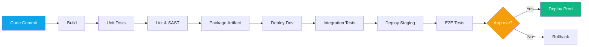

import {
  Info,
  Warning,
  Tip,
  BestPractice,
  Definition,
  Example,
  CommonMistake,
  Debugging,
  Exercise,
  Challenge,
  Quiz,
  CodeBlock,
  TerminalBlock,
  Flashcard,
  ProductionNote,
  ArchitectureNote,
  InterviewQuestion,
  AITutor,
} from "@site/src/components/shared/InteractiveBlocks";

# CI/CD Fundamentals: The Delivery Pipeline

<Definition>

**CI/CD** stands for Continuous Integration / Continuous Delivery (or Deployment). CI means automatically testing every change. CD means automatically delivering tested changes to environments — up to and including production.

</Definition>

<Analogy>

**CI/CD is like a factory assembly line for software.** Raw materials (code commits) enter, get inspected (tests), assembled (build), quality-checked (security scan), and packaged for delivery (deployment) — all automated, all traceable.

</Analogy>

---

## 🎯 Learning Objectives

- Understand the difference between CI, CD, and Continuous Deployment
- Design multi-stage pipelines for infrastructure and applications
- Apply pipeline-as-code principles with YAML

---

## 🧠 Simple Explanation

**Continuous Integration (CI):** Every time you push code, automated tests run. If tests fail, you fix it immediately. No more "it works on my machine."

**Continuous Delivery (CD):** After tests pass, your code is automatically packaged and ready to deploy. A human still presses the "deploy" button for production.

**Continuous Deployment:** After tests pass, your code goes straight to production. No human button. (Requires extreme confidence in your tests.)

---

## 🔥 Core Explanation

### The CI/CD Pipeline



---

## 🏗️ Professional Explanation

### Pipeline-as-Code

<CodeBlock language="yaml" title="CloudNova's CI/CD Pipeline Structure">
name: CloudNova CI/CD Pipeline

on:
push:
branches: [main, 'feature/**']
pull_request:
branches: [main]

env:
ARM_CLIENT_ID: ${{ secrets.AZURE_CLIENT_ID }}

jobs:

# ── CI Phase ──────────────────────────

build-and-test:
runs-on: ubuntu-latest
steps: - uses: actions/checkout@v4 - name: Run Tests
run: pytest tests/ -v - name: SAST Scan
uses: github/codeql-action/analyze@v3

terraform-plan:
needs: build-and-test
runs-on: ubuntu-latest
steps: - uses: actions/checkout@v4 - name: Terraform Plan
run: |
terraform init
terraform plan -out=tfplan

# ── CD Phase ──────────────────────────

deploy-dev:
if: github.ref == 'refs/heads/main'
needs: terraform-plan
environment: dev
runs-on: ubuntu-latest
steps: - name: Deploy to Dev
run: terraform apply -auto-approve tfplan

deploy-staging:
needs: deploy-dev
environment: staging
runs-on: ubuntu-latest
steps: - name: Deploy to Staging
run: terraform apply -auto-approve

deploy-prod:
needs: deploy-staging
environment: production
runs-on: ubuntu-latest
steps: - name: Deploy to Production
run: terraform apply -auto-approve

</CodeBlock>

<ProductionNote>

**Pipeline-as-Code means your CI/CD is version controlled.** If a pipeline breaks, you can `git revert` the workflow file just like any other code. No more "who changed the Jenkins job?"

</ProductionNote>

---

## 🏭 Production Explanation

### Infrastructure vs Application CI/CD

| Aspect       | Application CI/CD          | Infrastructure CI/CD               |
| ------------ | -------------------------- | ---------------------------------- |
| **Build**    | Compile, bundle            | `terraform plan`                   |
| **Test**     | Unit, integration, e2e     | `terraform validate`, OPA policies |
| **Artifact** | Container image, binary    | Terraform plan file                |
| **Deploy**   | Rolling update, blue-green | `terraform apply`                  |
| **Rollback** | Revert deployment          | `terraform apply` previous plan    |
| **Drift**    | N/A                        | Detect & reconcile                 |

<Info>

**Infrastructure CI/CD is fundamentally different.** You can't just "re-deploy" like an application — your state already exists. Plan files act as the "artifact," and Terraform handles the diff between desired and actual state.

</Info>

---

## ☁️ CloudNova Scenario

<Challenge title="Design a Multi-Stage Pipeline">

**Context:** CloudNova is deploying a new microservice with infrastructure:

- Python API (Docker container)
- Azure Container Apps hosting
- Terraform for infrastructure

Design a CI/CD pipeline that:

1. Tests the Python code
2. Builds and scans the Docker image
3. Validates the Terraform changes
4. Deploys to dev → staging → production

<details>
<summary>Pipeline Design</summary>

```yaml
jobs:
  # ── Application CI ──
  test-python:
    runs-on: ubuntu-latest
    steps:
      - run: pytest --cov

  build-image:
    needs: test-python
    steps:
      - run: docker build -t cloudnova-api:${{ github.sha }}
      - run: docker scan cloudnova-api:${{ github.sha }}
      - run: docker push cloudnova-api:${{ github.sha }}

  # ── Infrastructure CI ──
  terraform-plan:
    runs-on: ubuntu-latest
    steps:
      - run: terraform plan -out=tfplan

  # ── CD ──
  deploy-dev:
    needs: [build-image, terraform-plan]
    environment: dev
    steps:
      - run: terraform apply tfplan
      - run: az containerapp update --image cloudnova-api:${{ github.sha }}
```

</details>
</Challenge>

---

## 🧪 Active Recall

<Flashcard
  front="What's the difference between Continuous Delivery and Continuous Deployment?"
  back="**Continuous Delivery**: Code is automatically tested and ready to deploy, but a human approves the production deployment. **Continuous Deployment**: Every passing change goes directly to production — no human intervention."
/>

<Flashcard
  front="Why is 'pipeline-as-code' important?"
  back="Pipelines are version-controlled, reviewable in PRs, and auditable. Changes to CI/CD are tracked like any code change. No more clicking around in Jenkins UIs."
/>

<Flashcard
  front="How is Infrastructure CI/CD different from Application CI/CD?"
  back="Infrastructure uses plan/apply (not build/deploy), state must be managed remotely, rollback means applying a previous plan, and drift detection is essential since resources can change outside Terraform."
/>

---

## 📝 Quiz

<Quiz>
  <Question
    question="What does CI (Continuous Integration) mean in practice?"
    options={[
      "Deploying to production every day",
      "Automatically building and testing every code change",
      "Manually integrating code once per sprint",
      "Installing dependencies continuously",
    ]}
    correct={1}
  />

  <Question
    question="In a pipeline, what is an 'artifact'?"
    options={[
      "A bug in the code",
      "A packaged, versioned output (image, binary, plan file) passed between stages",
      "The CI/CD configuration file",
      "A failed test result",
    ]}
    correct={1}
  />
</Quiz>

---

## 🎤 Interview Preparation

<InterviewQuestion level="senior">

**Q:** "Design a CI/CD pipeline for a team deploying infrastructure with Terraform and applications with Docker."

**A:** Two parallel CI tracks: one for application code (tests → build → scan image → push to registry), one for infrastructure (fmt → validate → plan). Both must pass. CD deploys to dev first (infrastructure then application), integration tests verify, then staging, then production with approval gate. Every step has a rollback path — Terraform can apply previous plan, Containers can deploy previous image tag."

</InterviewQuestion>

---

## 📋 Summary

| Concept              | Key Point                                           |
| -------------------- | --------------------------------------------------- |
| **CI**               | Automate build + test on every commit               |
| **CD (Delivery)**    | Automate deployment readiness, manual prod approval |
| **CD (Deployment)**  | Automate everything including production            |
| **Pipeline as Code** | CI/CD config in Git, reviewed like code             |
| **Infra CI/CD**      | Plan-as-artifact, state-aware, drift detection      |
