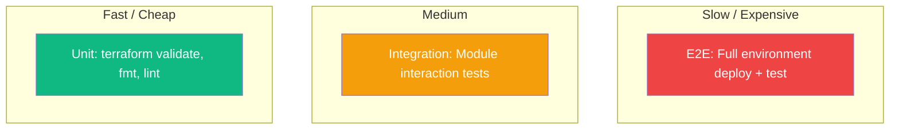

import {
  Info, Warning, Tip, BestPractice, Definition, Example,
  CommonMistake, Debugging, Exercise, Challenge, Quiz, CodeBlock,
  Flashcard, ProductionNote, ArchitectureNote, InterviewQuestion, AITutor
} from '@site/src/components/shared/InteractiveBlocks';

# Pipeline Design Patterns & Testing Strategies

<Definition>

**Pipeline design patterns** are reusable architectural approaches that make CI/CD pipelines scalable, maintainable, and efficient. Combined with **testing strategies**, they prevent bad code from reaching production.

</Definition>

---

## 🎯 Learning Objectives

- Apply fan-in/fan-out, matrix, and sequential pipeline patterns
- Implement the testing pyramid for cloud infrastructure
- Shift security and quality checks left (earlier in the pipeline)

---

## 🔥 Core Explanation

### The Testing Pyramid for Cloud Infrastructure



<BestPractice>

**Most tests should be fast unit-level checks.** Terraform `fmt` and `validate` take seconds. If you only test at the E2E level (deploy full environment), your pipeline takes hours and developers skip testing entirely.

</BestPractice>

---

## 🏗️ Professional Explanation

### Pipeline Patterns

| Pattern | Use Case | Example |
|---------|----------|---------|
| **Fan-out** | Run independent tasks in parallel | Test Python, test Bicep, lint docs all at once |
| **Fan-in** | Wait for all parallel jobs, then proceed | All tests pass → deploy |
| **Matrix** | Run same job with different parameters | Test against Python 3.10, 3.11, 3.12 |
| **Sequential** | Each stage depends on previous | Build → Test → Deploy |

<CodeBlock language="yaml" title="Fan-out + Fan-in Pattern">
jobs:
  # Fan-out: run in parallel
  test-python:
    runs-on: ubuntu-latest
    steps: [run: pytest]
  
  test-terraform:
    runs-on: ubuntu-latest
    steps: [run: terraform validate]
  
  lint-docs:
    runs-on: ubuntu-latest
    steps: [run: markdownlint]
  
  # Fan-in: all must pass before deploy
  deploy:
    needs: [test-python, test-terraform, lint-docs]
    runs-on: ubuntu-latest
    steps: [run: ./deploy.sh]
</CodeBlock>

---

## 🏭 Production Explanation

### Shift-Left Security

<CodeBlock language="yaml" title="Security at Every Stage">
jobs:
  # Stage 1: Pre-commit (fastest)
  pre-commit:
    steps:
      - run: pre-commit run --all-files
      - run: detect-secrets scan
  
  # Stage 2: CI (on PR)
  sast:
    steps:
      - uses: github/codeql-action/analyze@v3
      - run: checkov -d terraform/
  
  # Stage 3: Pre-deploy (pre-prod)
  image-scan:
    steps:
      - run: trivy image cloudnova-api:latest
  
  # Stage 4: Post-deploy (production)
  compliance:
    steps:
      - run: az policy-compliance scan
</CodeBlock>

<ProductionNote>

**Finding a vulnerability during pre-commit costs minutes.** Finding it in production costs hours — and possibly customer data. Every shift left multiplies your return on security investment.

</ProductionNote>

---

## ☁️ CloudNova Scenario

<Exercise title="Optimize a Slow Pipeline">

Sarah's team has a pipeline that takes 45 minutes:

```
Build (5min) → Unit Tests (3min) → Terraform Validate (2min) → 
Security Scan (10min) → Integration Tests (15min) → Deploy Dev (10min)
```

**Task:** Identify optimization opportunities.

<details>
<summary>Optimization Plan</summary>

1. **Parallelize:** Unit Tests, Terraform Validate, and Security Scan can run concurrently — saves ~10 min
2. **Cache:** Terraform providers and Docker layers — saves ~3 min
3. **Shift-left:** Run linting and fmt in pre-commit hooks — removes from pipeline
4. **Split:** Move Integration Tests to post-dev-deploy — defers 15min to async phase

**Result:** ~15-minute pipeline for the critical path
</details>
</Exercise>

---

## 🧪 Active Recall

<Flashcard
  front="What is the 'testing pyramid' and why does it matter for CI/CD?"
  back="More unit tests (fast, cheap) at the bottom, fewer E2E tests (slow, expensive) at the top. This keeps pipeline feedback fast — you don't want to wait an hour to learn you have a syntax error."
/>

<Flashcard
  front="What does 'shift-left' mean?"
  back="Moving quality and security checks earlier in the development lifecycle — from production → deployment → CI → pre-commit → IDE. The earlier you catch issues, the cheaper they are to fix."
/>

<Flashcard
  front="What's the fan-out/fan-in pattern?"
  back="Fan-out runs independent jobs in parallel for speed. Fan-in waits for all to complete before proceeding. Example: test Python, lint docs, validate Terraform all at once → all pass → deploy."
/>

---

## 📝 Quiz

<Quiz>
  <Question
    question="Which tests should be most numerous in your CI pipeline?"
    options={["E2E tests", "Integration tests", "Unit/fmt/validate tests", "Manual tests"]}
    correct={2}
    explanation="Fast, cheap unit-level checks should dominate. E2E tests are valuable but slow — run them selectively."
  />
  
  <Question
    question="What's the primary benefit of the fan-out pattern?"
    options={[
      "Better security",
      "Reduced pipeline time through parallel execution",
      "Simpler pipeline configuration",
      "Fewer merge conflicts"
    ]}
    correct={1}
  />
</Quiz>

---

## 📋 Summary

| Pattern | When to Use |
|---------|------------|
| **Fan-out** | Independent tasks → run in parallel |
| **Matrix** | Same task, different parameters |
| **Sequential** | Each stage depends on previous |
| **Shift-left** | Move checks earlier for faster feedback |
