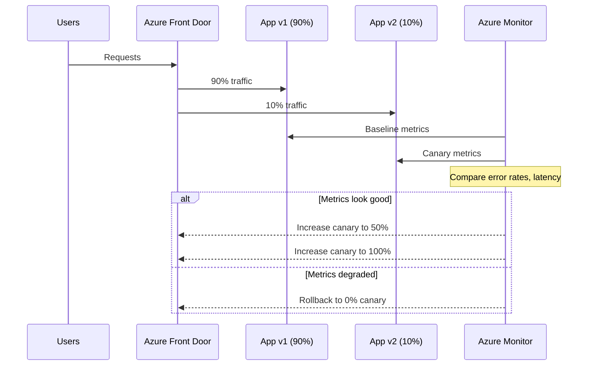

import {
  Info, Warning, Tip, BestPractice, Definition, Example,
  Exercise, Challenge, Quiz, CodeBlock, Flashcard,
  ProductionNote, ArchitectureNote, InterviewQuestion
} from '@site/src/components/shared/InteractiveBlocks';

# Release Strategies: Blue-Green, Canary, Rolling

<Definition>

**Release strategies** control how new versions reach users. The goal is always the same: deploy changes without downtime, without broken user experiences, and with the ability to roll back instantly.

</Definition>

---

## 🎯 Learning Objectives

- Compare three deployment strategies and their trade-offs
- Choose the right strategy for your workload
- Implement zero-downtime deployments in Azure

---

## 🔥 Core Explanation

### Strategy Comparison

```mermaid
graph TD
    subgraph "Blue-Green"
        LB1[Load Balancer] --> BLUE[Blue (v1)]
        LB1 --> GREEN[Green (v2)]
        LB1 -.->|Switch| GREEN
    end
    
    subgraph "Canary"
        LB2[Load Balancer] --> V1_90[v1: 90%]
        LB2 --> V2_10[v2: 10%]
        LB2 -.->|Gradually shift| V2_100[v2: 100%]
    end
    
    subgraph "Rolling"
        LB3[Load Balancer] --> I1[Instance 1: v1→v2]
        LB3 --> I2[Instance 2: v1]
        LB3 --> I3[Instance 3: v1]
        I2 -.->|Next| I2B[Instance 2: v2]
        I3 -.->|Next| I3B[Instance 3: v2]
    end
```

| Strategy | How it works | Rollback | Cost | Best for |
|----------|-------------|----------|------|----------|
| **Blue-Green** | Two identical environments, switch traffic | Instant (switch back) | 2x infrastructure | Critical apps, DB migrations |
| **Canary** | Gradual traffic shift to new version | Stop traffic shift | Slightly higher | APIs, web apps |
| **Rolling** | Replace instances one at a time | Slow (reverse process) | Same as normal | Stateless services, K8s |

---

## 🏗️ Professional Explanation

### Blue-Green for Infrastructure

<CodeBlock language="terraform" title="Blue-Green with Terraform Workspaces">
# Deploy green environment
terraform workspace new green
terraform apply -var="environment=green"

# Run tests against green
./smoke-test.sh green.cloudnova.io

# Switch traffic (Azure Front Door)
az network front-door backend-pool update \
  --resource-group cloudnova \
  --name default-backend \
  --address green.cloudnova.io

# After verification, destroy blue
terraform workspace select blue
terraform destroy
</CodeBlock>

<ProductionNote>

**Blue-green for infrastructure is expensive but worth it.** CloudNova uses it for major database migrations and Kubernetes cluster upgrades — scenarios where a failed rollback would cause extended downtime.

</ProductionNote>

---

## 🏛️ Architect Explanation

### Canary with Azure



<ArchitectureNote>

**Canary is not about the deployment — it's about the observation.** Without proper monitoring comparing v1 and v2 metrics, canary deployment is just gambling. Every canary needs a defined success metric and automated rollback trigger.

</ArchitectureNote>

---

## 🧪 Active Recall

<Flashcard
  front="What's the main cost of blue-green deployment?"
  back="You need 2x infrastructure — two complete environments running simultaneously. During the switch, both are live. After verification, you can destroy the old environment."
/>

<Flashcard
  front="What is the key difference between canary and rolling deployment?"
  back="Canary routes a percentage of users to the new version (gradual traffic shift). Rolling replaces instances one at a time (gradual instance replacement). Canary is about traffic; rolling is about instances."
/>

<Flashcard
  front="What's the biggest risk of rolling deployment?"
  back="During the rollout, you're running mixed versions. If v2 introduces a database schema change, v1 instances might fail. Blue-green avoids this by keeping environments completely separate."
/>

---

## 📝 Quiz

<Quiz>
  <Question
    question="Which deployment strategy requires 2x infrastructure?"
    options={["Rolling", "Canary", "Blue-Green", "All of the above"]}
    correct={2}
  />
  
  <Question
    question="What is essential for a successful canary deployment?"
    options={[
      "Fast instances",
      "Monitoring comparing v1 vs v2 metrics with automated rollback",
      "A large team",
      "Manual approval"
    ]}
    correct={1}
    explanation="Without comparative monitoring and automated rollback, canary deployment is just hoping nothing breaks."
  />
</Quiz>

---

## 📋 Summary

| Strategy | Rollback Speed | Cost | Best For |
|----------|---------------|------|----------|
| **Blue-Green** | Instant | 2x infra | DB migrations, critical upgrades |
| **Canary** | Fast (stop shift) | Slightly higher | APIs, web apps |
| **Rolling** | Slow (reverse) | Normal | Stateless K8s services |
