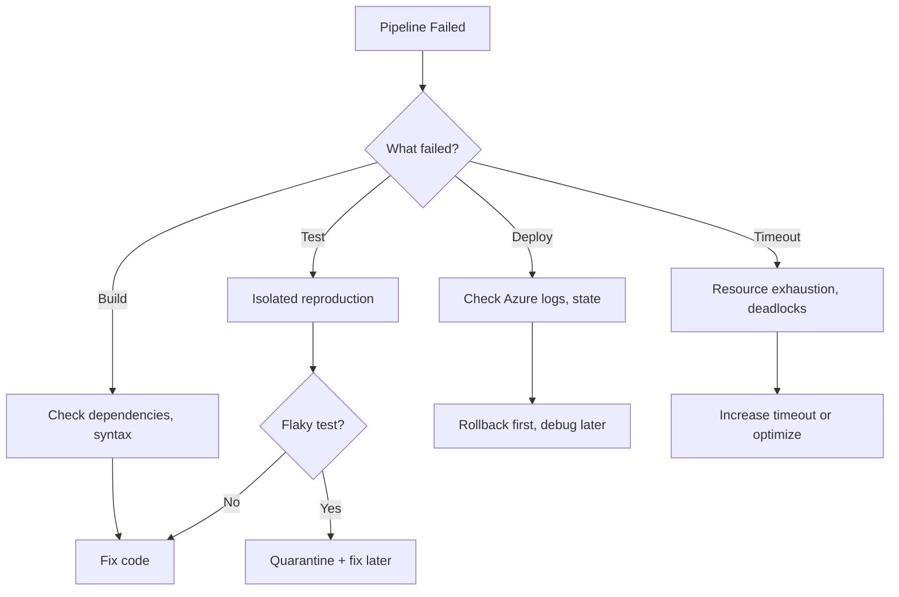

import {
  Info,
  Warning,
  Tip,
  BestPractice,
  Definition,
  CommonMistake,
  Debugging,
  Challenge,
  Quiz,
  CodeBlock,
  Flashcard,
  ProductionNote,
  InterviewQuestion,
} from "@site/src/components/shared/InteractiveBlocks";

# Pipeline Debugging & Incident Response

<Definition>

**Pipeline debugging** is the systematic process of finding and fixing CI/CD failures. **Incident response** is what you do when a deployment breaks production — and how you recover fast.

</Definition>

---

## 🎯 Learning Objectives

- Debug pipeline failures methodically (not by clicking "re-run")
- Build runbooks for common CI/CD failure modes
- Automate rollback and incident response

---

## 🔥 Core Explanation

### The Pipeline Debugging Framework



<BestPractice>

**Never "re-run and hope."** If a pipeline fails, debug the root cause first. Blind re-runs waste CI minutes and mask real problems. The only exception: known infrastructure flakes (network timeouts, runner issues).

</BestPractice>

---

## 🏗️ Professional Explanation

### Common Failure Modes & Runbooks

| Failure                  | Symptom                             | Runbook                                             |
| ------------------------ | ----------------------------------- | --------------------------------------------------- |
| **Terraform state lock** | `Error acquiring state lock`        | Check for stuck lock, force-unlock if safe          |
| **Azure quota exceeded** | `QuotaExceeded` error               | Increase quota or clean up unused resources         |
| **Secret expired**       | `Authentication failed`             | Rotate service principal secret, update in pipeline |
| **Dependency timeout**   | `npm install` / `pip install` hangs | Check mirror availability, add retry logic          |
| **Flaky test**           | Same code, different results        | Quarantine the test, create ticket to fix           |

<CodeBlock language="yaml" title="Self-Healing Pipeline with Retry">
  jobs: deploy: runs-on: ubuntu-latest steps: - name: Terraform Apply with Retry uses:
  nick-fields/retry@v3 with: timeout_minutes: 10 max_attempts: 3 retry_on: error command: |
  terraform apply -auto-approve tfplan || \ (terraform force-unlock -force LOCK_ID && \ terraform
  apply -auto-approve tfplan)
</CodeBlock>

---

## 🏭 Production Explanation

### Automated Rollback

<CodeBlock language="yaml" title="Rollback on Deployment Failure">
jobs:
  deploy:
    steps:
      - name: Deploy
        id: deploy
        run: terraform apply -auto-approve tfplan
        continue-on-error: true
      
      - name: Health Check
        if: steps.deploy.outcome == 'success'
        run: ./health-check.sh || exit 1
        continue-on-error: true
      
      - name: Rollback on Failure
        if: failure()
        run: |
          echo "⚠️ Deployment failed or unhealthy — rolling back"
          # For Terraform: we have the previous state in remote backend
          # Rollback means applying a known-good config
          git checkout ${{ env.PREVIOUS_STABLE_COMMIT }}
          terraform apply -auto-approve
</CodeBlock>

<ProductionNote>

**Every deployment pipeline needs a rollback path.** For Terraform, the rollback is `terraform apply` of a previous plan or a known-good commit. For containers, it's deploying the previous image tag. Define and TEST the rollback before you need it.

</ProductionNote>

---

## ☁️ CloudNova Scenario

<Challenge title="Production Incident Response">

**Incident:** The 3:00 AM deployment failed halfway through. The Terraform apply partially succeeded — some resources updated, others didn't. The application is in an inconsistent state.

**Your task as on-call engineer:**

1. Stop the bleeding
2. Assess the damage
3. Roll back to the last known good state
4. Root cause analysis

<details>
<summary>Incident Runbook</summary>

```bash
# 1. IMMEDIATE: Check what Terraform did
terraform show  # See current state
terraform plan  # See what's pending

# 2. If resources are in bad state — force rollback
# Revert to last known good commit
git checkout $(git log --oneline -1 --before="3 hours ago" main)
terraform plan   # Should show "undo" operations
terraform apply -auto-approve

# 3. Verify health
./health-check.sh

# 4. Post-incident: Create blameless postmortem
# - What happened?
# - Why did it happen?
# - How to prevent it?
# - How to detect it faster?
```

</details>
</Challenge>

---

## 🧪 Active Recall

<Flashcard
  front="What should you NEVER do when a pipeline fails?"
  back="Blindly click 're-run' without investigating the root cause. This wastes CI minutes and masks real problems. Exception: known infrastructure flakes."
/>

<Flashcard
  front="What is a runbook?"
  back="A documented, step-by-step procedure for handling a specific failure mode. Instead of panicking during an incident, you follow the runbook. Example: 'Terraform state lock — steps to diagnose and force-unlock.'"
/>

<Flashcard
  front="How do you roll back a failed Terraform deployment?"
  back="Checkout a known-good commit or state, run `terraform plan` to see the undo operations, then `terraform apply`. Terraform's state tracks all resources — it knows what to undo."
/>

---

## 📝 Quiz

<Quiz>
  <Question
    question="What is a flaky test?"
    options={[
      "A test that always fails",
      "A test that passes and fails intermittently with the same code",
      "A test written in Python",
      "A test that takes too long",
    ]}
    correct={1}
    explanation="Flaky tests are non-deterministic — same code, different results. They erode trust in CI and should be quarantined and fixed."
  />

  <Question
    question="What's the first thing you should do when a production deployment fails?"
    options={[
      "Debug the root cause immediately",
      "Roll back to the last known good state first, then debug",
      "Notify all developers on Slack",
      "Re-run the pipeline",
    ]}
    correct={1}
    explanation="Stabilize production first (rollback), then debug. Users don't care about your root cause analysis — they care about the service working."
  />
</Quiz>

---

## 📋 Summary

| Principle                | Practice                                 |
| ------------------------ | ---------------------------------------- |
| **Debug, don't re-run**  | Find root cause before retrying          |
| **Runbooks**             | Documented procedures for known failures |
| **Rollback first**       | Stabilize production, debug later        |
| **Self-healing**         | Retry logic for transient failures       |
| **Blameless postmortem** | Learn, don't blame                       |
