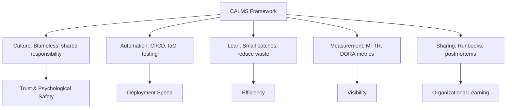

import {
  Info,
  Warning,
  Tip,
  BestPractice,
  Definition,
  Analogy,
  Exercise,
  Challenge,
  Quiz,
  Flashcard,
  ProductionNote,
  InterviewQuestion,
} from "@site/src/components/shared/InteractiveBlocks";

# DevOps Culture & Principles

<Definition>

**DevOps** is a cultural and professional movement that stresses communication, collaboration, and integration between development and operations teams. It is not a job title, a tool, or a team — it's a way of working.

</Definition>

<Analogy>

**DevOps is like removing the wall between the kitchen and the dining room.** Before DevOps, developers (chefs) threw code "over the wall" to operations (servers) who had to deal with whatever arrived. DevOps tears down the wall — the same team cooks and serves.

</Analogy>

---

## 🎯 Learning Objectives

- Understand DevOps as culture, philosophy, and practice
- Apply the CALMS assessment framework
- Recognize and fix DevOps anti-patterns

---

## 🔥 Core Explanation

### The CALMS Framework

| Dimension       | What it means                                | CloudNova Example                       |
| --------------- | -------------------------------------------- | --------------------------------------- |
| **C**ulture     | Shared responsibility, blameless postmortems | Devs on-call for their services         |
| **A**utomation  | CI/CD, IaC, automated testing                | Terraform + GitHub Actions              |
| **L**ean        | Eliminate waste, small batches               | Short-lived feature branches            |
| **M**easurement | Metrics, monitoring, feedback                | MTTR, deployment frequency              |
| **S**haring     | Knowledge sharing, documentation             | Runbooks, postmortems, pair programming |

---

## 🏗️ Professional Explanation

### DevOps Anti-Patterns

| Anti-Pattern                                 | Why it fails                         | Fix                                      |
| -------------------------------------------- | ------------------------------------ | ---------------------------------------- |
| **"DevOps Team"**                            | Creates another silo                 | Embed ops skills in dev teams            |
| **"Throw it over the wall"**                 | No shared ownership                  | Devs own production, ops consults        |
| **"Our tools will fix it"**                  | Tools without culture = faster chaos | Culture first, then tooling              |
| **"We do DevOps because we use Kubernetes"** | Confusing tooling with philosophy    | DevOps is about flow, not specific tools |

<Warning>

**The "DevOps Engineer" title trap:** If you have a "DevOps team" that developers throw work to, you've just renamed your ops team. Real DevOps means development teams own their infrastructure and operations.

</Warning>

---

## 🏭 Production Explanation

### DORA Metrics — How to Measure DevOps

| Metric                          | Elite     | High    | Medium   | Low       |
| ------------------------------- | --------- | ------- | -------- | --------- |
| **Deployment Frequency**        | On-demand | Daily   | Weekly   | Monthly   |
| **Lead Time for Changes**       | < 1 hour  | < 1 day | < 1 week | > 1 month |
| **Mean Time to Restore (MTTR)** | < 1 hour  | < 1 day | < 1 week | > 1 month |
| **Change Failure Rate**         | < 5%      | < 10%   | < 15%    | > 15%     |

<ProductionNote>

**CloudNova's target:** Elite tier for all four metrics. We deploy on-demand (multiple times daily), lead time is hours, MTTR averages 45 minutes (automated rollback), and change failure rate is below 3%.

</ProductionNote>

---

## ☁️ CloudNova Scenario

<Challenge title="Spot the Anti-Pattern">

A team at CloudNova says: "We're doing DevOps! We hired two DevOps engineers and bought a Kubernetes cluster. They handle all deployments for us."

**Task:** Identify anti-patterns and propose a fix.

Analysis

**Anti-patterns:**

1. "Hired DevOps engineers" → Created a separate team, which is a new silo
2. "They handle all deployments for us" → Devs aren't owning production
3. "Bought a Kubernetes cluster" → Confusing tools with DevOps

**Fix:**

1. Embed the DevOps engineers into development teams as enablers
2. Train developers to own their CI/CD pipelines and deployments
3. Build shared responsibility — devs on-call for their services
4. Use Kubernetes because it solves a problem, not because "it's DevOps"
      

</Challenge>

---

## 🧪 Active Recall

<Flashcard
  front="What does CALMS stand for?"
  back="**C**ulture — shared responsibility, blameless postmortems
**A**utomation — CI/CD, IaC, testing
**L**ean — small batches, eliminate waste
**M**easurement — DORA metrics, monitoring
**S**haring — documentation, runbooks, knowledge transfer"
/>

<Flashcard
  front="What are the four DORA metrics?"
  back="1. **Deployment Frequency** — how often you deploy
2. **Lead Time for Changes** — time from commit to production
3. **Mean Time to Restore (MTTR)** — time to recover from failure
4. **Change Failure Rate** — percentage of deployments causing failure"
/>

<Flashcard
  front="Why is having a 'DevOps Team' an anti-pattern?"
  back="It creates another silo between developers and operations. True DevOps means cross-functional teams that own the full lifecycle — development, deployment, and operations. A separate 'DevOps team' just renamed the ops team."
/>

---

## 📝 Quiz

<Quiz>
  <Question
    question="What is DevOps primarily about?"
    options={[
      "Using Kubernetes and Terraform",
      "A cultural movement for collaboration between dev and ops",
      "Hiring DevOps engineers",
      "Automating everything",
    ]}
    correct={1}
    explanation="DevOps is a cultural philosophy first. Tools support the culture, not define it."
  />

  <Question
    question="What does MTTR measure?"
    options={[
      "How often you deploy",
      "Time from failure detection to recovery",
      "Time from commit to production",
      "Number of failing deployments",
    ]}
    correct={1}
  />
</Quiz>

---

## 🎤 Interview Preparation

<InterviewQuestion level="senior">

**Q:** "How would you introduce DevOps practices to a team that's never used them?"

**A:** "Start with culture, not tools. I'd begin with blameless postmortems to build psychological safety. Then introduce small automation wins — probably CI/CD for tests first, since it gives immediate value. Get developers on-call for their services to build ownership. Measure the baseline DORA metrics so we can show improvement. Only then introduce advanced tooling like Kubernetes or service mesh — when the team understands why, not just how."

</InterviewQuestion>

---

## 📋 Summary

| Principle         | Practice                                      |
| ----------------- | --------------------------------------------- |
| **Culture first** | Shared responsibility, blameless postmortems  |
| **Automation**    | CI/CD, IaC, automated everything              |
| **Measurement**   | Track DORA metrics, improve continuously      |
| **No silos**      | Cross-functional teams own the full lifecycle |
