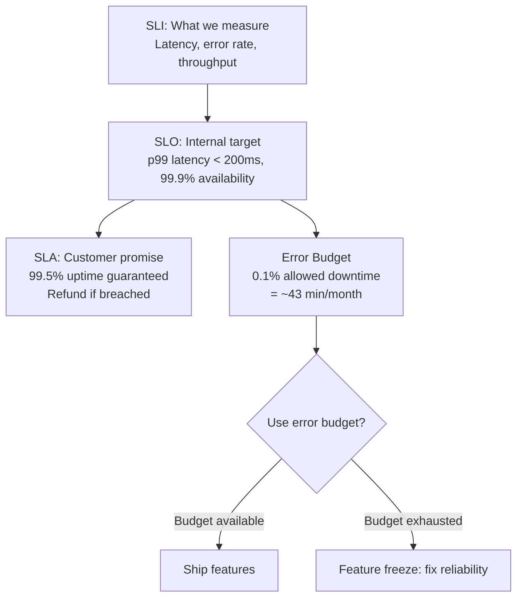

import {
  Info,
  Warning,
  Tip,
  BestPractice,
  Definition,
  Analogy,
  Exercise,
  Challenge,
  Quiz,
  CodeBlock,
  Flashcard,
  ProductionNote,
  ArchitectureNote,
  InterviewQuestion,
} from "@site/src/components/shared/InteractiveBlocks";

# Site Reliability Engineering (SRE) & SLIs

<Definition>

**Site Reliability Engineering (SRE)** applies software engineering principles to operations. It was pioneered by Google and introduces key concepts: SLIs (indicators), SLOs (objectives), error budgets, and toil reduction.

</Definition>

<Analogy>

**SRE is like a thermostat for your service.** You set a target temperature (SLO: "99.9% uptime"), measure the actual temperature (SLI: "current uptime is 99.92%"), and the error budget tells you how much deviation is acceptable before you must stop shipping features and fix reliability.

</Analogy>

---

## 🎯 Learning Objectives

- Understand how SRE extends DevOps with reliability engineering
- Define and measure SLIs, SLOs, and SLAs
- Use error budgets to make data-driven release decisions

---

## 🔥 Core Explanation

### SLIs, SLOs, SLAs — The Reliability Stack

| Term                | Definition                           | Example                              |
| ------------------- | ------------------------------------ | ------------------------------------ |
| **SLI** (Indicator) | Actual measurement                   | "API latency p99 is 215ms this week" |
| **SLO** (Objective) | Internal target                      | "API latency p99 must be < 200ms"    |
| **SLA** (Agreement) | External promise (with consequences) | "99.9% uptime or 10% credit"         |

<BestPractice>

**SLOs should be stricter than SLAs.** If your SLA promises 99.5% uptime, set your SLO at 99.9%. This creates a buffer (error budget) so you catch issues before customers do.

</BestPractice>

---

## 🏗️ Professional Explanation

### Error Budgets in Practice

<CodeBlock language="yaml" title="Error Budget Calculation">
# Monthly error budget for 99.9% SLO:
# 30 days * 24 hours * 60 minutes = 43,200 minutes/month
# Allowed downtime: 43,200 * 0.001 = 43.2 minutes/month

# CloudNova's error budget policy:

# - Green (> 50% remaining): Ship freely

# - Yellow (20-50% remaining): Ship cautiously, prioritize reliability

# - Red (< 20% remaining): Feature freeze, all hands on reliability

# - Exhausted: Emergency mode — revert recent changes

</CodeBlock>

<Tip>

**Error budgets turn subjective "should we ship or fix bugs?" debates into data-driven decisions.** If the budget is green, ship it. If red, fix it. No arguing required.

</Tip>

---

## 🏭 Production Explanation

### Toil — The Silent Killer

| Is it toil?       | Yes | No                                       |
| ----------------- | --- | ---------------------------------------- |
| Manual            | ✅  | Automated = not toil                     |
| Repetitive        | ✅  | Novel work = not toil                    |
| Automatable       | ✅  | Requires human judgment = not toil       |
| No enduring value | ✅  | Creates long-term improvement = not toil |
| Scales with usage | ✅  | Constant regardless of scale = not toil  |

<ProductionNote>

**CloudNova's toil policy:** No engineer should spend more than 50% of their time on toil. Every repetitive task gets automated within two sprints of being identified. Toil reduction is tracked as a key engineering metric.

</ProductionNote>

---

## ☁️ CloudNova Scenario

<Challenge title="Define SLOs for CloudNova">

CloudNova's customer-facing API serves:

- Product catalog (read-heavy, latency-sensitive)
- Order processing (write-heavy, consistency-critical)
- Payment gateway (PCI-compliant, availability-critical)

Define appropriate SLIs and SLOs for each service.

SLO Definitions

| Service              | SLI          | SLO     | Why                        |
| -------------------- | ------------ | ------- | -------------------------- |
| **Product Catalog**  | p99 latency  | < 150ms | Users abandon slow pages   |
| **Order Processing** | Error rate   | < 0.1%  | Revenue-impacting failures |
| **Payment Gateway**  | Availability | 99.99%  | PCI compliance + revenue   |
| **Payment Gateway**  | p99 latency  | < 500ms | External gateway overhead  |

Payment Gateway gets the strictest SLO because it directly impacts revenue and compliance.

</Challenge>

---

## 🧪 Active Recall

<Flashcard
  front="What's the difference between SLI, SLO, and SLA?"
  back="**SLI** = actual measurement (what IS happening). **SLO** = internal target (what we WANT). **SLA** = external promise with consequences (what we PROMISE customers, or else). SLI < SLO < SLA in strictness."
/>

<Flashcard
  front="What is an error budget and why is it useful?"
  back="The allowed amount of unreliability (e.g., 43 min downtime/month for 99.9%). It turns reliability decisions from subjective arguments into data: green budget = ship features, red budget = fix reliability."
/>

<Flashcard
  front="What is 'toil' in SRE terms?"
  back="Manual, repetitive, automatable work that scales with service usage and provides no enduring value. Examples: manually restarting servers, clicking through deployment UIs, hand-editing configs."
/>

---

## 📝 Quiz

<Quiz>
  <Question
    question="If your SLA promises 99.5% uptime, what should your SLO be?"
    options={[
      "99.5% — same as SLA",
      "99.9% — stricter than SLA",
      "99.0% — looser than SLA",
      "Doesn't matter",
    ]}
    correct={1}
    explanation="SLO should be stricter than SLA to catch issues before customers notice. The gap between SLO and SLA is your safety buffer."
  />

  <Question
    question="What happens when the error budget is exhausted?"
    options={[
      "Nothing — keep shipping",
      "Feature freeze — all engineering effort shifts to reliability",
      "Reduce the SLO",
      "Ignore it",
    ]}
    correct={1}
  />
</Quiz>

---

## 📋 Summary

| Concept            | Purpose                          |
| ------------------ | -------------------------------- |
| **SLI**            | Measure actual reliability       |
| **SLO**            | Set internal reliability targets |
| **SLA**            | Promise reliability to customers |
| **Error Budget**   | Data-driven release gating       |
| **Toil Reduction** | Automate repetitive work         |
