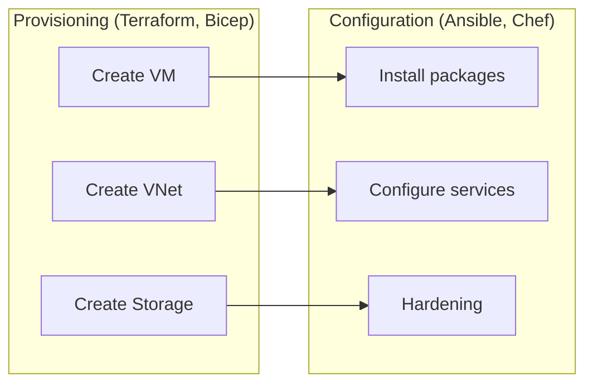
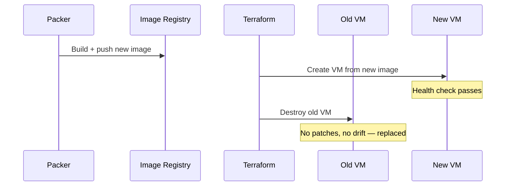

import {
  Info,
  Warning,
  Tip,
  BestPractice,
  Definition,
  Example,
  Exercise,
  Challenge,
  Quiz,
  CodeBlock,
  Flashcard,
  ProductionNote,
  ArchitectureNote,
  InterviewQuestion,
} from "@site/src/components/shared/InteractiveBlocks";

# Infrastructure Automation & Configuration Management

<Definition>

**Infrastructure automation** provisions and configures servers, networks, and services via code. **Configuration management** ensures servers remain in their desired state. Together, they eliminate manual infrastructure work.

</Definition>

---

## 🎯 Learning Objectives

- Distinguish provisioning (Terraform) from configuration (Ansible)
- Apply immutable infrastructure patterns
- Automate server hardening with Ansible playbooks

---

## 🔥 Core Explanation

### Provisioning vs Configuration Management

| Layer             | Tool                     | What it does                |
| ----------------- | ------------------------ | --------------------------- |
| **Provisioning**  | Terraform, Bicep, Pulumi | Creates cloud resources     |
| **Configuration** | Ansible, Chef, Puppet    | Configures OS and software  |
| **Image Baking**  | Packer                   | Pre-builds golden images    |
| **Orchestration** | Kubernetes               | Manages container lifecycle |

---

## 🏗️ Professional Explanation

### Immutable Infrastructure

<BestPractice>

**Never patch a running server — replace it.** When you need to update a server, build a new image, deploy a new VM, and destroy the old one. This eliminates configuration drift and ensures every environment is identical.

</BestPractice>

<CodeBlock language="hcl" title="Packer Template — Golden Image">
source "azure-arm" "ubuntu" {
  image_offer     = "ubuntu-24_04-lts"
  image_publisher = "Canonical"
  
  azure_tags = {
    built_by = "packer"
    version  = var.image_version
  }
}

build {
sources = ["source.azure-arm.ubuntu"]

provisioner "ansible" {
playbook_file = "./ansible/hardening.yml"
}

provisioner "shell" {
inline = [
"sudo apt-get update && sudo apt-get upgrade -y",
"sudo apt-get install -y azure-cli monitoring-agent"
]
}
}

</CodeBlock>

---

## 🏭 Production Explanation

### Ansible for Compliance Automation

## <CodeBlock language="yaml" title="CIS Hardening Playbook">

- name: CIS Benchmark Hardening
  hosts: linux_servers
  become: yes
  vars:
  cis_level: 1
  tasks: - name: Ensure SSH root login is disabled
  lineinfile:
  path: /etc/ssh/sshd_config
  regexp: '^PermitRootLogin'
  line: 'PermitRootLogin no'
  notify: restart sshd - name: Ensure password policy is configured
  pam_pwquality:
  name: minlen
  value: "14"

      - name: Ensure auditd is running
        service:
          name: auditd
          state: started
          enabled: yes

      - name: Ensure automatic updates are configured
        apt:
          name: unattended-upgrades
          state: present

  handlers: - name: restart sshd
  service:
  name: sshd
  state: restarted

  </CodeBlock>

<ProductionNote>

**CloudNova runs Ansible in CI/CD**, not manually. Every new VM gets the hardening playbook applied via Packer during image baking. Any server found non-compliant is automatically replaced — no manual remediation.

</ProductionNote>

---

## 🧪 Active Recall

<Flashcard
  front="What's the difference between provisioning and configuration management?"
  back="**Provisioning** creates cloud resources (VM, VNet, storage). **Configuration management** configures the OS/software on those resources (packages, services, security). Terraform provisions; Ansible configures."
/>

<Flashcard
  front="What is immutable infrastructure?"
  back="Never modify a running server. To update, build a new image with Packer, deploy a new VM, and destroy the old one. This eliminates configuration drift."
/>

<Flashcard
  front="Why use Packer + Ansible together?"
  back="Packer builds the VM image; Ansible configures it during the build. The result is a 'golden image' with all security hardening pre-applied. Every VM from that image is identical and compliant."
/>

---

## 📝 Quiz

<Quiz>
  <Question
    question="Which tool is primarily for infrastructure provisioning?"
    options={["Ansible", "Terraform", "Chef", "Puppet"]}
    correct={1}
  />

  <Question
    question="What is the main benefit of immutable infrastructure?"
    options={[
      "Lower cost",
      "No configuration drift — every server is identical",
      "Faster boot times",
      "Simpler DNS configuration",
    ]}
    correct={1}
    explanation="By replacing instead of patching, you guarantee every server matches the golden image. No 'snowflake' servers."
  />
</Quiz>

---

## 📋 Summary

| Tool          | Purpose                   |
| ------------- | ------------------------- |
| **Terraform** | Provision cloud resources |
| **Ansible**   | Configure servers         |
| **Packer**    | Build golden images       |
| **Immutable** | Replace, don't patch      |
