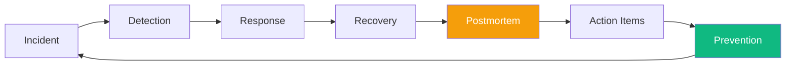

import {
  Info,
  Warning,
  Tip,
  BestPractice,
  Definition,
  CommonMistake,
  Exercise,
  Challenge,
  Quiz,
  Flashcard,
  ProductionNote,
  InterviewQuestion,
} from "@site/src/components/shared/InteractiveBlocks";

# Postmortems & Learning from Incidents

<Definition>

A **postmortem** (or incident retrospective) is a written analysis of an incident: what happened, why, how we fixed it, and how we prevent it from happening again. It must be **blameless** — focused on systems, not individuals.

</Definition>

---

## 🎯 Learning Objectives

- Write postmortems that produce actionable learning
- Differentiate blameless from blameful culture
- Build systems that prevent incident recurrence

---

## 🔥 Core Explanation

### The Postmortem Template

<BestPractice title="CloudNova Postmortem Template">

```markdown
# Incident: [Title]

## Timeline (UTC)

- 14:32 — Automated alert: API error rate > 1%
- 14:34 — On-call engineer acknowledges
- 14:38 — Identified: database connection pool exhausted
- 14:42 — Mitigated: increased pool size, restarted affected pods
- 14:45 — Service restored
  **Duration:** 13 minutes | **Impact:** 2% of users affected

## Root Cause

The new release introduced a connection leak in the payment module.

## What Went Well

- Alert fired within 2 minutes of threshold breach
- Automated rollback was triggered but not needed (mitigation worked)
- On-call response time under 3 minutes

## What Went Wrong

- Connection pool exhaustion wasn't caught in staging (low traffic)
- No connection pool monitoring dashboard

## Action Items

1. [P0] Fix connection leak in payment module — @dev-team
2. [P1] Add connection pool monitoring to dashboards — @sre-team
3. [P2] Add load testing to staging deployment pipeline — @qa-team
```

</BestPractice>

---

## 🏗️ Professional Explanation

### Blameless Culture

| Blameful                  | Blameless                                                 |
| ------------------------- | --------------------------------------------------------- |
| "Who caused this?"        | "What caused this?"                                       |
| "Alex wrote the bad code" | "The code passed review — how did our process miss this?" |
| Punishment                | Learning                                                  |
| Fear of reporting         | Psychological safety                                      |

<Warning>

**Without blameless culture, you don't get postmortems — you get cover-ups.** If engineers fear punishment, incidents go unreported, root causes stay hidden, and the same failures repeat.

</Warning>

---

## 🏭 Production Explanation

### From Postmortem to Prevention



<ProductionNote>

**A postmortem without action items is just a diary entry.** Every postmortem must produce concrete, assigned, time-bound action items. Track them like bugs. Review them in sprint planning.

</ProductionNote>

---

## ☁️ CloudNova Scenario

<Challenge title="Write a Postmortem">

**Incident:** At CloudNova, a Terraform apply deleted the staging database because someone removed a `prevent_destroy` lifecycle rule during a refactor. The incident lasted 45 minutes. The DB was restored from backup.

Write a blameless postmortem.

<details>
<summary>Example Postmortem</summary>

```markdown
# Incident: Staging DB Accidental Deletion

## Timeline (UTC)

- 10:15 — Terraform apply triggered via CI/CD
- 10:18 — Alert: staging API returning 500 errors
- 10:22 — Discovered DB was destroyed during apply
- 10:25 — Initiated DB restore from latest backup
- 10:55 — DB restored, API healthy
  **Duration:** 37 min | **Impact:** Staging environment only

## Root Cause

`prevent_destroy = true` was removed from the DB module during refactoring. Code review did not flag this.

## What Went Well

- Alerts detected the issue immediately
- Backup restoration was tested and reliable

## What Went Wrong

- `prevent_destroy` removal was not caught in review
- No policy check (OPA/Sentinel) flagged the change

## Action Items

1. [P0] Add OPA policy: `prevent_destroy = true` required for DB resources
2. [P1] Add `terraform plan` diff highlighting for destructive changes in PR
3. [P2] Implement `terraform apply` confirmation prompt for destroy operations
```

</details>
</Challenge>

---

## 🧪 Active Recall

<Flashcard
  front="What are the five sections of a good postmortem?"
  back="1. **Timeline** — what happened, when
2. **Root Cause** — why it happened
3. **What Went Well** — process strengths
4. **What Went Wrong** — process gaps
5. **Action Items** — concrete, assigned, time-bound fixes"
/>

<Flashcard
  front="What is the difference between blameful and blameless culture?"
  back="Blameful asks 'who caused this?' and punishes. Blameless asks 'what in our system allowed this?' and learns. Blameless culture creates psychological safety — incidents get reported and fixed instead of hidden."
/>

<Flashcard
  front="What makes a postmortem action item effective?"
  back="It must be **concrete** (not 'improve monitoring'), **assigned** to a person/team, and **time-bound** (not 'someday'). Track action items like bugs — they should be completed or explicitly deprioritized."
/>

---

## 📝 Quiz

<Quiz>
  <Question
    question="What is the primary goal of a postmortem?"
    options={[
      "To find who caused the incident",
      "To learn from the incident and prevent recurrence",
      "To document what happened for compliance",
      "To assign blame",
    ]}
    correct={1}
  />

  <Question
    question="Why is blameless culture important?"
    options={[
      "It's not — blame is necessary",
      "It creates psychological safety so incidents get reported and fixed",
      "It's a legal requirement",
      "It makes people happier but doesn't affect reliability",
    ]}
    correct={1}
  />
</Quiz>

---

## 📋 Summary

| Principle        | Practice                          |
| ---------------- | --------------------------------- |
| **Blameless**    | Focus on systems, not people      |
| **Timeline**     | Document the sequence             |
| **Root Cause**   | Ask "why" five times              |
| **Action Items** | Concrete, assigned, time-bound    |
| **Prevention**   | Postmortem → Action → Improvement |
