import {
  Info,
  Warning,
  Tip,
  BestPractice,
  Definition,
  Exercise,
  Challenge,
  Quiz,
  CodeBlock,
  Flashcard,
  SecurityNote,
  ProductionNote,
  ArchitectureNote,
  InterviewQuestion,
} from "@site/src/components/shared/InteractiveBlocks";

# DevSecOps: Security in the Pipeline

<Definition>

**DevSecOps** integrates security practices into every phase of the DevOps lifecycle — from code commit to production. Security is not a final gate; it's a continuous, automated process embedded in the pipeline.

</Definition>

---

## 🎯 Learning Objectives

- Integrate SAST, DAST, SCA, and container scanning into CI/CD
- Apply the shift-left principle to find vulnerabilities early
- Build a security pipeline that blocks insecure deployments

---

## 🔥 Core Explanation

### The DevSecOps Pipeline

```mermaid
graph LR
    CODE[Code Commit] --> PRE[Pre-commit Hooks]
    PRE --> SAST[SAST: Static Analysis]
    SAST --> SCA[SCA: Dependency Scan]
    SCA --> BUILD[Build]
    BUILD --> IMAGE[Container Image Scan]
    IMAGE --> DAST[DAST: Dynamic Analysis]
    DAST --> COMPLIANCE[Compliance Check]
    COMPLIANCE --> DEPLOY[Deploy]

    style PRE fill:#10b981,color:#fff
    style SAST fill:#10b981,color:#fff
    style SCA fill:#f59e0b,color:#fff
    style IMAGE fill:#f59e0b,color:#fff
    style DAST fill:#ef4444,color:#fff
    style COMPLIANCE fill:#ef4444,color:#fff
```



| Stage          | Tool                           | What it catches         |
| -------------- | ------------------------------ | ----------------------- |
| **Pre-commit** | `detect-secrets`, `pre-commit` | Secrets in code         |
| **SAST**       | CodeQL, SonarQube, Semgrep     | Code vulnerabilities    |
| **SCA**        | Dependabot, Snyk, Trivy        | Vulnerable dependencies |
| **Container**  | Trivy, Aqua, Prisma Cloud      | Image CVEs              |
| **DAST**       | OWASP ZAP, Burp Suite          | Runtime vulnerabilities |
| **Compliance** | Checkov, tfsec, OPA            | IaC misconfigurations   |

---

## 🏗️ Professional Explanation

### Shift-Left Security

<BestPractice>

**The cost of fixing a vulnerability increases exponentially with time.** Finding it during pre-commit costs minutes. Finding it in production costs hours (or worse — customer data exposure). Every shift left is a multiplier on your security ROI.

</BestPractice>

<CodeBlock language="yaml" title="Security Pipeline Example">
name: Security Pipeline
on: [pull_request]

jobs:
secret-scan:
runs-on: ubuntu-latest
steps: - uses: actions/checkout@v4 - run: |
pip install detect-secrets
detect-secrets scan --all-files | \
 detect-secrets audit --report

sast:
runs-on: ubuntu-latest
steps: - uses: actions/checkout@v4 - uses: github/codeql-action/analyze@v3
with:
languages: python

sca:
runs-on: ubuntu-latest
steps: - uses: actions/checkout@v4 - run: |
pip install safety
safety check

iac-scan:
runs-on: ubuntu-latest
steps: - uses: actions/checkout@v4 - uses: bridgecrewio/checkov-action@master
with:
directory: terraform/
framework: terraform

container-scan:
needs: [build]
runs-on: ubuntu-latest
steps: - run: |
docker build -t app:${{ github.sha }} .
          trivy image --severity HIGH,CRITICAL app:${{ github.sha }}

</CodeBlock>

---

## 🏭 Production Explanation

### Security as a Gate, Not a Bottleneck

<SecurityNote>

**Failed security checks should block deployment.** If a CRITICAL CVE is found in a container image, the pipeline must fail — not warn. Security gates are the last line of defense before production.

</SecurityNote>

<CodeBlock language="yaml" title="Conditional Deployment Gate">
  deploy: needs: [container-scan, sast, sca, iac-scan] if: | needs.container-scan.result ==
  'success' && needs.sast.result == 'success' && needs.sca.result == 'success' environment:
  production steps: - run: terraform apply tfplan
</CodeBlock>

<Warning>

**Don't let security become a bottleneck.** If scans take 45 minutes, developers will find ways to skip them. Invest in fast, incremental scanning. Cache vulnerability databases. Use severity-based gates (block on CRITICAL, warn on HIGH).

</Warning>

---

## ☁️ CloudNova Scenario

<Challenge title="Implement DevSecOps">

**Context:** CloudNova's security audit found that Terraform code was deployed without any security scanning. A misconfigured storage account was publicly accessible for 3 weeks before discovery.

**Task:** Design a DevSecOps pipeline that prevents this.

<details>
<summary>Solution</summary>

```yaml
# PR triggers full security scan
security-scan:
  steps:
    - run: checkov -d terraform/ --framework terraform
      # Fails on: public storage, missing encryption, open NSGs

    - run: terrascan scan -d terraform/
      # Fails on: non-compliant resources

    - run: opa eval --data policies/ --input terraform/
      # Fails on: custom CloudNova policies
```

Key policies:

1. `prevent_destroy = true` on all databases
2. Storage accounts: `default_action = "Deny"` on network rules
3. All resources must have `environment` and `cost_center` tags
4. VMs must use managed identities, not passwords
   </details>
</Challenge>

---

## 🧪 Active Recall

<Flashcard
  front="What does 'shift-left' mean in DevSecOps?"
  back="Moving security checks earlier in the development lifecycle — from production → staging → CI → pre-commit → IDE. The earlier you find vulnerabilities, the cheaper and faster they are to fix."
/>

<Flashcard
  front="What's the difference between SAST, DAST, and SCA?"
  back="**SAST** scans source code for vulnerabilities (static = no execution). **DAST** tests running applications (dynamic = during execution). **SCA** scans dependencies/libraries for known CVEs."
/>

<Flashcard
  front="What tools scan Infrastructure as Code for misconfigurations?"
  back="**Checkov** (Bridgecrew), **tfsec** (Aqua), **terrascan** (Tenable), and **OPA/Rego** (Open Policy Agent). These catch misconfigurations like public S3 buckets, open security groups, and missing encryption."
/>

---

## 📝 Quiz

<Quiz>
  <Question
    question="Which scan catches SQL injection vulnerabilities in source code?"
    options={["DAST", "SCA", "SAST", "Container scan"]}
    correct={2}
    explanation="SAST (Static Application Security Testing) analyzes source code without executing it, catching patterns like SQL injection."
  />

  <Question
    question="What should happen when a CRITICAL vulnerability is found in CI?"
    options={[
      "Log a warning and continue",
      "Block the pipeline — deployment must not proceed",
      "Send an email",
      "Ignore it — fix it later",
    ]}
    correct={1}
  />
</Quiz>

---

## 📋 Summary

| Stage          | Tool                       | When             |
| -------------- | -------------------------- | ---------------- |
| **Pre-commit** | detect-secrets, git hooks  | Before commit    |
| **SAST**       | CodeQL, SonarQube, Semgrep | On PR            |
| **SCA**        | Dependabot, Snyk, safety   | On PR + schedule |
| **Container**  | Trivy, Aqua                | After build      |
| **IaC**        | Checkov, tfsec, OPA        | On PR            |
| **DAST**       | OWASP ZAP                  | Staging/pre-prod |
