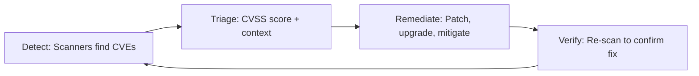

import {
  Info, Warning, Tip, BestPractice, Definition,
  Exercise, Quiz, CodeBlock, Flashcard,
  SecurityNote, ProductionNote, InterviewQuestion
} from '@site/src/components/shared/InteractiveBlocks';

# Vulnerability Management & SBOM

<Definition>

**Vulnerability Management** is the continuous process of identifying, prioritizing, and remediating security vulnerabilities. An **SBOM** (Software Bill of Materials) lists every component in your software — like an ingredients label for your application.

</Definition>

---

## 🎯 Learning Objectives

- Implement vulnerability management: detect → triage → remediate → verify
- Generate and consume SBOMs for supply chain security
- Respond to zero-day vulnerabilities systematically

---

## 🔥 Core Explanation

### The Vulnerability Management Lifecycle

| CVSS Score | Severity | CloudNova SLA |
|-----------|----------|---------------|
| 9.0-10.0 | **Critical** | Fix within 24 hours |
| 7.0-8.9 | **High** | Fix within 7 days |
| 4.0-6.9 | **Medium** | Fix within 30 days |
| 0.1-3.9 | **Low** | Fix within 90 days |

---

## 🏗️ Professional Explanation

### SBOM — Know Your Ingredients

<CodeBlock language="bash" title="Generating SBOMs">
# Generate SBOM for Python project
pip install cyclonedx-bom
cyclonedx-py -o sbom-python.json

# Generate SBOM for Docker image
syft docker:cloudnova-api:latest -o cyclonedx-json > sbom-image.json

# Generate SBOM for Terraform modules
# List all providers and their versions
terraform providers schema -json | \
  jq '.provider_schemas | keys'
</CodeBlock>

<SecurityNote>

**Executive Order 14028** requires SBOMs for software sold to the US government. Even if you don't sell to the government, SBOMs are essential for zero-day response — when Log4Shell hits, you need to know instantly if you're affected.

</SecurityNote>

---

## 🏭 Production Explanation

### Zero-Day Response Playbook

<CodeBlock language="bash" title="Zero-Day Response Automation">
# 1. Search SBOM for affected component
grep -r "log4j" sbom-*.json

# 2. Find all images using the vulnerable component
syft scan registry.cloudnova.io/* | grep "log4j"

# 3. Patch and rebuild
git checkout -b fix/CVE-2026-XXXXX
# Update dependency version
# Wait for CI to build, scan, and deploy

# 4. Verify remediation
trivy image cloudnova-api:patched | grep "log4j"
# Should return nothing — vulnerability gone
</CodeBlock>

<ProductionNote>

**Without an SBOM, finding affected systems during Log4Shell took weeks.** With an SBOM, CloudNova identified all affected containers in 15 minutes by searching for `log4j-core` across all generated SBOMs.

</ProductionNote>

---

## 🧪 Active Recall

<Flashcard
  front="What is an SBOM and why is it critical for security?"
  back="**Software Bill of Materials** — a complete list of every component, library, and dependency in your software. Critical for zero-day response: when a CVE is announced, you search your SBOM to instantly know if you're affected."
/>

<Flashcard
  front="What's the CVSS severity range for a CRITICAL vulnerability?"
  back="**9.0-10.0** — requires remediation within 24 hours at CloudNova."
/>

<Flashcard
  front="What's the difference between triage and remediation?"
  back="**Triage** = assess severity + context (is this CVE actually exploitable in our environment?). **Remediation** = fix it (patch, upgrade, or apply compensating controls)."
/>

---

## 📝 Quiz

<Quiz>
  <Question
    question="How quickly should you fix a CRITICAL (CVSS 9.0+) vulnerability?"
    options={["Within 30 days", "Within 7 days", "Within 24 hours", "Whenever convenient"]}
    correct={2}
  />
  
  <Question
    question="What is the primary value of an SBOM?"
    options={[
      "It satisfies auditors",
      "Instant identification of affected systems during zero-day response",
      "It replaces vulnerability scanning",
      "It's required for open source projects"
    ]}
    correct={1}
  />
</Quiz>

---

## 📋 Summary

| Component | Purpose |
|-----------|---------|
| **Vulnerability Mgmt** | Detect → Triage → Remediate → Verify |
| **SBOM** | Complete component inventory |
| **CVSS** | Standardized severity scoring |
| **Zero-Day Response** | SBOM search → patch → rebuild → verify |
