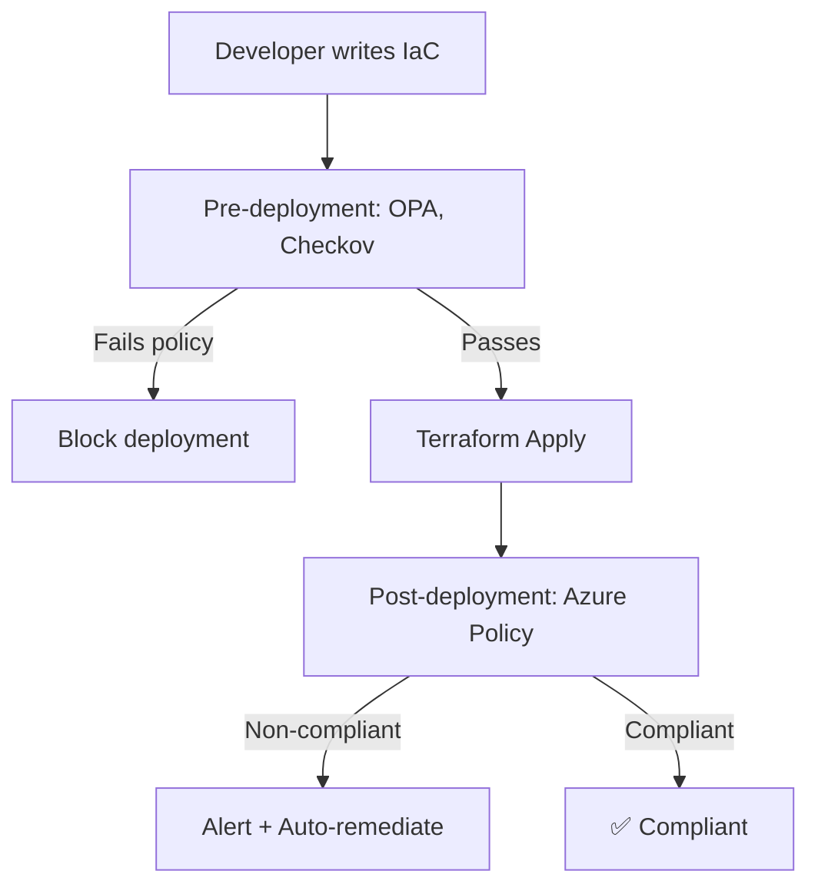

import {
  Info, Warning, Tip, BestPractice, Definition,
  Exercise, Challenge, Quiz, CodeBlock, Flashcard,
  SecurityNote, ProductionNote, ArchitectureNote, InterviewQuestion
} from '@site/src/components/shared/InteractiveBlocks';

# Compliance as Code & Policy-as-Code

<Definition>

**Policy-as-Code** enforces rules through code instead of manual review. **Compliance-as-Code** extends this to regulatory requirements — automatically proving that infrastructure meets standards like SOC2, ISO 27001, or PCI DSS.

</Definition>

---

## 🎯 Learning Objectives

- Write and enforce policies with OPA/Rego and Azure Policy
- Automate compliance evidence collection
- Prevent non-compliant infrastructure from being deployed

---

## 🔥 Core Explanation

### The Policy Enforcement Stack



**Pre-deployment** (OPA, Checkov, Sentinel): Catch issues before they reach Azure.
**Post-deployment** (Azure Policy): Continuously monitor and auto-remediate.

---

## 🏗️ Professional Explanation

### OPA/Rego — Guardrails for Terraform

<CodeBlock language="rego" title="OPA Policy: Enforce Tagging">
package terraform.analysis

# All Azure resources must have tags
deny[msg] {
  resource := input.resource_changes[_]
  resource.type == "azurerm_resource_group"
  not resource.change.after.tags
  msg = sprintf("%s: Resource group must have tags", [resource.address])
}

deny[msg] {
  resource := input.resource_changes[_]
  resource.type == "azurerm_resource_group"
  not resource.change.after.tags.environment
  msg = sprintf("%s: Missing required tag: environment", [resource.address])
}

# Storage accounts must not be publicly accessible
deny[msg] {
  resource := input.resource_changes[_]
  resource.type == "azurerm_storage_account"
  resource.change.after.network_rules.default_action != "Deny"
  msg = sprintf("%s: Storage account must deny public access", [resource.address])
}
</CodeBlock>

<CodeBlock language="bash" title="Run OPA in CI/CD">
# Export terraform plan to JSON
terraform plan -out=tfplan
terraform show -json tfplan > tfplan.json

# Evaluate OPA policies against the plan
opa eval --data policies/ --input tfplan.json \
  "data.terraform.analysis.deny"

# If any deny rules fire, fail the pipeline
if [ $? -ne 0 ]; then
  echo "❌ Policy violation detected"
  exit 1
fi
</CodeBlock>

<ArchitectureNote>

**OPA evaluates policies against planned changes, not actual state.** This means you catch violations before resources exist. Combined with Azure Policy (which catches drift post-deployment), you have defense-in-depth for compliance.

</ArchitectureNote>

---

## 🏭 Production Explanation

### Azure Policy — Continuous Compliance

<CodeBlock language="json" title="Azure Policy: Require Tags">
{
  "properties": {
    "displayName": "Require environment tag on resource groups",
    "policyRule": {
      "if": {
        "field": "type",
        "equals": "Microsoft.Resources/resourceGroups"
      },
      "then": {
        "effect": "deny",
        "details": {
          "type": "Microsoft.Resources/tags",
          "existenceCondition": {
            "field": "Microsoft.Resources/tags[environment]",
            "exists": "true"
          }
        }
      }
    }
  }
}
</CodeBlock>

| Effect | Behavior |
|--------|----------|
| **Deny** | Block non-compliant creation |
| **Audit** | Log non-compliance (don't block) |
| **DeployIfNotExists** | Auto-remediate when missing |
| **Modify** | Auto-add tags/configuration |

<ProductionNote>

**CloudNova uses a layered approach:** OPA blocks non-compliance in CI/CD (pre-deployment). Azure Policy catches drift and legacy resources (post-deployment). Together, they ensure continuous compliance — not just point-in-time checks.

</ProductionNote>

---

## ☁️ CloudNova Scenario

<Challenge title="Write Compliance Policies">

**Context:** CloudNova needs to enforce for SOC2 compliance:
1. All storage accounts must deny public access
2. All resources must have `environment`, `cost_center`, and `data_classification` tags
3. VMs must use managed identities, not passwords

Write the OPA policies and Azure Policy definitions.

<details>
<summary>Solution</summary>

```rego
# OPA: Tag enforcement
deny[msg] {
  required_tags := {"environment", "cost_center", "data_classification"}
  resource := input.resource_changes[_]
  not required_tags - object.keys(object.get(resource.change.after, "tags", {})) == set()
  msg = sprintf("%s: Missing required tags", [resource.address])
}

# OPA: Managed identity requirement
deny[msg] {
  resource := input.resource_changes[_]
  resource.type == "azurerm_linux_virtual_machine"
  not resource.change.after.identity
  msg = sprintf("%s: VM must use managed identity", [resource.address])
}
```
</details>
</Challenge>

---

## 🧪 Active Recall

<Flashcard
  front="What's the difference between OPA and Azure Policy?"
  back="**OPA** evaluates policies pre-deployment (against Terraform plans) — catches issues before resources exist. **Azure Policy** monitors post-deployment — catches drift and legacy resources. Use both for defense-in-depth."
/>

<Flashcard
  front="What is the Rego language?"
  back="Rego is OPA's policy language. It's declarative and query-based — you define what compliance looks like, and OPA checks if the input matches. It's designed specifically for policy evaluation."
/>

<Flashcard
  front="What are the four Azure Policy effects?"
  back="1. **Deny** — block non-compliant creation
2. **Audit** — log but don't block
3. **DeployIfNotExists** — auto-remediate
4. **Modify** — auto-add/change properties"
/>

---

## 📝 Quiz

<Quiz>
  <Question
    question="Where does OPA evaluate policies — before or after deployment?"
    options={["After deployment", "Before deployment (during CI/CD)", "On-demand only", "Never"]}
    correct={1}
    explanation="OPA runs against `terraform plan` output — catching issues before resources are created."
  />
  
  <Question
    question="Which Azure Policy effect should you use for auto-remediation?"
    options={["Deny", "Audit", "DeployIfNotExists", "Disabled"]}
    correct={2}
  />
</Quiz>

---

## 📋 Summary

| Layer | Tool | When |
|-------|------|------|
| **Pre-deployment** | OPA, Checkov, Sentinel | CI/CD (PR stage) |
| **Post-deployment** | Azure Policy | Continuously |
| **Audit** | Compliance reports | Automated |
