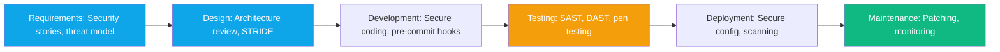

import {
  Info,
  Warning,
  Tip,
  BestPractice,
  Definition,
  Exercise,
  Challenge,
  Quiz,
  Flashcard,
  SecurityNote,
  ProductionNote,
  InterviewQuestion,
} from "@site/src/components/shared/InteractiveBlocks";

# Secure SDLC & Threat Modeling

<Definition>

The **Secure SDLC** (Software Development Lifecycle) embeds security activities into every phase of development — from requirements through deployment and maintenance. **Threat modeling** systematically identifies what could go wrong before writing a single line of code.

</Definition>

---

## 🎯 Learning Objectives

- Apply Secure SDLC practices to cloud infrastructure projects
- Use STRIDE to identify threats systematically
- Write security requirements as part of user stories

---

## 🔥 Core Explanation

### The Secure SDLC



---

## 🏗️ Professional Explanation

### STRIDE Threat Modeling

| Threat                     | What it means            | Cloud Example                                         |
| -------------------------- | ------------------------ | ----------------------------------------------------- |
| **S**poofing               | Impersonating identity   | Stolen API keys, fake managed identity                |
| **T**ampering              | Modifying data/code      | Unauthorized Terraform apply, altered container image |
| **R**epudiation            | Denying an action        | No audit logs for who deleted a resource              |
| **I**nfo Disclosure        | Data leak                | Public S3 bucket, exposed connection string           |
| **D**enial of Service      | Overwhelming the service | DDoS, resource exhaustion                             |
| **E**levation of Privilege | Getting higher access    | Exploiting RBAC misconfiguration                      |

<SecurityNote>

**Threat model before you code, not after.** For CloudNova's payment processing module, we modeled threats during the design phase and caught 8 potential vulnerabilities before a single line of Terraform was written. Cost to fix in design: 2 hours. Cost to fix in production: incident + audit + customer impact.

</SecurityNote>

---

## 🏭 Production Explanation

### Security User Stories

<BestPractice>

**Every feature story should have a security counterpart:**

```
As a security engineer,
I want all storage accounts to deny public access by default,
So that data is never accidentally exposed to the internet.

Acceptance Criteria:
- [ ] Terraform module defaults to deny public access
- [ ] OPA policy blocks any override to allow public access
- [ ] Azure Policy audits all storage accounts for compliance
```

</BestPractice>

---

## 🧪 Active Recall

<Flashcard
  front="What does STRIDE stand for?"
  back="**S**poofing, **T**ampering, **R**epudiation, **I**nformation Disclosure, **D**enial of Service, **E**levation of Privilege — six categories of security threats."
/>

<Flashcard
  front="When should you do threat modeling?"
  back="During the **design phase**, before writing code. Threat modeling in design costs hours. Fixing threats found in production costs incidents and potentially customer data exposure."
/>

---

## 📝 Quiz

<Quiz>
  <Question
    question="What phase of the SDLC should threat modeling occur?"
    options={["Deployment", "Design/Requirements", "Testing", "After an incident"]}
    correct={1}
  />

  <Question
    question="Which STRIDE category involves a public S3 bucket exposing customer data?"
    options={["Spoofing", "Tampering", "Information Disclosure", "Denial of Service"]}
    correct={2}
  />
</Quiz>

---

## 📋 Summary

| Principle            | Practice                         |
| -------------------- | -------------------------------- |
| **Secure SDLC**      | Security in every phase          |
| **STRIDE**           | Systematic threat identification |
| **Threat Model**     | Design-phase, not post-incident  |
| **Security Stories** | Acceptance criteria for security |
