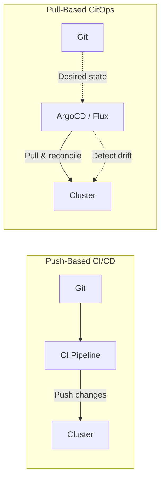
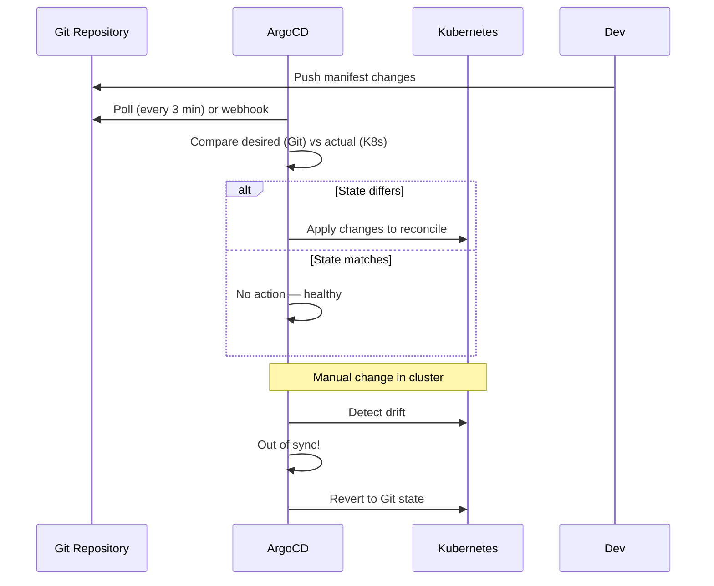

import {
  Info, Warning, Tip, BestPractice, Definition, Analogy,
  Exercise, Challenge, Quiz, CodeBlock, Flashcard,
  ProductionNote, ArchitectureNote, InterviewQuestion
} from '@site/src/components/shared/InteractiveBlocks';

# GitOps: Principles & Practice

<Definition>

**GitOps** is an operational model where Git is the single source of truth for declarative infrastructure and applications. An automated process (ArgoCD, Flux) continuously reconciles the live state with the desired state in Git.

</Definition>

<Analogy>

**GitOps is like a self-correcting thermostat.** You set the desired temperature (Git), and the thermostat (ArgoCD/Flux) continuously adjusts the actual temperature (cluster) to match. If someone opens a window (manual change), the thermostat detects the drift and corrects it.

</Analogy>

---

## 🎯 Learning Objectives

- Understand GitOps as a deployment model vs a tool
- Compare push-based CI/CD (GitHub Actions) with pull-based GitOps (ArgoCD)
- Apply GitOps to Kubernetes and Terraform

---

## 🔥 Core Explanation

### GitOps vs Traditional CI/CD



| Aspect | Push (CI/CD) | Pull (GitOps) |
|--------|-------------|---------------|
| **Who initiates?** | CI pipeline pushes changes | Agent pulls from Git |
| **Drift detection** | None (unless separate tool) | Built-in — continuous reconciliation |
| **Cluster access** | CI needs cluster credentials | Agent runs inside cluster |
| **Rollback** | Re-run pipeline with old commit | Git revert → auto-reconciled |
| **Audit** | Pipeline logs | Git history = audit log |

---

## 🏗️ Professional Explanation

### GitOps with ArgoCD



<CodeBlock language="yaml" title="ArgoCD Application Definition">
apiVersion: argoproj.io/v1alpha1
kind: Application
metadata:
  name: cloudnova-api
  namespace: argocd
spec:
  project: default
  source:
    repoURL: https://github.com/apexdataro-Fin/AEP
    targetRevision: main
    path: k8s/overlays/production
  destination:
    server: https://kubernetes.default.svc
    namespace: cloudnova-prod
  syncPolicy:
    automated:
      prune: true          # Remove resources not in Git
      selfHeal: true       # Revert manual changes
    syncOptions:
      - CreateNamespace=true
</CodeBlock>

<ProductionNote>

**`selfHeal: true` is the superpower of GitOps.** If someone manually edits a Kubernetes resource (`kubectl edit deployment`), ArgoCD detects the drift and reverts it within 3 minutes. The cluster is continuously proven to match Git.

</ProductionNote>

---

## 🏭 Production Explanation

### GitOps for Terraform

<CodeBlock language="yaml" title="Flux + Terraform Controller">
apiVersion: source.toolkit.fluxcd.io/v1
kind: GitRepository
metadata:
  name: cloudnova-infra
spec:
  interval: 5m
  url: https://github.com/apexdataro-Fin/AEP
  ref:
    branch: main
---
apiVersion: infra.contrib.fluxcd.io/v1alpha2
kind: Terraform
metadata:
  name: cloudnova-core
spec:
  interval: 10m
  path: ./terraform/environments/production
  sourceRef:
    kind: GitRepository
    name: cloudnova-infra
  approvePlan: auto
  destroyResourcesOnDeletion: false
  storeReadablePlan: human
</CodeBlock>

<ArchitectureNote>

**GitOps extends beyond Kubernetes.** The same principles (Git as source of truth, reconciliation loop, drift detection) apply to Terraform, Ansible, and any declarative configuration. The key insight: reconcile continuously, not just on deploy.

</ArchitectureNote>

---

## ☁️ CloudNova Scenario

<Challenge title="Design a GitOps Workflow">

**Context:** CloudNova wants to adopt GitOps for their production Kubernetes cluster. Requirements:
- All changes through Git (no `kubectl` directly)
- Automatic drift detection and correction
- Multi-environment: dev, staging, prod from the same repo
- Production requires manual approval

Design the GitOps architecture.

<details>
<summary>Architecture</summary>

```
k8s/
├── bases/                    # Common configs
│   ├── deployment.yaml
│   └── service.yaml
├── overlays/
│   ├── dev/                  # Auto-sync
│   │   └── kustomization.yaml
│   ├── staging/              # Auto-sync
│   │   └── kustomization.yaml
│   └── production/           # Manual sync
│       └── kustomization.yaml

ArgoCD Applications:
- cloudnova-dev: auto-sync enabled, self-heal enabled
- cloudnova-staging: auto-sync enabled, self-heal enabled
- cloudnova-prod: auto-sync DISABLED, manual sync only
```

Production uses manual sync to prevent accidental deployments. Dev/staging auto-sync for velocity.
</details>
</Challenge>

---

## 🧪 Active Recall

<Flashcard
  front="What is the fundamental difference between push-based CI/CD and pull-based GitOps?"
  back="Push-based CI/CD pushes changes to the cluster from outside. Pull-based GitOps has an agent inside the cluster that pulls from Git — providing built-in drift detection and no external cluster credentials needed."
/>

<Flashcard
  front="What does `selfHeal: true` do in ArgoCD?"
  back="It continuously monitors for drift. If someone manually changes a resource in the cluster (`kubectl edit`), ArgoCD detects the change and automatically reverts it to match the state defined in Git."
/>

<Flashcard
  front="What two tools are the leading GitOps operators for Kubernetes?"
  back="**ArgoCD** — declarative, UI-rich, multi-cluster, application-centric. **Flux** — CNCF-graduated, lightweight, integrates with Terraform controller. Both implement the reconciliation loop pattern."
/>

---

## 📝 Quiz

<Quiz>
  <Question
    question="What is the single source of truth in GitOps?"
    options={["The Kubernetes cluster", "Git repository", "ArgoCD dashboard", "CI/CD pipeline"]}
    correct={1}
    explanation="Git is the source of truth. The live cluster is continuously reconciled to match Git."
  />
  
  <Question
    question="What happens if someone runs `kubectl delete deployment` in a GitOps-managed cluster?"
    options={[
      "The deployment stays deleted",
      "ArgoCD recreates it within minutes",
      "An alert fires but nothing changes",
      "Git is updated automatically"
    ]}
    correct={1}
    explanation="With `selfHeal: true`, ArgoCD detects the drift and recreates the deleted resource to match Git."
  />
</Quiz>

---

## 📋 Summary

| Principle | Practice |
|-----------|----------|
| **Git as source of truth** | All changes through Git |
| **Pull, don't push** | Agent reconciles continuously |
| **Drift detection** | Self-heal reverts manual changes |
| **Declarative** | Desired state, not imperative steps |
