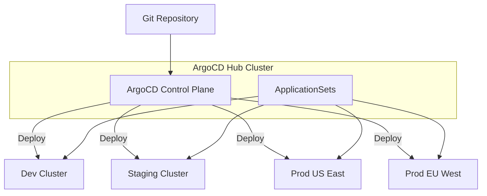

import {
  Info, Warning, Tip, BestPractice, Definition,
  Exercise, Challenge, Quiz, CodeBlock, Flashcard,
  ProductionNote, ArchitectureNote, InterviewQuestion
} from '@site/src/components/shared/InteractiveBlocks';

# ArgoCD Deep Dive: Multi-Cluster & Progressive Delivery

<Definition>

**ArgoCD** is a declarative, GitOps continuous delivery tool for Kubernetes. It automates the deployment of desired application states defined in Git repositories to target Kubernetes clusters.

</Definition>

---

## 🎯 Learning Objectives

- Manage multiple clusters from a single ArgoCD instance
- Implement blue-green and canary deployments with Argo Rollouts
- Use ApplicationSets for scalable, templated deployments

---

## 🔥 Core Explanation

### Multi-Cluster Architecture

---

## 🏗️ Professional Explanation

### Argo Rollouts — Progressive Delivery

<CodeBlock language="yaml" title="Canary Deployment with Argo Rollouts">
apiVersion: argoproj.io/v1alpha1
kind: Rollout
metadata:
  name: cloudnova-api
spec:
  replicas: 5
  strategy:
    canary:
      steps:
        - setWeight: 20    # Route 20% to new version
        - pause:
            duration: 5m   # Wait 5 minutes
        - setWeight: 50    # Route 50%
        - pause:
            duration: 5m
        - setWeight: 100   # Full rollout
      analysis:
        templates:
          - templateName: error-rate-check
        startingStep: 1    # Start analysis after 20% step
</CodeBlock>

<ProductionNote>

**Argo Rollouts replaces Kubernetes Deployment for progressive delivery.** It adds canary, blue-green, and automated analysis (promoted only if metrics stay healthy). If error rates spike during canary, Rollouts automatically aborts.

</ProductionNote>

---

## 🏭 Production Explanation

### ApplicationSets — Deploy at Scale

<CodeBlock language="yaml" title="ApplicationSet for Multi-Environment">
apiVersion: argoproj.io/v1alpha1
kind: ApplicationSet
metadata:
  name: cloudnova-environments
spec:
  generators:
    - list:
        elements:
          - env: dev
            cluster: dev-cluster
            autoSync: "true"
          - env: staging
            cluster: staging-cluster
            autoSync: "true"
          - env: prod
            cluster: prod-cluster
            autoSync: "false"
  template:
    metadata:
      name: cloudnova-{{env}}
    spec:
      source:
        repoURL: https://github.com/apexdataro-Fin/AEP
        path: k8s/overlays/{{env}}
      destination:
        server: '{{cluster}}'
      syncPolicy:
        automated:
          selfHeal: '{{autoSync}}'
</CodeBlock>

---

## 🧪 Active Recall

<Flashcard
  front="What is an ApplicationSet in ArgoCD?"
  back="A templated way to create many ArgoCD Applications from generators (list, Git, cluster). Instead of defining 20 separate Applications for 20 tenants, one ApplicationSet generates them from a list or Git directory."
/>

<Flashcard
  front="How does Argo Rollouts improve on Kubernetes Deployment?"
  back="It adds canary and blue-green strategies with automated analysis. If metrics degrade during a rollout, it automatically aborts. Standard Deployments only support RollingUpdate and Recreate."
/>

---

## 📝 Quiz

<Quiz>
  <Question
    question="What happens if error rates spike during an Argo Rollouts canary deployment?"
    options={[
      "The deployment continues — canary is for testing only",
      "Rollouts automatically aborts and rolls back",
      "An email is sent",
      "Nothing — it's informational only"
    ]}
    correct={1}
  />
</Quiz>

---

## 📋 Summary

| Feature | Purpose |
|---------|---------|
| **Multi-Cluster** | One control plane, many clusters |
| **Rollouts** | Canary/blue-green with auto-analysis |
| **ApplicationSets** | Templated, scalable deployments |
