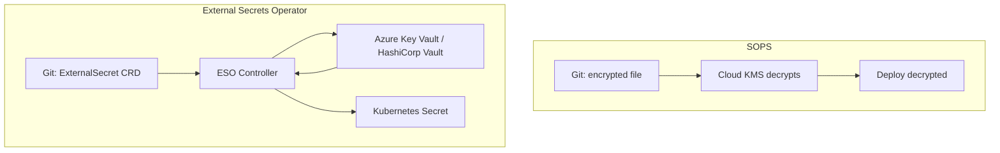

import {
  Info,
  Warning,
  Tip,
  BestPractice,
  Definition,
  Exercise,
  Challenge,
  Quiz,
  CodeBlock,
  Flashcard,
  SecurityNote,
  ProductionNote,
  InterviewQuestion,
} from "@site/src/components/shared/InteractiveBlocks";

# Secrets Management in GitOps

<Definition>

**GitOps secrets management** addresses the fundamental tension: Git is the single source of truth, but Git must never contain plaintext secrets. Solutions encrypt or reference secrets so they can live in Git safely.

</Definition>

---

## 🎯 Learning Objectives

- Understand the challenge: Git as truth, but no plaintext secrets
- Compare SOPS, Sealed Secrets, and External Secrets Operator
- Implement secure secrets in an ArgoCD/Flux workflow

---

## 🔥 Core Explanation

### The Secrets Problem in GitOps

| Challenge              | Why it matters                                             |
| ---------------------- | ---------------------------------------------------------- |
| **Git is truth**       | Secrets must be version-controlled like everything else    |
| **Git is not a vault** | Plaintext secrets in Git = compromised on push             |
| **Reconciliation**     | GitOps agents need secrets to deploy, but can't store them |
| **Rotation**           | Secrets change — Git should reflect the current version    |

---

## 🏗️ Professional Explanation

### Three Approaches

| Tool                          | How it works                                        | Best for                                                  |
| ----------------------------- | --------------------------------------------------- | --------------------------------------------------------- |
| **SOPS**                      | Encrypts values in YAML/JSON with cloud KMS         | Files in Git, decrypted at deploy time                    |
| **Sealed Secrets**            | Encrypts Kubernetes Secrets into SealedSecret CRDs  | K8s-native, cluster-specific encryption                   |
| **External Secrets Operator** | Syncs secrets from external vaults into K8s Secrets | Enterprise with existing vault (Key Vault, Vault, AWS SM) |

<CodeBlock language="bash" title="SOPS with Azure Key Vault">
# Encrypt a secrets file
sops --encrypt \
  --azure-kv https://cloudnova-kv.vault.azure.net/keys/sops-key \
  secrets.yaml > secrets.enc.yaml

# Decrypt at deploy time (ArgoCD plugin)

sops --decrypt secrets.enc.yaml | kubectl apply -f -

</CodeBlock>

<CodeBlock language="yaml" title="External Secrets Operator">
  apiVersion: external-secrets.io/v1beta1 kind: ExternalSecret metadata: name: database-credentials
  spec: refreshInterval: 1h secretStoreRef: name: azure-keyvault kind: SecretStore target: name:
  db-secret data: - secretKey: password remoteRef: key: database-password
</CodeBlock>

<SecurityNote>

**External Secrets Operator (ESO) is CloudNova's recommended approach.** Secrets live in Azure Key Vault (encrypted, audited, rotated). Git contains only a reference (ExternalSecret CRD). ESO syncs them into Kubernetes Secrets. When Key Vault rotates a secret, ESO updates the cluster automatically.

</SecurityNote>

---

## ☁️ CloudNova Scenario

<Challenge title="Choose a Secrets Strategy">

**Context:** CloudNova needs secrets management for their GitOps deployment. Requirements:

- Secrets must never be in Git in plaintext
- Must support automatic rotation (databases rotate passwords monthly)
- Must work with ArgoCD on AKS

**Task:** Recommend a strategy and explain why.

Recommendation

**External Secrets Operator + Azure Key Vault.**

Why:

1. **No secrets in Git** — only ExternalSecret CRDs (references)
2. **Auto-rotation** — Key Vault rotates secrets, ESO syncs automatically
3. **Enterprise-ready** — Azure Key Vault has audit logs, RBAC, HSM backing
4. **ArgoCD-native** — ESO runs inside the cluster, creates K8s Secrets that pods consume

This is superior to SOPS (manual decryption + re-encryption on rotation) and Sealed Secrets (cluster-specific, harder to rotate).

</Challenge>

---

## 🧪 Active Recall

<Flashcard
  front="What problem do SOPS, Sealed Secrets, and External Secrets Operator all solve?"
  back="The fundamental GitOps tension: Git is the source of truth and must contain all configuration — but Git must NEVER contain plaintext secrets. These tools encrypt or reference secrets so they can safely live in Git."
/>

<Flashcard
  front="Why is External Secrets Operator preferred for enterprise GitOps?"
  back="It syncs secrets from external vaults (Key Vault, HashiCorp Vault) into Kubernetes Secrets automatically. Secrets never touch Git. Rotation happens in the vault and auto-propagates. Audit logs are in the vault, not the cluster."
/>

---

## 📝 Quiz

<Quiz>
  <Question
    question="What does External Secrets Operator store in Git?"
    options={[
      "Encrypted secrets",
      "References to secrets in external vaults (no actual secret data)",
      "Plaintext secrets (it's safe because it's GitOps)",
      "Nothing — secrets aren't managed in GitOps",
    ]}
    correct={1}
    explanation="ESO stores only ExternalSecret CRDs — references like 'database password from Key Vault'. The actual secret never enters Git."
  />

  <Question
    question="What happens when a secret is rotated in Azure Key Vault with ESO?"
    options={[
      "ESO requires manual restart",
      "ESO automatically syncs the new value to Kubernetes within the refresh interval",
      "The old secret persists until the pod restarts",
      "The deployment fails",
    ]}
    correct={1}
  />
</Quiz>

---

## 📋 Summary

| Approach           | Secret Location | Auto-Rotation | Best For      |
| ------------------ | --------------- | ------------- | ------------- |
| **SOPS**           | Git (encrypted) | Manual        | Simple setups |
| **Sealed Secrets** | Git (encrypted) | Manual        | K8s-native    |
| **ESO**            | External vault  | Automatic     | Enterprise    |
