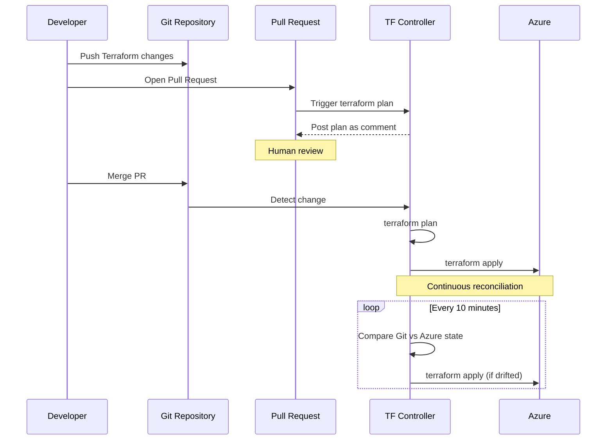

import {
  Info,
  Warning,
  Tip,
  BestPractice,
  Definition,
  Exercise,
  Challenge,
  Quiz,
  CodeBlock,
  Flashcard,
  ProductionNote,
  ArchitectureNote,
  InterviewQuestion,
} from "@site/src/components/shared/InteractiveBlocks";

# GitOps for Terraform & Infrastructure

<Definition>

**GitOps for Terraform** extends the reconciliation model from Kubernetes to infrastructure. Instead of CI/CD pipelines pushing Terraform applies, a GitOps controller continuously reconciles infrastructure state with Git — detecting drift and auto-correcting.

</Definition>

---

## 🎯 Learning Objectives

- Apply GitOps pull model to Terraform workflows
- Compare Flux TF-controller, Atlantis, and pipeline-based approaches
- Implement infrastructure drift detection with automatic remediation

---

## 🔥 Core Explanation

### The Terraform GitOps Challenge

Terraform is fundamentally push-based (`terraform apply`). Making it work with GitOps (pull-based reconciliation) requires a different approach:

| Challenge            | GitOps Solution                                       |
| -------------------- | ----------------------------------------------------- |
| **Push-based apply** | Controller runs `terraform plan/apply` on interval    |
| **State management** | Remote state backend (Azure Storage)                  |
| **Plan review**      | PR triggers plan; merge triggers apply via controller |
| **Drift detection**  | Controller compares Git vs actual state periodically  |



---

## 🏗️ Professional Explanation

### Three Approaches Compared

| Approach               | How it works                      | Drift Detection | Best For                         |
| ---------------------- | --------------------------------- | --------------- | -------------------------------- |
| **CI/CD Pipeline**     | GitHub Actions pushes apply       | ❌ None         | Simple setups                    |
| **Atlantis**           | PR comments trigger plan/apply    | ❌ None         | Teams wanting PR-driven workflow |
| **Flux TF Controller** | Controller reconciles on interval | ✅ Built-in     | Full GitOps with drift detection |

<ArchitectureNote>

**The killer feature of Flux TF Controller is drift detection.** Without it, you don't know if someone manually changed a resource in Azure Portal. Flux polls every 10 minutes, detects drift, and either alerts or auto-corrects, depending on configuration.

</ArchitectureNote>

---

## 🏭 Production Explanation

### Flux TF Controller Setup

<CodeBlock language="yaml" title="Flux Terraform Controller">
  apiVersion: infra.contrib.fluxcd.io/v1alpha2 kind: Terraform metadata: name: cloudnova-core
  namespace: flux-system spec: interval: 10m path: ./terraform/environments/production sourceRef:
  kind: GitRepository name: cloudnova-infra # Drift detection: plan every interval, detect changes #
  If drift detected and approvePlan=auto → auto-apply approvePlan: auto # Store plan output in
  ConfigMap for audit storeReadablePlan: human # Variables from Kubernetes Secrets varsFrom: - kind:
  Secret name: terraform-vars # Force unlock if state is stuck forceUnlock: false # Don't destroy
  resources when Terraform object is deleted destroyResourcesOnDeletion: false
</CodeBlock>

<ProductionNote>

**CloudNova runs Flux TF Controller in production with `approvePlan: auto`** for dev and staging environments. Production uses `approvePlan: manual` — drift is detected and reported, but requires a human to approve the correction. This prevents automated production changes while still giving us drift visibility.

</ProductionNote>

---

## 🏛️ Architecture Decision

### Pipeline vs Controller

<Warning title="Don't Mix Push and Pull">

Using both a CI/CD pipeline AND a GitOps controller for the same Terraform state leads to race conditions. Choose one model per environment:

- **Pipeline (push)**: Good for simple setups, CI/CD integration
- **Controller (pull)**: Good for drift detection, self-healing, GitOps purity

CloudNova Standard: Flux TF Controller for infrastructure, ArgoCD for applications.

</Warning>

---

## ☁️ CloudNova Scenario

<Challenge title="Drift Detection Drill">

**Context:** A CloudNova engineer manually changed a storage account's network rules in Azure Portal during an emergency (bypassing Terraform). The Git state says `default_action = "Deny"`; the actual Azure state is now `default_action = "Allow"`.

**Task:** How does the GitOps system detect and respond?

<details>
<summary>Resolution</summary>

**Detection (within 10 minutes):**
Flux TF Controller runs `terraform plan`. It detects:

```
~ network_rules {
    ~ default_action = "Deny" → "Allow"
  }
```

**Response (production — approvePlan: manual):**

1. Flux creates a DriftDetection alert
2. On-call engineer reviews the drift
3. If the manual change was intentional → update Git to match
4. If the manual change was accidental → approve the correction
5. Flux applies: `terraform apply` → restores `default_action = "Deny"`

**Response (dev — approvePlan: auto):**
Flux auto-corrects immediately — no human needed.

</details>
</Challenge>

---

## 🧪 Active Recall

<Flashcard
  front="What is the key benefit of GitOps for Terraform over traditional CI/CD pipelines?"
  back="**Continuous drift detection.** CI/CD pipelines only run on push/PR. GitOps controllers run `terraform plan` on a schedule (e.g., every 10 minutes), detecting when actual infrastructure diverges from Git — whether from manual changes, Azure Portal edits, or resource modifications."
/>

<Flashcard
  front="Why shouldn't you mix push-based pipelines and pull-based controllers for the same Terraform state?"
  back="It creates race conditions. Both try to apply changes to the same state simultaneously. Choose one model: pipeline (simple, event-driven) or controller (drift-detecting, self-healing)."
/>

<Flashcard
  front="What's the difference between `approvePlan: auto` and `approvePlan: manual` in Flux TF Controller?"
  back="`auto` means detected drift is automatically corrected — good for dev/staging. `manual` means drift is reported but requires human approval to correct — appropriate for production where automated infrastructure changes need oversight."
/>

---

## 📝 Quiz

<Quiz>
  <Question
    question="How often does Flux TF Controller check for drift by default?"
    options={[
      "Every push",
      "On a configurable interval (e.g., every 10 minutes)",
      "Only on PR merge",
      "Never — drift detection is manual",
    ]}
    correct={1}
    explanation="The `interval` field controls how often Flux reconciles. Default 10 minutes is typical for infrastructure."
  />

  <Question
    question="What happens if someone changes a resource manually in Azure Portal under GitOps management?"
    options={[
      "Nothing — the change persists",
      "The GitOps controller detects drift and alerts or auto-corrects",
      "The change is automatically committed to Git",
      "Azure Portal blocks the change",
    ]}
    correct={1}
    explanation="The controller detects drift on the next reconciliation interval and responds according to `approvePlan` setting."
  />
</Quiz>

---

## 📋 Summary

| Approach               | Drift Detection     | Best Environment                 |
| ---------------------- | ------------------- | -------------------------------- |
| **CI/CD Pipeline**     | ❌                  | Simple, small-scale              |
| **Atlantis**           | ❌ (PR-driven)      | Teams needing PR workflow        |
| **Flux TF Controller** | ✅ (interval-based) | Full GitOps with drift detection |
| **Prod setting**       | Manual approval     | `approvePlan: manual`            |
| **Dev setting**        | Auto-correct        | `approvePlan: auto`              |
