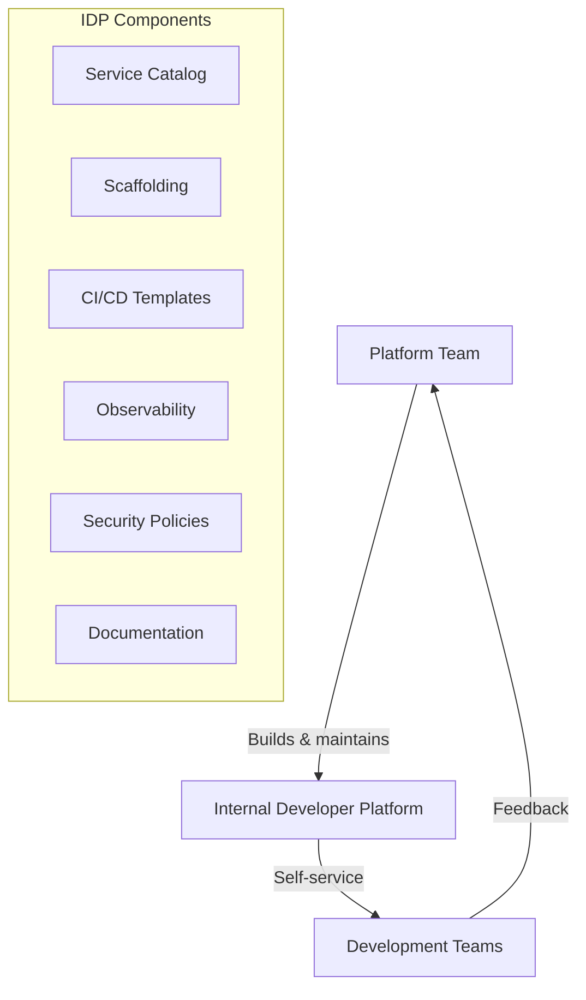

import {
  Info, Warning, Tip, BestPractice, Definition, Analogy,
  Exercise, Challenge, Quiz, Flashcard,
  ProductionNote, ArchitectureNote, InterviewQuestion
} from '@site/src/components/shared/InteractiveBlocks';

# Platform Engineering: The Internal Developer Platform

<Definition>

**Platform Engineering** builds and maintains an Internal Developer Platform (IDP) — a self-service layer that abstracts infrastructure complexity so developers can ship faster without becoming cloud experts.

</Definition>

<Analogy>

**A platform is like a car's dashboard, not the engine.** Developers shouldn't need to understand the internal combustion process to drive. The platform provides the steering wheel, pedals, and gauges — abstracting the engine, transmission, and fuel systems behind a clean interface.

</Analogy>

---

## 🎯 Learning Objectives

- Understand platform engineering as a product, not a project
- Design IDP components: catalog, scaffolding, CI/CD, observability
- Apply golden path thinking: make the right way the easy way

---

## 🔥 Core Explanation

### Platform as a Product

| Anti-Pattern | Platform Engineering Approach |
|-------------|------------------------------|
| "DevOps team handles deployments" | Self-service CI/CD templates |
| "Ask ops to create a database" | Scaffolding tool creates it in 5 min |
| "Read the wiki for setup" | Golden path tutorial in the IDP |
| "Each team builds their own pipeline" | Reusable, blessed pipeline templates |

---

## 🏗️ Professional Explanation

### Golden Paths

<BestPractice>

**Golden paths: Make the right way the easy way.** Don't force developers onto one path — make the supported, secure, compliant path so smooth they choose it naturally. If the "right way" is harder than the quick hack, developers will hack.

</BestPractice>

| Golden Path | What developers get |
|-------------|-------------------|
| **New Microservice** | Scaffolded repo with CI/CD, Dockerfile, k8s manifests, monitoring |
| **New Database** | Terraform module applied via self-service form |
| **Deploy to Production** | Automated pipeline with security + approval gates |
| **Add Monitoring** | Pre-configured dashboards, alerts auto-provisioned |

---

## 🏭 Production Explanation

### IDP Stack — Backstage + Crossplane

<CodeBlock language="yaml" title="Backstage Component Definition">
apiVersion: backstage.io/v1alpha1
kind: Component
metadata:
  name: cloudnova-payments
  description: Payment processing service
  annotations:
    github.com/project-slug: apexdataro-Fin/cloudnova-payments
    backstage.io/techdocs-ref: dir:.
spec:
  type: service
  lifecycle: production
  owner: team-payments
  system: cloudnova-platform
  providesApis:
    - cloudnova-payments-api
  dependsOn:
    - component:cloudnova-database
</CodeBlock>

<ProductionNote>

**CloudNova's IDP (built on Backstage)** provides a unified developer experience: service catalog (who owns what), software templates (scaffold new services), TechDocs (documentation auto-generated from Markdown in repos), and plugins for Kubernetes, Azure, and CI/CD. Developers spend less time on infrastructure and more on features.

</ProductionNote>

---

## 🧪 Active Recall

<Flashcard
  front="What is the 'golden path' concept in platform engineering?"
  back="Instead of forcing one way, make the supported, secure, compliant path the easiest path. Developers choose the golden path because it's better — not because they're forced to."
/>

<Flashcard
  front="What is the key difference between a platform team and a traditional ops team?"
  back="A platform team builds a **product** (the IDP) that developers self-serve from. A traditional ops team handles tickets and manual requests. Platform is product; ops is service desk."
/>

<Flashcard
  front="What are the core components of an Internal Developer Platform?"
  back="1. **Service Catalog** — who owns what
2. **Scaffolding** — create new services with best practices baked in
3. **CI/CD Templates** — reusable, secure pipelines
4. **Observability** — pre-configured dashboards and alerts
5. **Documentation** — auto-generated from code"
/>

---

## 📝 Quiz

<Quiz>
  <Question
    question="What is the primary goal of platform engineering?"
    options={[
      "To build better infrastructure",
      "To reduce cognitive load on developers by abstracting infrastructure complexity",
      "To replace DevOps engineers",
      "To build Kubernetes clusters"
    ]}
    correct={1}
  />
  
  <Question
    question="What's wrong with 'ask ops to create a database'?"
    options={[
      "Nothing — that's their job",
      "It's a manual, non-scalable process that creates a bottleneck",
      "It's faster than self-service",
      "Databases should never be created"
    ]}
    correct={1}
  />
</Quiz>

---

## 📋 Summary

| Principle | Practice |
|-----------|----------|
| **Platform as Product** | IDP with self-service, feedback loops |
| **Golden Paths** | Make right way the easy way |
| **Self-Service** | Developers provision their own infra |
| **Reduce Cognitive Load** | Abstract complexity behind clean interfaces |
