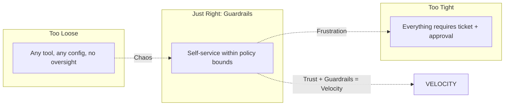

import {
  Info,
  Warning,
  Tip,
  BestPractice,
  Definition,
  Exercise,
  Challenge,
  Quiz,
  Flashcard,
  ProductionNote,
  ArchitectureNote,
  InterviewQuestion,
} from "@site/src/components/shared/InteractiveBlocks";

# Multi-Tenancy & Platform Governance

<Definition>

**Platform governance** ensures that self-service doesn't become chaos. It provides guardrails — policies, quotas, approvals — that keep teams safe while preserving their autonomy.

</Definition>

---

## 🎯 Learning Objectives

- Design multi-tenant platforms with appropriate isolation levels
- Implement governance without killing developer velocity
- Balance freedom (teams choose tools) with compliance (organization sets standards)

---

## 🔥 Core Explanation

### The Governance Spectrum

<BestPractice>

**Governance through guardrails, not gates.** A gate says "stop — get approval." A guardrail says "go ahead — but only within these safe boundaries." Guardrails enable velocity; gates create bottlenecks.

</BestPractice>

---

## 🏗️ Professional Explanation

### Quota Management

| Resource             | Dev Quota  | Prod Quota    | Enforcement     |
| -------------------- | ---------- | ------------- | --------------- |
| **AKS clusters**     | 2 per team | Per-app only  | Azure Policy    |
| **Storage accounts** | 5 per team | As needed     | Budget alerts   |
| **Public IPs**       | 2 per team | Approved list | OPA policy      |
| **Monthly spend**    | $500/team  | $5,000/app    | Budget + alerts |

---

## 🧪 Active Recall

<Flashcard
  front="What's the difference between a governance gate and a guardrail?"
  back="**Gate** = 'stop, get approval' (creates bottlenecks). **Guardrail** = 'go ahead, but stay within these safe boundaries' (enables velocity). Prefer guardrails for non-critical decisions."
/>

---

## 📝 Quiz

<Quiz>
  <Question
    question="What is the ideal governance model for platform engineering?"
    options={[
      "No governance — let teams use whatever they want",
      "Guardrails — self-service within safe, policy-enforced boundaries",
      "Full approval — every change requires a ticket",
      "Only governance for production",
    ]}
    correct={1}
  />
</Quiz>

---

## 📋 Summary

| Principle                 | Practice                             |
| ------------------------- | ------------------------------------ |
| **Guardrails > Gates**    | Policy-bounded self-service          |
| **Multi-Tenancy**         | Appropriate isolation per workload   |
| **Automated Enforcement** | OPA, Azure Policy, not manual review |
