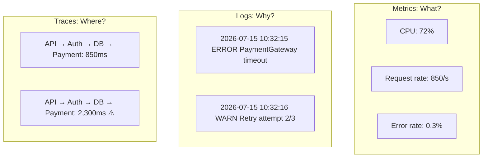

import {
  Info,
  Warning,
  Tip,
  BestPractice,
  Definition,
  Exercise,
  Challenge,
  Quiz,
  CodeBlock,
  Flashcard,
  ProductionNote,
  InterviewQuestion,
} from "@site/src/components/shared/InteractiveBlocks";

# Monitoring Fundamentals & Signal Types

<Definition>

**Monitoring** is the collection, processing, and analysis of data about your systems to understand their health, performance, and behavior. An effective monitoring strategy uses multiple signal types — not just "is it up?"

</Definition>

---

## 🎯 Learning Objectives

- Apply the four golden signals to any service
- Differentiate metrics, logs, and traces (and when to use each)
- Design alerts that wake people up for good reasons only

---

## 🔥 Core Explanation

### The Four Golden Signals (Google SRE)

| Signal         | What it measures          | Example                                 |
| -------------- | ------------------------- | --------------------------------------- |
| **Latency**    | How long requests take    | p99 API response time < 200ms           |
| **Traffic**    | How much demand           | Requests per second, active connections |
| **Errors**     | Rate of failed requests   | 5xx error rate < 0.1%                   |
| **Saturation** | How "full" the service is | CPU > 80%, connection pool > 90%        |

---

## 🏗️ Professional Explanation

### Signals: Metrics, Logs, Traces

---

## 🏭 Production Explanation

### Alerting Strategy

<CodeBlock language="yaml" title="Alert Severity Guidelines">
# Severity 1 (Critical) — Page immediately
- API error rate > 1% for 5 minutes
- Database unavailable
- Payment processing failure

# Severity 2 (Warning) — Page during business hours

- CPU > 80% for 15 minutes
- Disk > 85%
- Certificate expiring within 7 days

# Severity 3 (Info) — Ticket only, no page

- Non-production environment issues
- Expected maintenance windows
- Cost anomaly (no immediate impact)
  </CodeBlock>

<ProductionNote>

**Alert fatigue kills monitoring.** If every alert wakes someone up, soon no alerts will be taken seriously. CloudNova's rule: only page for user-impacting, actionable issues during off-hours. Everything else creates a ticket.

</ProductionNote>

---

## 🧪 Active Recall

<Flashcard
  front="What are the four golden signals?"
  back="1. **Latency** — request duration
2. **Traffic** — demand volume
3. **Errors** — failure rate
4. **Saturation** — resource utilization"
/>

<Flashcard
  front="When do you use logs vs metrics vs traces?"
  back="**Metrics** = aggregate patterns (what's happening?). **Logs** = detailed events (why did it happen?). **Traces** = request journeys (where is the bottleneck?). Use all three together."
/>

<Flashcard
  front="What's the golden rule of alerting?"
  back="Only page for **user-impacting, actionable** issues. If the alert doesn't require immediate human action, it should be a ticket, not a page. Alert fatigue destroys on-call effectiveness."
/>

---

## 📝 Quiz

<Quiz>
  <Question
    question="Which golden signal tracks resource utilization?"
    options={["Latency", "Traffic", "Errors", "Saturation"]}
    correct={3}
  />

  <Question
    question="When should an alert wake someone up at 3 AM?"
    options={[
      "Whenever any alert fires",
      "Only for user-impacting, actionable issues",
      "Never — all alerts should wait until morning",
      "For any production issue",
    ]}
    correct={1}
  />
</Quiz>

---

## 📋 Summary

| Signal      | Question        | Tool                      |
| ----------- | --------------- | ------------------------- |
| **Metrics** | What?           | Prometheus, Azure Monitor |
| **Logs**    | Why?            | Log Analytics, ELK        |
| **Traces**  | Where?          | App Insights, Jaeger      |
| **Alerts**  | Who should act? | PagerDuty, Azure Alerts   |
