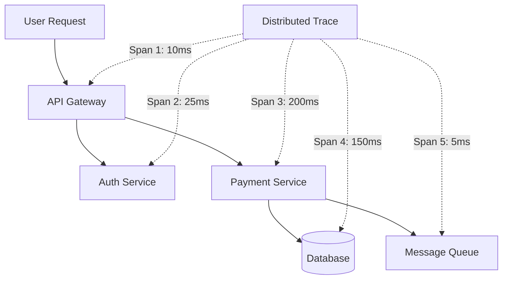

import {
  Info, Warning, Tip, BestPractice, Definition, Analogy,
  Exercise, Challenge, Quiz, CodeBlock, Flashcard,
  ProductionNote, ArchitectureNote, InterviewQuestion
} from '@site/src/components/shared/InteractiveBlocks';

# Observability: Logs, Metrics, Traces

<Definition>

**Observability** is the ability to understand a system's internal state from its external outputs. More than monitoring (which tells you *that* something is wrong), observability tells you *why* — even for problems you've never seen before.

</Definition>

<Analogy>

**Monitoring is a check-engine light.** (Something is wrong.) **Observability is the diagnostic port.** (Here's exactly what happened, where, and why.) You need both — the light tells you to look, the diagnostics tell you what to fix.

</Analogy>

---

## 🎯 Learning Objectives

- Understand observability as a superset of monitoring
- Implement distributed tracing with OpenTelemetry
- Build dashboards that support unknown-unknown investigation

---

## 🔥 Core Explanation

### Three Pillars

| Pillar | Question | Tool |
|--------|----------|------|
| **Logs** | What happened at this specific moment? | Azure Log Analytics, Loki |
| **Metrics** | What's the pattern over time? | Prometheus, Azure Metrics |
| **Traces** | How did this request flow through the system? | Jaeger, Tempo, App Insights |

---

## 🏗️ Professional Explanation

### OpenTelemetry — Vendor-Neutral Instrumentation

<CodeBlock language="python" title="OpenTelemetry in a Python API">
from opentelemetry import trace
from opentelemetry.exporter.otlp import OTLPSpanExporter
from opentelemetry.instrumentation.flask import FlaskInstrumentor

# Auto-instrument Flask app
FlaskInstrumentor().instrument_app(app)

# Export traces to OTLP collector (works with any backend)
exporter = OTLPSpanExporter(
    endpoint="https://otlp.cloudnova.io:4317"
)

# Custom span
tracer = trace.get_tracer(__name__)
with tracer.start_as_current_span("process-payment") as span:
    span.set_attribute("payment.amount", amount)
    span.set_attribute("payment.currency", currency)
    process_payment(amount, currency)
</CodeBlock>

<ArchitectureNote>

**OpenTelemetry is the vendor-neutral standard.** Instrument once with OTel, send to any backend (Jaeger, Grafana Tempo, Azure App Insights, Datadog). No more rewriting instrumentation when you switch monitoring tools.

</ArchitectureNote>

---

## 🏭 Production Explanation

### The Unknown-Unknown Problem

<ProductionNote>

**Traditional monitoring catches known failure modes** (CPU > 80%, error rate > 1%). **Observability helps with unknown-unknowns** — problems you never anticipated. By correlating logs, metrics, and traces, you can ask ad-hoc questions: "Show me all requests where the payment service called the database but got no response within 5 seconds."

</ProductionNote>

---

## 🧪 Active Recall

<Flashcard
  front="What's the difference between monitoring and observability?"
  back="**Monitoring** tells you *that* something is wrong (CPU high, error rate spiked) — known failure modes. **Observability** helps you understand *why* — even for problems you never anticipated — by exploring logs, metrics, and traces together."
/>

<Flashcard
  front="Why use OpenTelemetry instead of vendor-specific SDKs?"
  back="Instrument once, send anywhere. OTel is vendor-neutral — change backends (Jaeger → Tempo → Datadog) without rewriting instrumentation code. It's the TCP/IP of observability."
/>

<Flashcard
  front="What do the three pillars of observability show you?"
  back="**Logs**: discrete events at a point in time. **Metrics**: aggregated patterns over time. **Traces**: individual request journeys across services. Together, they give a complete picture."
/>

---

## 📝 Quiz

<Quiz>
  <Question
    question="What is a span in distributed tracing?"
    options={[
      "The entire request journey",
      "A single unit of work within a trace (e.g., one database query)",
      "A log entry",
      "A metric data point"
    ]}
    correct={1}
  />
  
  <Question
    question="Why is OpenTelemetry important?"
    options={[
      "It's the only monitoring tool you need",
      "It provides vendor-neutral instrumentation — instrument once, export anywhere",
      "It replaces Prometheus",
      "It's a Microsoft product"
    ]}
    correct={1}
  />
</Quiz>

---

## 📋 Summary

| Pillar | Purpose | Azure Tool |
|--------|---------|------------|
| **Logs** | Discrete events | Log Analytics |
| **Metrics** | Time-series patterns | Azure Metrics, Prometheus |
| **Traces** | Request journeys | App Insights, Jaeger |
| **OTel** | Vendor-neutral instrumentation | OpenTelemetry Collector |
