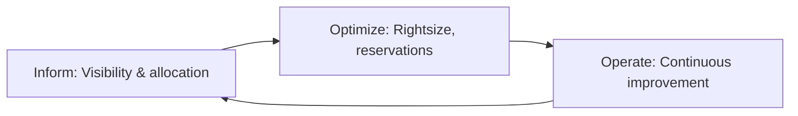

import {
  Info, Warning, Tip, BestPractice, Definition,
  Exercise, Challenge, Quiz, CodeBlock, Flashcard,
  CostNote, ProductionNote, InterviewQuestion
} from '@site/src/components/shared/InteractiveBlocks';

# FinOps: Cloud Financial Operations

<Definition>

**FinOps** is the practice of bringing financial accountability to cloud spending. It's a cultural shift where engineering, finance, and business teams collaborate to make data-driven spending decisions.

</Definition>

---

## 🎯 Learning Objectives

- Apply the FinOps lifecycle: Inform, Optimize, Operate
- Implement cost allocation through tagging
- Build budgets and alerts that prevent "bill shock"

---

## 🔥 Core Explanation

### The FinOps Lifecycle



| Phase | Activities |
|-------|-----------|
| **Inform** | Tag resources, allocate costs to teams, build dashboards |
| **Optimize** | Rightsize VMs, purchase reservations, delete unused resources |
| **Operate** | Budget alerts, anomaly detection, continuous review |

---

## 🏗️ Professional Explanation

### Tagging Strategy for Cost Allocation

<BestPractice>

**Every resource gets three mandatory cost tags** at CloudNova:
- `environment` — dev, staging, prod (lower environments get auto-shutdown)
- `cost_center` — finance, engineering, marketing
- `data_classification` — public, internal, confidential

</BestPractice>

<CodeBlock language="bash" title="Enforcing Tags with Azure Policy">
# Assign policy: Require cost_center tag
az policy definition create \
  --name require-cost-center \
  --rules '{"if":{"field":"tags[cost_center]","exists":"false"},"then":{"effect":"deny"}}'

az policy assignment create \
  --policy require-cost-center \
  --scope /subscriptions/cloudnova-sub
</CodeBlock>

---

## 🏭 Production Explanation

### Cost Optimization Patterns

<CostNote>

| Pattern | Savings | Effort |
|---------|---------|--------|
| **Reservations (1-3 year)** | 40-65% | Low (one-time purchase) |
| **Rightsizing** | 20-50% | Medium (review recco) |
| **Auto-shutdown dev nights/weekends** | 30-50% | Low (automation) |
| **Delete unused resources** | Variable | Low (weekly cleanup script) |
| **Azure Hybrid Benefit** | Up to 40% | Low (activate) |
| **Spot VMs for batch jobs** | Up to 90% | Medium (handle eviction) |

</CostNote>

<CodeBlock language="kql" title="Find Unattached Managed Disks ($$$ waste)">
Resources
| where type == "microsoft.compute/disks"
| where properties.diskState == "Unattached"
| project name, resourceGroup, 
          diskSizeGB = properties.diskSizeGB,
          monthlyCost = properties.diskSizeGB * 0.05  // $0.05/GB
| order by monthlyCost desc
</CodeBlock>

---

## ☁️ CloudNova Scenario

<Challenge title="Cost Investigation">

Sarah notices the monthly Azure bill jumped from $12,000 to $18,000. Find the source.

<details>
<summary>Investigation Steps</summary>

```kql
// Find what changed month-over-month
AzureDiagnostics
| where TimeGenerated > ago(60d)
| summarize Cost = sum(TotalCost) by bin(TimeGenerated, 1d), ResourceGroup
| render timechart

// By resource type
| summarize Cost = sum(TotalCost) by ResourceType
| order by Cost desc
```

Root cause: Dev team spun up AKS clusters for testing and forgot to delete them. Solution: auto-cleanup policy for dev resources older than 7 days.
</details>
</Challenge>

---

## 🧪 Active Recall

<Flashcard
  front="What are the three phases of FinOps?"
  back="1. **Inform** — visibility, tagging, cost allocation
2. **Optimize** — rightsizing, reservations, waste elimination
3. **Operate** — budgets, alerts, continuous improvement"
/>

<Flashcard
  front="What's the single highest-impact cost optimization for Azure?"
  back="**Reserved Instances (RIs)** — commit to 1 or 3 years for 40-65% discount. Combined with Azure Hybrid Benefit (existing Windows licenses), savings can exceed 70%."
/>

<Flashcard
  front="What tags does every CloudNova resource require?"
  back="`environment` (dev/staging/prod), `cost_center` (team/department), `data_classification` (public/internal/confidential). Tags enable cost allocation and automated policies (e.g., shut down dev at night)."
/>

---

## 📝 Quiz

<Quiz>
  <Question
    question="What is the first step in the FinOps lifecycle?"
    options={["Start buying reservations", "Inform — get visibility into spending", "Fire people for spending too much", "Ignore costs until the bill comes"]}
    correct={1}
    explanation="You can't optimize what you can't see. Inform (visibility + allocation) comes before Optimize or Operate."
  />
  
  <Question
    question="How much can Azure Reservations save compared to pay-as-you-go?"
    options={["5-10%", "40-65%", "100%", "Nothing"]}
    correct={1}
  />
</Quiz>

---

## 📋 Summary

| Phase | Key Action |
|-------|-----------|
| **Inform** | Tag everything, allocate costs |
| **Optimize** | Reservations, rightsizing, auto-shutdown |
| **Operate** | Budgets, alerts, continuous review |
