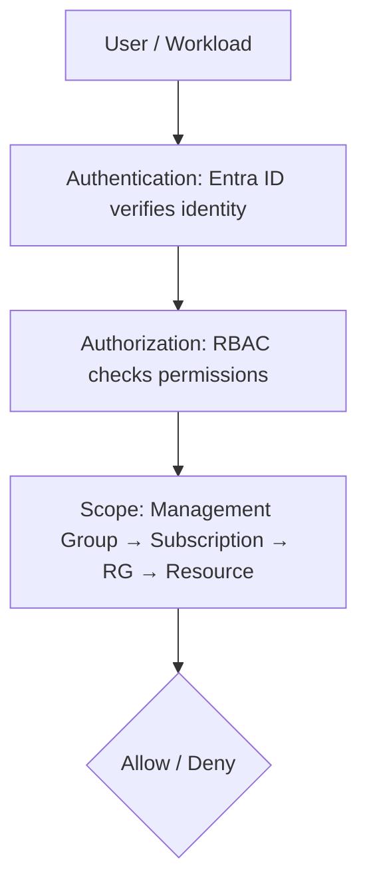
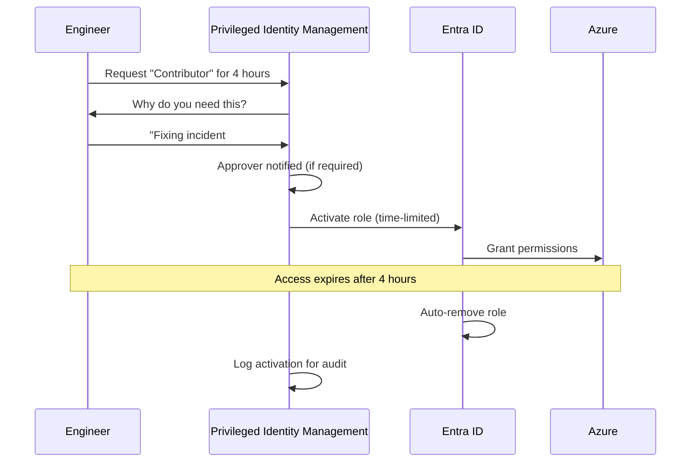

import {
  Info,
  Warning,
  Tip,
  BestPractice,
  Definition,
  Exercise,
  Challenge,
  Quiz,
  CodeBlock,
  Flashcard,
  SecurityNote,
  ProductionNote,
  ArchitectureNote,
  InterviewQuestion,
} from "@site/src/components/shared/InteractiveBlocks";

# Identity & Access Management Mastery

<Definition>

**Identity** is the new perimeter. In a cloud-native world without firewalls, who you are and what you're allowed to do replaces network boundaries as the primary security control.

</Definition>

---

## 🎯 Learning Objectives

- Design RBAC with least privilege (not "Contributor for everyone")
- Implement managed identities — no more passwords for workloads
- Use Privileged Identity Management (PIM) for just-in-time admin access

---

## 🔥 Core Explanation

### The IAM Stack

| Component             | Azure Service                | What it does                |
| --------------------- | ---------------------------- | --------------------------- |
| **Authentication**    | Entra ID (formerly Azure AD) | Verifies identity           |
| **Authorization**     | RBAC                         | Checks permissions at scope |
| **Identity for Apps** | Managed Identities           | Passwordless workload auth  |
| **Privileged Access** | PIM                          | Just-in-time admin roles    |

---

## 🏗️ Professional Explanation

### Managed Identities — The End of Service Principals

<CodeBlock language="terraform" title="System-Assigned vs User-Assigned Identity">
# System-Assigned: One identity, one resource, auto lifecycle
resource "azurerm_linux_virtual_machine" "app" {
  name = "cloudnova-app"
  
  identity {
    type = "SystemAssigned"
  }
}

# User-Assigned: One identity, many resources

resource "azurerm_user_assigned_identity" "app_identity" {
name = "cloudnova-app-id"
resource_group_name = azurerm_resource_group.main.name
location = azurerm_resource_group.main.location
}

resource "azurerm_role_assignment" "keyvault_reader" {
scope = azurerm_key_vault.main.id
role_definition_name = "Key Vault Secrets User"
principal_id = azurerm_user_assigned_identity.app_identity.principal_id
}

</CodeBlock>

<SecurityNote>

**Managed Identities eliminate credential rotation entirely.** No passwords. No certificates. No service principal secrets expiring at 3 AM. Entra ID handles the token lifecycle — you just assign the identity to resources.

</SecurityNote>

---

## 🏭 Production Explanation

### PIM — Just-in-Time Admin

<ProductionNote>

**CloudNova's PIM policy:** No one has permanent "Owner" or "Contributor" access to production subscriptions. Everyone — even Sarah (CTO) — activates privileged roles through PIM with justification. Audit logs track every activation.

</ProductionNote>

---

## 🧪 Active Recall

<Flashcard
  front="What is the difference between system-assigned and user-assigned managed identity?"
  back="**System-Assigned**: One identity tied to one resource, deleted when resource is deleted. **User-Assigned**: Standalone identity that can be assigned to multiple resources, persists independently."
/>

<Flashcard
  front="Why are managed identities better than service principals?"
  back="No credential management. No secret rotation. No expiring certificates. Entra ID handles the entire token lifecycle automatically. Service principals require manual credential rotation."
/>

<Flashcard
  front="What does PIM (Privileged Identity Management) provide?"
  back="Just-in-time privileged access. Admin roles are not permanently assigned — they're activated for a limited time with justification and approval. After the time expires, permissions are automatically removed."
/>

---

## 📝 Quiz

<Quiz>
  <Question
    question="Which identity type should a VM use to access Key Vault?"
    options={[
      "Service Principal with client secret",
      "Managed Identity",
      "Username and password in environment variables",
      "Storage account key",
    ]}
    correct={1}
  />

  <Question
    question="What is the primary advantage of PIM?"
    options={[
      "It's free",
      "No standing admin access — roles are activated just-in-time and auto-expire",
      "It makes Azure faster",
      "It replaces RBAC entirely",
    ]}
    correct={1}
  />
</Quiz>

---

## 📋 Summary

| Concept                | Practice                               |
| ---------------------- | -------------------------------------- |
| **Managed Identity**   | Passwordless, no rotation              |
| **RBAC**               | Least privilege at narrowest scope     |
| **PIM**                | Just-in-time, time-bound, audited      |
| **Identity Perimeter** | AuthN/AuthZ replaces network perimeter |
