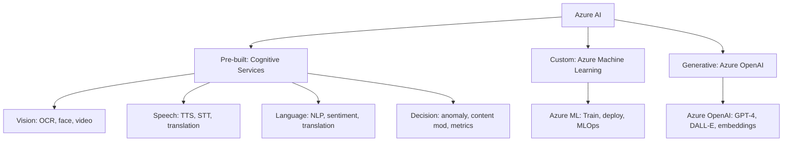

import {
  Info,
  Warning,
  Tip,
  BestPractice,
  Definition,
  Exercise,
  Quiz,
  CodeBlock,
  Flashcard,
  SecurityNote,
  ProductionNote,
  InterviewQuestion,
} from "@site/src/components/shared/InteractiveBlocks";

# Azure AI Services: Cognitive Services & Machine Learning

<Definition>

**Azure AI** is Microsoft's portfolio of artificial intelligence services: pre-built APIs (Vision, Speech, Language, Decision), custom model training (Azure ML), and generative AI (Azure OpenAI Service).

</Definition>

---

## 🎯 Learning Objectives

- Navigate the Azure AI portfolio and choose the right service
- Apply pre-built Cognitive Services vs training custom models
- Understand responsible AI principles for production deployment

---

## 🔥 Core Explanation

### The Azure AI Portfolio

| Service Type           | When to Use                           | Example                                   |
| ---------------------- | ------------------------------------- | ----------------------------------------- |
| **Cognitive Services** | Common AI tasks, no training needed   | OCR on invoices, sentiment analysis       |
| **Azure ML**           | Custom models with your data          | Predictive maintenance, fraud detection   |
| **Azure OpenAI**       | Generative AI: chat, embeddings, code | AI tutor, RAG knowledge base, code review |

---

## 🏗️ Professional Explanation

### Calling Cognitive Services

<CodeBlock language="python" title="Document Intelligence (Form Recognizer)">
from azure.ai.formrecognizer import DocumentAnalysisClient
from azure.core.credentials import AzureKeyCredential

client = DocumentAnalysisClient(
endpoint="https://cloudnova-ai.cognitiveservices.azure.com/",
credential=AzureKeyCredential(os.environ["AI_KEY"])
)

# Analyze an invoice

with open("invoice.pdf", "rb") as f:
poller = client.begin_analyze_document("prebuilt-invoice", f)
result = poller.result()

for field in result.documents[0].fields.values():
print(f"{field.value_type}: {field.value}")

# Output: VendorName: Contoso Corp, InvoiceTotal: $1,250.00...

</CodeBlock>

<Tip>

**Start with pre-built models.** If Cognitive Services solves your problem, you save months of training, data labeling, and model maintenance. Only go custom when pre-built doesn't fit your domain.

</Tip>

---

## 🏭 Production Explanation

### Responsible AI

<SecurityNote>

**Every Azure AI deployment must pass CloudNova's Responsible AI checklist:**

1. **Fairness** — Is the model biased against any group?
2. **Reliability** — Does it fail gracefully on unexpected input?
3. **Privacy** — Is training data compliant with GDPR/data policies?
4. **Transparency** — Can we explain predictions to users?
5. **Accountability** — Who reviews model performance and drift?

</SecurityNote>

---

## 🧪 Active Recall

<Flashcard
  front="When should you use Azure Cognitive Services vs Azure Machine Learning?"
  back="**Cognitive Services** — pre-built models for common AI tasks (OCR, speech, language). Use when you don't need training. **Azure ML** — custom models trained on your data. Use when pre-built doesn't fit your domain (e.g., predictive maintenance for YOUR machines)."
/>

<Flashcard
  front="What is Azure OpenAI Service?"
  back="Microsoft's managed offering of OpenAI models (GPT-4, DALL-E, embeddings). It adds enterprise features: Azure RBAC, private networking, data residency, content filtering, and SLA — while providing the same API as OpenAI."
/>

---

## 📝 Quiz

<Quiz>
  <Question
    question="Which Azure service would you use for extracting text from scanned documents?"
    options={[
      "Azure Machine Learning",
      "Azure OpenAI",
      "Cognitive Services - Document Intelligence",
      "Azure Kubernetes Service",
    ]}
    correct={2}
  />

  <Question
    question="What's the advantage of Azure OpenAI over direct OpenAI API?"
    options={[
      "It's cheaper",
      "Enterprise security: RBAC, private networking, data residency, compliance",
      "It has better models",
      "It's open source",
    ]}
    correct={1}
  />
</Quiz>

---

## 📋 Summary

| Service                | Best For                               |
| ---------------------- | -------------------------------------- |
| **Cognitive Services** | Pre-built AI (OCR, speech, NLP)        |
| **Azure ML**           | Custom model training + MLOps          |
| **Azure OpenAI**       | Generative AI with enterprise security |
