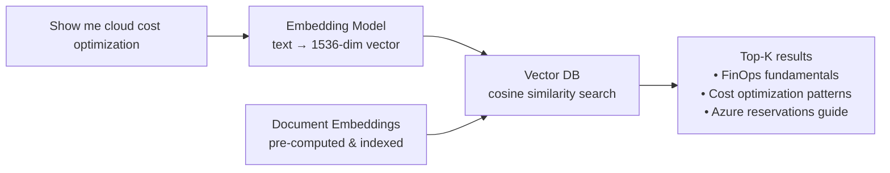

import {
  Info,
  Warning,
  Tip,
  BestPractice,
  Definition,
  Analogy,
  Exercise,
  Challenge,
  Quiz,
  CodeBlock,
  Flashcard,
  ArchitectureNote,
  ProductionNote,
  InterviewQuestion,
} from "@site/src/components/shared/InteractiveBlocks";

# Vector Databases for AI Engineers

<Definition>

A **Vector Database** stores data as mathematical vectors (embeddings) and enables similarity search — finding items that are semantically similar, not just keyword matches.

</Definition>

<Analogy>

**A regular database is like a library catalog** — you search by exact title or author. **A vector database is like a librarian who understands what you mean** — "books about adventure in space" returns sci-fi novels even if they don't contain those exact words.

</Analogy>

---

## 🎯 Learning Objectives

- Understand embeddings: how text/images become vectors
- Implement semantic search with vector similarity
- Choose the right vector DB for your use case

---

## 🔥 Core Explanation

### How Vector Search Works

<CodeBlock language="python" title="Semantic Search with Vector DB">
import chromadb
from openai import AzureOpenAI

client = chromadb.Client()
collection = client.create_collection("cloudnova-docs")

# Embed and store documents

for doc in documents:
embedding = azure_openai.embeddings.create(
model="text-embedding-3-small",
input=doc.text
).data[0].embedding

    collection.add(
        ids=[doc.id],
        embeddings=[embedding],
        metadatas=[{"title": doc.title}]
    )

# Semantic search

query_embedding = azure_openai.embeddings.create(
model="text-embedding-3-small",
input="how to reduce azure costs"
).data[0].embedding

results = collection.query(
query_embeddings=[query_embedding],
n_results=5
)

</CodeBlock>

---

## 🏗️ Professional Explanation

### Vector DB Landscape

| Database            | Type                  | Best For                          |
| ------------------- | --------------------- | --------------------------------- |
| **Chroma**          | Open-source, embedded | Prototyping, small datasets       |
| **Pinecone**        | Managed cloud         | Production, scale, low latency    |
| **Weaviate**        | Open-source, GraphQL  | Hybrid search (vector + keyword)  |
| **Azure AI Search** | Managed, Azure-native | Enterprise, integrated with Azure |
| **pgvector**        | PostgreSQL extension  | When you already have Postgres    |

<ArchitectureNote>

**HNSW (Hierarchical Navigable Small World)** is the indexing algorithm behind most vector DBs. It creates a multi-layer graph where top layers skip large distances and bottom layers refine. This gives O(log n) search — fast even with millions of vectors.

</ArchitectureNote>

---

## 🏭 Production Explanation

### When to Use Vector DBs

| Use Case                                 | Vector DB Approach                      | Traditional Approach             |
| ---------------------------------------- | --------------------------------------- | -------------------------------- |
| **Semantic search**                      | ✅ Query by meaning, not keywords       | ❌ Exact keyword matching        |
| **Recommendations**                      | ✅ Similar items via embedding distance | ⚠️ Collaborative filtering       |
| **RAG (Retrieval Augmented Generation)** | ✅ Find relevant context for LLM        | ❌ Keyword search misses context |
| **Image similarity**                     | ✅ Search by image content              | ❌ Metadata tags only            |
| **Anomaly detection**                    | ✅ Detect outliers in embedding space   | ⚠️ Statistical methods           |

---

## 🧪 Active Recall

<Flashcard
  front="What does a vector database store?"
  back="Mathematical vectors (embeddings) — arrays of floating-point numbers (e.g., 1536-dimensional) that represent the semantic meaning of text, images, or other data."
/>

<Flashcard
  front="How does semantic search differ from keyword search?"
  back="Keyword search matches exact terms ('cost optimization' returns only documents containing those words). Semantic search matches by meaning ('how to reduce spending' returns cost optimization documents even without exact keyword match)."
/>

<Flashcard
  front="What is an embedding?"
  back="A numerical representation of data (text, image, audio) in a high-dimensional vector space. Similar concepts are close together in this space. Generated by embedding models like `text-embedding-3-small` from OpenAI."
/>

---

## 📝 Quiz

<Quiz>
  <Question
    question="What algorithm makes vector search fast at scale?"
    options={[
      "B-tree",
      "HNSW (Hierarchical Navigable Small World)",
      "QuickSort",
      "Dijkstra's algorithm",
    ]}
    correct={1}
    explanation="HNSW creates a multi-layer graph for approximate nearest neighbor search in O(log n) time."
  />

  <Question
    question="Which vector DB is best for an Azure-native enterprise deployment?"
    options={["Chroma", "Pinecone", "Azure AI Search", "pgvector"]}
    correct={2}
    explanation="Azure AI Search integrates natively with Azure services, supports RBAC, private endpoints, and compliance certifications."
  />
</Quiz>

---

## 📋 Summary

| Component           | Purpose                           |
| ------------------- | --------------------------------- |
| **Embedding**       | Convert text → vector             |
| **Vector DB**       | Store + search vectors            |
| **HNSW**            | Fast approximate nearest neighbor |
| **Semantic Search** | Search by meaning, not keywords   |
