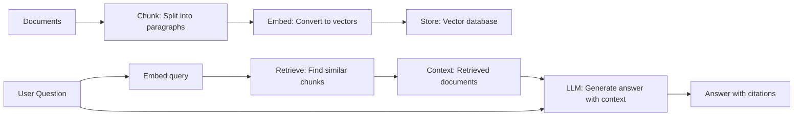

import {
  Info, Warning, Tip, BestPractice, Definition, Analogy,
  Exercise, Challenge, Quiz, CodeBlock, Flashcard,
  ArchitectureNote, ProductionNote, InterviewQuestion
} from '@site/src/components/shared/InteractiveBlocks';

# Retrieval-Augmented Generation (RAG) Architecture

<Definition>

**RAG (Retrieval-Augmented Generation)** combines LLMs with external knowledge retrieval. Instead of relying on the LLM's training data alone, RAG retrieves relevant documents and provides them as context — enabling the LLM to answer questions about data it was never trained on.

</Definition>

<Analogy>

**RAG is like an open-book exam for LLMs.** Without RAG, the LLM relies on its memory (training data — might be outdated or wrong). With RAG, the LLM looks up the answer in your documents first, then answers with citations. Hallucinations drop dramatically.

</Analogy>

---

## 🎯 Learning Objectives

- Understand RAG as the bridge between LLMs and your private data
- Implement the full RAG pipeline: chunk → embed → retrieve → generate
- Apply chunking strategies that preserve context

---

## 🔥 Core Explanation

### The RAG Pipeline

---

## 🏗️ Professional Explanation

### Chunking Strategies

| Strategy | Best For | Trade-off |
|----------|----------|-----------|
| **Fixed-size (500 tokens)** | General docs, equal length | May split sentences mid-thought |
| **Semantic (by paragraph/section)** | Well-structured docs | Variable chunk sizes |
| **Recursive (split by \n\n → \n → .)** | Code + text mixed | Good balance |
| **Sliding window (overlap)** | Dense technical docs | Redundancy but preserves context |

<CodeBlock language="python" title="RAG Implementation with LangChain">
from langchain.text_splitter import RecursiveCharacterTextSplitter
from langchain.embeddings import AzureOpenAIEmbeddings
from langchain.vectorstores import Chroma
from langchain.chains import RetrievalQA

# 1. Chunk documents
splitter = RecursiveCharacterTextSplitter(
    chunk_size=500,
    chunk_overlap=50
)
chunks = splitter.split_documents(documents)

# 2. Embed and store
embeddings = AzureOpenAIEmbeddings(
    model="text-embedding-3-small"
)
vectorstore = Chroma.from_documents(chunks, embeddings)

# 3. Retrieve and generate
qa_chain = RetrievalQA.from_chain_type(
    llm=azure_llm,
    retriever=vectorstore.as_retriever(search_kwargs={"k": 5})
)
answer = qa_chain.run("How does CloudNova handle cost optimization?")
# Answer includes citations from retrieved documents
</CodeBlock>

---

## 🏭 Production Explanation

### RAG vs Fine-Tuning

| Aspect | RAG | Fine-Tuning |
|--------|-----|------------|
| **Knowledge source** | External documents (dynamic) | Baked into model weights (static) |
| **Update knowledge** | Add/remove documents instantly | Retrain model (hours/days) |
| **Cost** | Embedding + inference | Training + inference |
| **Hallucination** | Lower (grounded in docs) | Higher (relies on training) |
| **Best for** | Customer docs, FAQs, knowledge bases | Domain-specific style/tone |

<ProductionNote>

**CloudNova uses RAG for internal documentation search.** Engineers ask questions in natural language, and the RAG system retrieves relevant runbooks, architecture docs, and incident postmortems — with citations so they can verify the source.

</ProductionNote>

---

## 🧪 Active Recall

<Flashcard
  front="What is the RAG pipeline? (4 steps)"
  back="1. **Chunk** — split documents into manageable pieces
2. **Embed** — convert chunks to vectors
3. **Retrieve** — find chunks similar to the query
4. **Generate** — prompt the LLM with retrieved chunks as context"
/>

<Flashcard
  front="Why is chunking important for RAG?"
  back="LLMs have context windows. You can't feed entire books. Chunking breaks documents into pieces small enough to fit in context while preserving meaning. Poor chunking = poor retrieval = poor answers."
/>

<Flashcard
  front="When would you choose RAG over fine-tuning?"
  back="Choose RAG when: your knowledge changes frequently (docs, FAQs), you need citations/attribution, you want lower hallucination rates, or you need to update knowledge without retraining. Choose fine-tuning when: you need a specific tone/style, not factual knowledge."
/>

---

## 📝 Quiz

<Quiz>
  <Question
    question="What is the primary advantage of RAG over using an LLM alone?"
    options={[
      "It's faster",
      "It grounds answers in your actual documents, reducing hallucinations and enabling private data Q&A",
      "It's cheaper than any other approach",
      "It replaces the LLM entirely"
    ]}
    correct={1}
    explanation="RAG bridges the gap between LLM's general knowledge and your specific, private documents. The LLM generates answers grounded in retrieved context."
  />
  
  <Question
    question="Why use chunk overlap in document splitting?"
    options={[
      "To make chunks larger",
      "To preserve context across chunk boundaries — a sentence split mid-thought in one chunk is complete in the next",
      "To reduce storage costs",
      "It's a bug, not a feature"
    ]}
    correct={1}
  />
</Quiz>

---

## 📋 Summary

| Step | Purpose |
|------|---------|
| **Chunk** | Split docs for context window |
| **Embed** | Convert to searchable vectors |
| **Retrieve** | Find relevant context |
| **Generate** | LLM answers with context |
