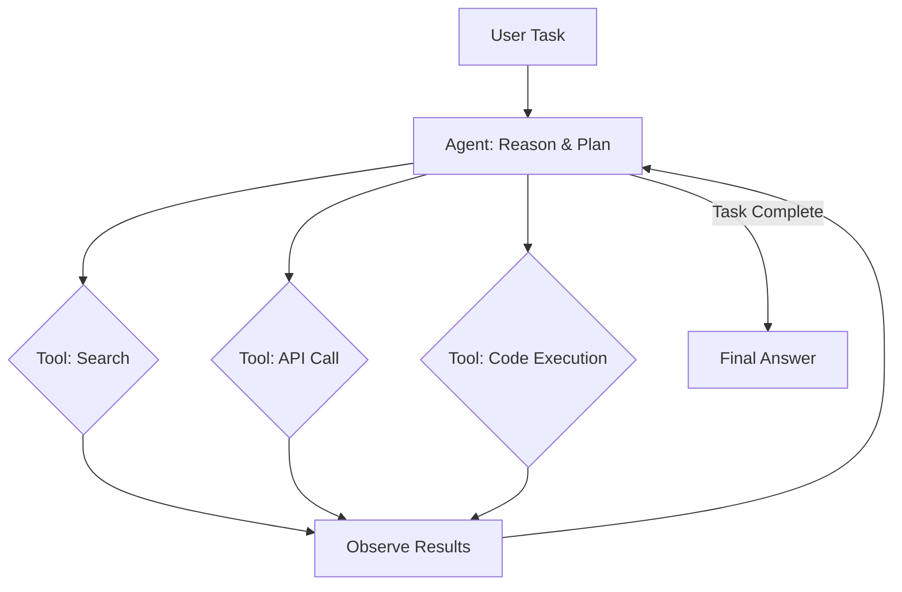

import {
  Info, Warning, Tip, BestPractice, Definition,
  Exercise, Challenge, Quiz, CodeBlock, Flashcard,
  ArchitectureNote, ProductionNote, SecurityNote, InterviewQuestion
} from '@site/src/components/shared/InteractiveBlocks';

# AI Agents: Architecture & Patterns

<Definition>

An **AI Agent** is an LLM-powered system that can reason, plan, use tools (APIs, databases, code execution), and take actions autonomously. Unlike a simple chatbot, agents can solve multi-step problems.

</Definition>

---

## 🎯 Learning Objectives

- Understand agent architectures: ReAct, function calling, multi-agent
- Build agents that use tools: APIs, databases, code execution
- Design guardrails for safe production deployment

---

## 🔥 Core Explanation

### Agent vs Chatbot

| Chatbot | AI Agent |
|---------|----------|
| Single Q&A turn | Multi-step reasoning |
| No external tools | Calls APIs, queries DBs, runs code |
| Stateless (or simple history) | Plans, reflects, retries |
| "What's the weather?" | "Book me the cheapest flight to NYC next Tuesday, send confirmation to my email" |

---

## 🏗️ Professional Explanation

### ReAct Pattern (Reasoning + Acting)

<CodeBlock language="python" title="Agent with Tool Use (LangChain)">
from langchain.agents import tool, AgentExecutor, create_react_agent

@tool
def check_azure_costs(resource_group: str) -> str:
    """Check current Azure spending for a resource group."""
    # Calls Azure Cost Management API
    return f"Resource group {resource_group}: $1,250 this month"

@tool
def deploy_terraform(module: str, environment: str) -> str:
    """Deploy a Terraform module to an environment."""
    return f"Deployed {module} to {environment}"

# Agent with tools
agent = create_react_agent(llm, [check_azure_costs, deploy_terraform])

# Multi-step problem solving
result = agent.run(
    "Check costs for the 'production' resource group. "
    "If spending is below $2,000, deploy the 'monitoring' module to production."
)
# Agent: checks costs → sees $1,250 < $2,000 → deploys monitoring
</CodeBlock>

<ArchitectureNote>

**The ReAct pattern interleaves reasoning and action.** The agent thinks ("I need to check costs first"), acts (calls the tool), observes the result, reasons ("$1,250 is below $2,000, so I should deploy"), and acts again. This loop continues until the task is complete.

</ArchitectureNote>

---

## 🏭 Production Guardrails

<SecurityNote>

**Never give an AI agent unrestricted power.** CloudNova's rules for production agents:
1. **Least privilege** — agents have minimal RBAC for their specific task
2. **Human approval** — destructive actions (deploy, delete) require human confirmation
3. **Budget limits** — agents can't spend more than $X without approval
4. **Audit logging** — every agent action is logged with reasoning
5. **Rate limiting** — agents can't spam APIs or users

</SecurityNote>

---

## 🧪 Active Recall

<Flashcard
  front="What's the difference between a chatbot and an AI agent?"
  back="A **chatbot** answers questions in single turns. An **AI agent** reasons, plans, uses tools (APIs, databases, code), and executes multi-step tasks autonomously. Agents act; chatbots respond."
/>

<Flashcard
  front="What is the ReAct pattern?"
  back="**Reasoning + Acting** — the agent interleaves thinking steps with tool actions. Think → Act → Observe → Reason → Act → Observe... until the task is complete."
/>

<Flashcard
  front="What guardrails should production AI agents have?"
  back="1. Least-privilege RBAC
2. Human approval for destructive actions
3. Budget limits
4. Full audit logging
5. Rate limiting"
/>

---

## 📝 Quiz

<Quiz>
  <Question
    question="What enables an AI agent to interact with external systems?"
    options={["Better prompting", "Tools / function calling", "Larger context windows", "Faster inference"]}
    correct={1}
    explanation="Tools (function calling) allow the agent to call APIs, query databases, and execute code — moving from conversation to action."
  />
  
  <Question
    question="What's the biggest risk of production AI agents?"
    options={[
      "They're too slow",
      "Autonomous destructive actions — agents with power but no guardrails can delete resources, spend money, or expose data",
      "They use too many tokens",
      "They don't support multiple languages"
    ]}
    correct={1}
  />
</Quiz>

---

## 📋 Summary

| Concept | Practice |
|---------|----------|
| **Agent** | LLM + tools + planning |
| **ReAct** | Interleaved reasoning and action |
| **Function Calling** | LLM decides when to call tools |
| **Guardrails** | Least privilege, human approval, audit |
