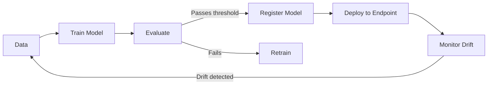

import {
  Info, Warning, Tip, BestPractice, Definition,
  Challenge, Quiz, CodeBlock, Flashcard,
  ProductionNote, InterviewQuestion
} from '@site/src/components/shared/InteractiveBlocks';

# MLOps: Machine Learning Operations on Azure

<Definition>

**MLOps** applies DevOps principles to machine learning. It automates the ML lifecycle: data preparation, training, evaluation, deployment, and monitoring — with the same rigor as software CI/CD.

</Definition>

---

## 🎯 Learning Objectives

- Apply CI/CD to ML: automate training, evaluation, and deployment
- Implement model registry for versioned, reproducible models
- Detect data and model drift to trigger retraining

---

## 🔥 Core Explanation

### MLOps vs DevOps

| Aspect | DevOps | MLOps |
|--------|--------|-------|
| **Artifact** | Container image, binary | Trained model + dependencies |
| **Testing** | Unit, integration, e2e | Data validation, model evaluation |
| **Deployment** | Rolling update | A/B testing, shadow deployment |
| **Monitoring** | CPU, latency, errors | Data drift, model accuracy, prediction distribution |
| **Rollback** | Revert deployment | Deploy previous model version |

---

## 🏗️ Professional Explanation

### Azure ML Pipeline

<CodeBlock language="yaml" title="MLOps Pipeline">
name: MLOps Training Pipeline
on:
  schedule:
    - cron: '0 0 * * 1'  # Weekly retraining

jobs:
  train:
    runs-on: ubuntu-latest
    steps:
      - uses: actions/checkout@v4
      
      - name: Submit Training Job
        run: |
          az ml job create \
            --file ml/training-job.yml \
            --resource-group cloudnova-ml \
            --workspace-name cloudnova-ml-ws
      
      - name: Evaluate Model
        run: |
          az ml model evaluate \
            --name fraud-detection \
            --version latest
      
      - name: Register Model
        if: success()
        run: |
          az ml model register \
            --name fraud-detection \
            --path ./outputs/model.pkl \
            --description "Weekly retrained model"
  
  deploy:
    needs: train
    runs-on: ubuntu-latest
    steps:
      - name: Deploy to Staging
        run: az ml online-endpoint update --name fraud-detection --traffic "staging=100"
      
      - name: A/B Test
        run: ./ml/ab-test.sh
      
      - name: Promote to Production
        if: success()
        run: az ml online-endpoint update --name fraud-detection --traffic "production=100"
</CodeBlock>

---

## 🏭 Production Explanation

### Model Drift Detection

| Drift Type | What it means | Detection |
|-----------|---------------|-----------|
| **Data Drift** | Input data distribution changed | Compare current vs training data stats |
| **Concept Drift** | Relationship between inputs and outputs changed | Monitor prediction accuracy over time |
| **Prediction Drift** | Model output distribution shifted | Track prediction histograms |

<ProductionNote>

**CloudNova monitors for data drift automatically.** If the fraud detection model's input data (transaction amounts, locations, times) shifts significantly from training data, an alert triggers automatic retraining. No manual "is the model still good?" questions.

</ProductionNote>

---

## 🧪 Active Recall

<Flashcard
  front="What is the key difference between DevOps and MLOps?"
  back="DevOps handles deterministic software (same input = same output). MLOps handles probabilistic models — data changes, model accuracy degrades, and you need drift monitoring and retraining pipelines."
/>

<Flashcard
  front="What are the three types of model drift?"
  back="1. **Data Drift** — input distribution changes
2. **Concept Drift** — relationship between inputs and outputs changes
3. **Prediction Drift** — model output distribution shifts"
/>

<Flashcard
  front="What is a model registry?"
  back="A versioned catalog of trained models. Each entry includes: model artifacts, training metrics, environment, and metadata. Enables reproducible deployment and rollback to any previous model version."
/>

---

## 📝 Quiz

<Quiz>
  <Question
    question="What triggers model retraining in an MLOps pipeline?"
    options={[
      "Manual request only",
      "Schedule, data drift detection, or performance degradation",
      "Every code commit",
      "Never — models are trained once"
    ]}
    correct={1}
  />
  
  <Question
    question="What is data drift?"
    options={[
      "The model's code changing",
      "The distribution of input data shifting from what the model was trained on",
      "The model running slower",
      "Data being deleted"
    ]}
    correct={1}
  />
</Quiz>

---

## 📋 Summary

| Component | Purpose |
|-----------|---------|
| **ML Pipeline** | Automate train → evaluate → register |
| **Model Registry** | Versioned, reproducible models |
| **Drift Detection** | Trigger retraining automatically |
| **A/B Deployment** | Test new model before full rollout |
