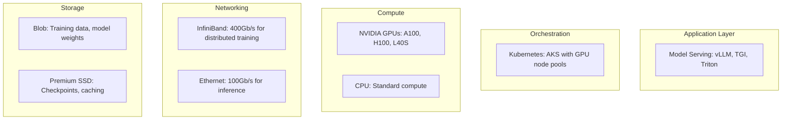

import {
  Info,
  Warning,
  Tip,
  BestPractice,
  Definition,
  Exercise,
  Challenge,
  Quiz,
  CodeBlock,
  Flashcard,
  ArchitectureNote,
  CostNote,
  ProductionNote,
  InterviewQuestion,
} from "@site/src/components/shared/InteractiveBlocks";

# AI Infrastructure: GPUs, Serving & Scaling

<Definition>

**AI Infrastructure** is the compute, networking, and storage fabric that powers AI workloads — from training billion-parameter models to serving inference at scale. It's the meeting point of cloud engineering and AI engineering.

</Definition>

---

## 🎯 Learning Objectives

- Understand GPU infrastructure: SKUs, networking, storage requirements
- Deploy model serving infrastructure on AKS
- Balance cost and performance for AI workloads

---

## 🔥 Core Explanation

### GPU Infrastructure Stack

| GPU SKU                | Best For                      | Azure VM Series |
| ---------------------- | ----------------------------- | --------------- |
| **NVIDIA A100 (80GB)** | Training large models         | NC A100 v4      |
| **NVIDIA H100**        | Next-gen training + inference | ND H100 v5      |
| **NVIDIA L40S**        | Inference, fine-tuning        | NGads V620      |
| **NVIDIA T4**          | Cost-effective inference      | NCas T4 v3      |

---

## 🏗️ Professional Explanation

### Model Serving on AKS

<CodeBlock language="yaml" title="GPU-Enabled AKS Node Pool">
  apiVersion: containerservice/v1 nodePools: - name: gpunp vmSize: Standard_NC24ads_A100_v4 count: 2
  enableAutoScaling: true minCount: 1 maxCount: 8 nodeTaints: - "nvidia.com/gpu=true:NoSchedule" ---
  # GPU workload toleration apiVersion: apps/v1 kind: Deployment metadata: name: llm-serving spec:
  template: spec: tolerations: - key: nvidia.com/gpu operator: Equal value: "true" effect:
  NoSchedule containers: - name: vllm image: vllm/vllm-openai:latest resources: limits:
  nvidia.com/gpu: 1 env: - name: MODEL_NAME value: "meta-llama/Llama-3-70b"
</CodeBlock>

<CostNote>

**GPU VMs are expensive.** An NC A100 v4 costs ~$3.67/hour ($2,600/month). Always: (1) use spot VMs for training, (2) auto-scale inference to zero at night, (3) right-size GPU SKU — don't use an A100 when a T4 suffices.

</CostNote>

---

## 🏭 Production Explanation

### Inference Optimization

| Technique                     | Impact                           | Effort        |
| ----------------------------- | -------------------------------- | ------------- |
| **Quantization (INT8, INT4)** | 2-4x speedup, 50-75% less memory | Low           |
| **Batching**                  | 5-10x throughput                 | Medium        |
| **Model distillation**        | Smaller model, similar quality   | High          |
| **Speculative decoding**      | 2-3x speedup                     | Medium        |
| **vLLM (PagedAttention)**     | 10-20x throughput vs naive       | Low (drop-in) |

<ProductionNote>

**vLLM is CloudNova's default serving engine.** It implements PagedAttention (manages KV cache like OS virtual memory), continuous batching, and optimized CUDA kernels — delivering 10-20x throughput compared to naive HuggingFace inference without any model changes.

</ProductionNote>

---

## 🧪 Active Recall

<Flashcard
  front="Which Azure VM series should you use for training large language models?"
  back="**NC A100 v4** (NVIDIA A100 80GB) or **ND H100 v5** (NVIDIA H100) — these provide the GPU memory and InfiniBand networking needed for distributed training across multiple GPUs."
/>

<Flashcard
  front="What's the biggest cost optimization for GPU workloads?"
  back="1. **Spot VMs** for training (up to 90% cheaper, but can be evicted)
2. **Auto-scale to zero** at night for inference
3. **Right-size GPU** — use T4 for small models, A100 only when needed
4. **Quantization** — INT8 or INT4 reduces memory by 50-75%"
/>

<Flashcard
  front="What does vLLM's PagedAttention do?"
  back="It manages the KV cache like an OS manages virtual memory — allocating memory in blocks, reusing across requests, and reducing waste. This enables 10-20x higher throughput compared to naive inference."
/>

---

## 📝 Quiz

<Quiz>
  <Question
    question="What Azure resource enables GPU workloads on AKS?"
    options={[
      "Regular node pool",
      "GPU-enabled node pool with NVIDIA device plugin",
      "Virtual machines",
      "App Service",
    ]}
    correct={1}
  />

  <Question
    question="What is the most cost-effective inference optimization with least effort?"
    options={[
      "Model distillation",
      "Quantization (INT8/INT4)",
      "Training a new model",
      "Buying more GPUs",
    ]}
    correct={1}
    explanation="Quantization reduces model size by 50-75% with minimal accuracy loss and near-zero implementation effort."
  />
</Quiz>

---

## 📋 Summary

| Component          | Practice                                        |
| ------------------ | ----------------------------------------------- |
| **GPU Node Pools** | AKS with NVIDIA device plugin                   |
| **Serving**        | vLLM for throughput, TGI for HuggingFace        |
| **Cost**           | Spot VMs, auto-scale, quantization              |
| **Networking**     | InfiniBand for training, Ethernet for inference |
