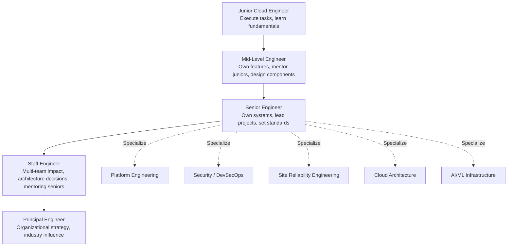

import {
  Info,
  Warning,
  Tip,
  BestPractice,
  Definition,
  Exercise,
  Challenge,
  Quiz,
  Flashcard,
  ProductionNote,
  InterviewQuestion,
} from "@site/src/components/shared/InteractiveBlocks";

# Cloud Engineering Career Paths & Growth

<Definition>

A **cloud engineering career** follows a progression from execution (junior) to strategy (principal), with multiple specialization paths: Platform Engineering, Security (DevSecOps), SRE, Architecture, and AI/ML Infrastructure.

</Definition>

---

## 🎯 Learning Objectives

- Navigate career levels: Junior → Mid → Senior → Staff → Principal
- Choose a specialization aligned with your interests and market demand
- Build a continuous learning plan that compounds over time

---

## 🔥 Core Explanation

### Career Ladder

| Level         | Time to Reach | Key Skills                                |
| ------------- | ------------- | ----------------------------------------- |
| **Junior**    | 0-2 years     | Execute tasks, learn cloud fundamentals   |
| **Mid-Level** | 2-5 years     | Own features, design components, mentor   |
| **Senior**    | 5-8 years     | Own systems, lead projects, set standards |
| **Staff**     | 8-12 years    | Multi-team impact, org architecture       |
| **Principal** | 12+ years     | Company strategy, industry influence      |

---

## 🏗️ Professional Explanation

### Specialization Paths

| Specialization           | What You Do                                    | Key Skills                                      |
| ------------------------ | ---------------------------------------------- | ----------------------------------------------- |
| **Platform Engineering** | Build the Internal Developer Platform          | Backstage, Crossplane, K8s, API design          |
| **DevSecOps**            | Security in CI/CD, compliance, threat modeling | OPA, SAST/DAST, Azure Policy, incident response |
| **SRE**                  | Reliability, SLIs/SLOs, incident management    | Prometheus, Grafana, chaos engineering          |
| **Cloud Architecture**   | Design complex systems, cost optimization      | Multi-cloud, Well-Architected Framework         |
| **AI/ML Infrastructure** | GPU clusters, model serving, MLOps             | AKS GPU, vLLM, Kubeflow, vector DBs             |

<Tip>

**Don't specialize too early.** Spend your first 2-3 years building broad fundamentals (Linux, networking, cloud, containers, IaC, CI/CD). Specialization builds on this foundation — without it, you'll hit a ceiling.

</Tip>

---

## 🏭 Professional Growth

### Compounding Learning

| Activity                             | Weekly Time | 1-Year Impact                 |
| ------------------------------------ | ----------- | ----------------------------- |
| **Read 1 technical blog post/day**   | 15 min/day  | Deep knowledge in 2-3 domains |
| **Build 1 side project/month**       | 4 hrs/month | Portfolio of 12 projects      |
| **Write 1 blog post/month**          | 2 hrs/month | 12 pieces of public proof     |
| **Answer 1 forum question/week**     | 30 min/week | Teaching solidifies learning  |
| **Attend 1 meetup/conference/month** | 2 hrs/month | Network + learn from peers    |

<BestPractice>

**The best career investment is compound learning.** 15 minutes of reading per day = 90 hours per year. That's 2 weeks of full-time learning. Multiply by 5 years and you've accumulated 450 hours — more than a master's degree. Consistency beats intensity.

</BestPractice>

---

## ☁️ CloudNova Career Simulation

<Challenge title="Map Your 5-Year Career">

**Context:** You're Alex Chen, Junior Cloud Engineer at CloudNova. Map your 5-year plan.

Example 5-Year Plan

**Year 1 (Junior):** Master fundamentals — Linux, networking, Terraform, CI/CD. Get AZ-104 certified.

**Year 2 (Junior → Mid):** Own first project end-to-end. Learn Kubernetes deeply. Get AZ-400.

**Year 3 (Mid):** Choose specialization — Platform Engineering. Build expertise in Backstage, Crossplane, K8s operators. Lead a small team.

**Year 4 (Mid → Senior):** Own the IDP architecture. Mentor 2 junior engineers. Speak at a conference.

**Year 5 (Senior):** Design CloudNova's next-gen platform. Industry-recognized expert in Platform Engineering. Interview for Staff Engineer.

</Challenge>

---

## 🧪 Active Recall

<Flashcard
  front="What's the difference between Senior and Staff Engineer?"
  back="**Senior** owns systems within a team. **Staff** has multi-team impact — sets organizational standards, mentors seniors, makes architecture decisions across teams, and influences company-wide engineering strategy."
/>

<Flashcard
  front="Why shouldn't you specialize too early?"
  back="Specialization builds on broad fundamentals. Without understanding networking, Linux, cloud, containers, and CI/CD, you'll hit a ceiling in any specialization. Spend 2-3 years building the foundation first."
/>

<Flashcard
  front="What is compound learning and why does it matter?"
  back="Small, consistent investments that accumulate over time. 15 minutes of reading per day = 90+ hours per year. Over 5 years, that's equivalent to a master's degree worth of self-study. Consistency > intensity."
/>

---

## 📝 Quiz

<Quiz>
  <Question
    question="At what level does an engineer typically start owning entire systems and leading projects?"
    options={["Junior", "Mid-Level", "Senior", "Principal"]}
    correct={2}
    explanation="Senior engineers own systems end-to-end, lead technical projects, set team standards, and mentor junior engineers."
  />

  <Question
    question="What provides more career value: 10 hours of learning in one weekend or 15 minutes daily?"
    options={[
      "10 hours in one weekend — more hours = better",
      "15 minutes daily — compound learning over time builds far more knowledge",
      "They're equivalent",
      "Neither matters",
    ]}
    correct={1}
    explanation="Consistency compounds. 15 min/day × 365 days = 91 hours/year. One weekend = 10 hours once. Over 5 years, the daily habit accumulates 455 hours — 45x more."
  />
</Quiz>

---

## ✨ Final Message from ARES EDU PLATFORM

> You've completed the Cloud Engineering Learning Path. From Linux fundamentals to AI agents, from `git init` to GitOps, from junior engineer to career architect — you now have the foundation to build, deploy, and operate cloud infrastructure at any scale.
>
> **The learning never stops.** Technology evolves. Keep reading. Keep building. Keep teaching.
>
> — The CloudNova Platform Team

---

## 📋 Summary

| Career Phase          | Focus                                |
| --------------------- | ------------------------------------ |
| **Junior (0-2yr)**    | Learn fundamentals, execute tasks    |
| **Mid (2-5yr)**       | Own features, design components      |
| **Senior (5-8yr)**    | Own systems, lead projects           |
| **Staff (8-12yr)**    | Multi-team impact, org standards     |
| **Principal (12+yr)** | Company strategy, industry influence |
